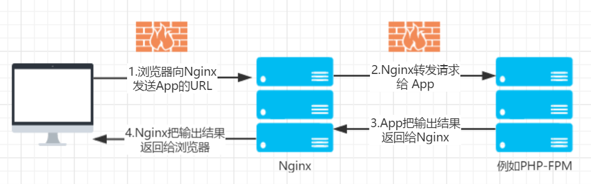
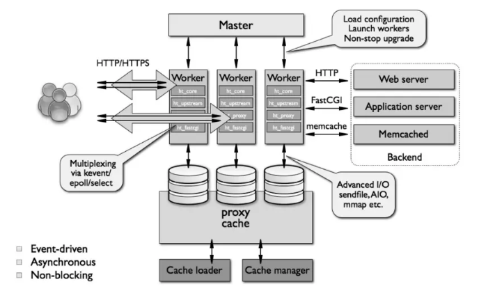

# Nginx

[TOC]

## 概述

Nginx 它的发音为 [ˈendʒɪnks] ，是轻量级 Web 服务器 、反向代理服务器及电子邮件（IMAP/POP3）代理服务器。其特点是占有内存少，并发能力强。 

由俄罗斯的程序员 Igor Sysoev 所开发，2004年10月作为一个试图回答公众发布 C10K 问题。其中 C10k  是同时管理 10,000 个连接的挑战。Nginx 采用了事件驱动和异步架构，此设计使 Nginx 成为可扩展、高性能的服务器。 

是一个开源、轻量级和高性能的 Web 服务器，也用作 HTTP、HTTPS、SMTP、IMAP、POP3 协议的反向代理服务器，另一方面，它也用作 IMAP、POP3 和 IMAP 的 HTTP 负载均衡器、HTTP 缓存和电子邮件代理。 

Nginx 以事件驱动的方式编写，所以有非常好的性能，同时也是一个非常高效的反向代理、负载平衡服务器。在性能上，Nginx 占用很少的系统资源，能支持更多的并发连接，达到更高的访问效率；在功能上，Nginx 是优秀的代理服务器和负载均衡服务器；在安装配置上，Nginx 安装简单、配置灵活。

Nginx 支持热部署，启动速度特别快，还可以在不间断服务的情况下对软件版本或配置进行升级，即使运行数月也无需重新启动。

在微服务的体系之下，Nginx 正在被越来越多的项目采用作为网关来使用，配合 Lua 做限流、熔断等控制。



Nginx 不可以直接处理php、java。Nginx 只是一个静态文件服务器或者 http 请求转发器，它可以把静态文件的请求直接返回静态文件资源，把动态文件的请求转发给后台的处理程序，例如 php-fpm、apache、tomcat、jetty 等，这些后台服务，即使没有nginx的情况下也是可以直接访问的。

## 功能

**基础功能：**

-  处理静态文件，索引文件以及自动索引；
-  反向代理加速(无缓存)，简单的负载均衡和容错；
-  FastCGI，简单的负载均衡和容错；
-  模块化的结构。过滤器包括gzipping, byte ranges, chunked responses, 以及 SSI-filter 。在SSI过滤器中，到同一个 proxy 或者 FastCGI 的多个子请求并发处理；
-  SSL 和 TLS SNI 支持；

**IMAP/POP3 代理服务功能：**

-  使用外部 HTTP 认证服务器重定向用户到 IMAP/POP3 后端；
-  使用外部 HTTP 认证服务器认证用户后连接重定向到内部的 SMTP 后端；
-  认证方法：
-  POP3: POP3 USER/PASS, APOP, AUTH LOGIN PLAIN CRAM-MD5;
-  IMAP: IMAP LOGIN;
-  SMTP: AUTH LOGIN PLAIN CRAM-MD5;
-  SSL 支持；
-  在 IMAP 和 POP3 模式下的 STARTTLS 和 STLS 支持；

**支持的操作系统：**

-  FreeBSD 3.x, 4.x, 5.x, 6.x i386; FreeBSD 5.x, 6.x amd64;
-  Linux 2.2, 2.4, 2.6 i386; Linux 2.6 amd64;
-  Solaris 8 i386; Solaris 9 i386 and sun4u; Solaris 10 i386;
-  MacOS X (10.4) PPC;

**结构与扩展：**

-  一个主进程和多个工作进程。工作进程是单线程的，且不需要特殊授权即可运行；
-  kqueue (FreeBSD 4.1+), epoll (Linux 2.6+), rt signals (Linux 2.2.19+), /dev/poll (Solaris 7 11/99+), select, 以及 poll 支持；
-  kqueue支持的不同功能包括 EV_CLEAR, EV_DISABLE （临时禁止事件）， NOTE_LOWAT, EV_EOF, 有效数据的数目，错误代码；
-  sendfile (FreeBSD 3.1+), sendfile (Linux 2.2+), sendfile64 (Linux 2.4.21+), 和 sendfilev (Solaris 8 7/01+) 支持；
-  输入过滤 (FreeBSD 4.1+) 以及 TCP_DEFER_ACCEPT (Linux 2.4+) 支持；
-  10,000 非活动的 HTTP keep-alive 连接仅需要 2.5M 内存。
-  最小化的数据拷贝操作；

**其他HTTP功能：**

-  基于IP 和名称的虚拟主机服务；
-  Memcached 的 GET 接口；
-  支持 keep-alive 和管道连接；
-  灵活简单的配置；
-  重新配置和在线升级而无须中断客户的工作进程；
-  可定制的访问日志，日志写入缓存，以及快捷的日志回卷；
-  4xx-5xx 错误代码重定向；
-  基于 PCRE 的 rewrite 重写模块；
-  基于客户端 IP 地址和 HTTP 基本认证的访问控制；
-  PUT, DELETE, 和 MKCOL 方法；
-  支持 FLV （Flash 视频）；
-  带宽限制；

**实验特性：**

-  内嵌的 `perl`
-  通过 `aio_read() / aio_write()` 的套接字工作的实验模块，仅在 FreeBSD 下。
-  对线程的实验化支持，FreeBSD 4.x 的实现基于 rfork()

## 安装

见LNMP内容

## 卸载

### CentOS 7.6

### Ubuntu

```bash
# 卸载删除除配置文件外所有的文件
apt-get remove nginx nginx-common
# 卸载所有软件，包括配置文件
apt-get purge nginx nginx-common
```

## 控制

### 信号控制

| 信号      | 作用                                                         |
| --------- | ------------------------------------------------------------ |
| TERM或INT | 快速停止服务。                                               |
| QUIT      | 平缓停止服务。                                               |
| HUP       | 使用新的配置文件启动进程，之后平缓停止原有进程，“平滑重启”。 |
| USR1      | 重新打开日志文件，常用于日志切割。                           |
| USR2      | 使用新版本Nginx启动服务，之后平缓停止原有进程，“平滑升级”。  |
| WINCH     | 平缓停止worker process，用于服务器平滑升级。                 |

```bash
kill SIGNAL PID
kill SIGNAL `filepath`  #filepath为nginx.pid的路径
kill SIGNAL `cat filepath`  #filepath为nginx.pid的路径
# 上述两条需要确认哪一条是正确的。
```

### 启动

```bash
# ./sbin/nginx
```

```bash
nginx [-?hvVtq] [-s signal] [-c filename] [-p prefix] [-g directives]

-?,-h			:显示帮助信息
-v				：打印版本号并退出
-V				：打印版本号和配置并退出
-t				：测试配置正确性并退出
-q				：测试配置时只显示错误
-s signal		：向主进程发送信号，stop,quit,reopen,reload
-p prefix		：指定服务器路径
-c filename		：指定配置文件路径，替代缺省配置文件。
-g directives	：指定附加配置文件路径
```

### 停止

```bash
nginx -g TERM | INT | QUIT
# TERM，INT	快速停止
# QUIT		 平缓停止

kill TERM | INT | QUIT `/nginx/logs/nginx.pid`

kill -9 | SIGKILL `/nginx/logs/nginx.pid`
# 不建议
```

### 重启

```bash
nginx -g HUP [-c newConfFile]
kill HUP `/nginx/logs/nginx.pid`
```

### 升级

```bash
nginx -p newInstallPath

nginx -g USR2
kill USR2 `/nginx/logs/nginx.pid`

#确认新服务启动后,平滑停止旧服务
nginx -g WINCH
kill WINCH `/nginx/logs/nginx.pid`
```

## 工作原理

### Nginx进程

nginx 在启动后，会以 daemon 的方式在后台运行，后台进程包含一个 master 进程和多个 worker 进程，worker 进程以非 root 用户运行，可以在配置文件中配置运行 worker 进程的用户。 

master 进程主要用来管理 worker 进程，包含：接收来自外界的信号，向各 worker 进程发送信号，监控 worker 进程的运行状态，当 worker 进程退出后(异常情况下)，会自动重新启动新的 worker 进程。 

worker 进程则是处理基本的网络事件。多个 worker 进程之间是对等的，他们同等竞争来自客户端的请求，各进程互相之间是独立的。一个请求，只可能在一个 worker 进程中处理，一个 worker 进程，不可能处理其它进程的请求。 

主进程(master process)的功能： 

1. 读取 Nginx 配置文件并验证其有效性和正确性。
2. 按照配置启动、管理和关闭工作进程。
3. 接受外界指令，比如重启、升级及关闭服务器等指令。
4. 不中断服务，实现平滑升级，重启服务并应用新的配置。
5. 开启日志文件。

工作进程（woker process）的功能： 

1. 接收处理客户端的请求。
2. 将请求以此送入各个功能模块进行处理。
3. IO 调用，获取响应数据。
4. 与后端服务器通信，接收后端服务器的处理结果。
5. 缓存数据，访问缓存索引，查询和调用缓存数据。
6. 发送请求结果，响应客户端的请求。
7. 接收主程序指令，比如重启、升级和退出等。

cache相关进程：cache loader (缓存索引重建)与 cache manager( 缓存索引管理)组成

1. Cache loader 在 Nginx 服务启动后由主进程生成,根据本地磁盘上缓存建立索引元数据库后退出。
2. Cache manager 在元数据更新完成后，对元数据是否过期做出判断。 

  

### Nginx的模块结构

Nginx 的各种功能和操作都由模块来实现。Nginx 由内核和一系列模块组成，内核提供 web 服务的基本功能，如启用网络协议，创建运行环境，接收和分配客户端请求，处理模块之间的交互。

Nginx 的模块从结构上分为：

* 核心模块
  * HTTP 模块
  * EVENT 模块
  * MAIL 模块
* 基础模块
  * HTTP Access 模块
  * HTTP FastCGI 模块
  * HTTP Proxy 模块
  * HTTP Rewrite 模块
* 第三方模块
  * HTTP Upstream Request Hash 模块
  * Notice 模块
  * HTTP Access Key 模块
  * 用户自己开发的模块。

这样的设计使 Nginx 方便开发和扩展，Nginx的模块默认编译进 nginx 中，如果需要增加或删除模块，需要重新编译 nginx，这一点不如 Apache 的动态加载模块方便，最新版本 Nginx 已经支持动态模块。

## 文件

不同系统，文件位置可能不同。

所有结尾为 default 的文件都是备份文件。

```bash
/usr/local/nginx
├── client_body_temp                 # POST 大文件暂存目录
├── conf                             # Nginx 所有配置文件的目录
│   ├── fastcgi.conf                 # fastcgi 相关参数的配置文件
│   ├── fastcgi.conf.default         # fastcgi.conf 的原始备份文件
│   ├── fastcgi_params               # fastcgi 的参数文件
│   ├── fastcgi_params.default       
│   ├── koi-utf
│   ├── koi-win
│   ├── mime.types                   # 媒体类型
│   ├── mime.types.default
│   ├── nginx.conf                   # Nginx 默认的主配置文件，日常使用和修改的文件
│   ├── nginx.conf.default
│   ├── scgi_params                  # scgi 相关参数文件
│   ├── scgi_params.default  
│   ├── uwsgi_params                 # uwsgi 相关参数文件
│   ├── uwsgi_params.default
│   └── win-utf
├── fastcgi_temp                     # fastcgi 临时数据目录
├── html                             # Nginx 默认站点目录
│   ├── 50x.html                     # 错误页面优雅替代显示文件，例如出现502错误时会调用此页面
│   └── index.html                   # 默认的首页文件
├── logs                             # Nginx 日志目录
│   ├── access.log                   # 访问日志文件
│   ├── error.log                    # 错误日志文件
│   └── nginx.pid                    # pid 文件，Nginx 进程启动后，会把所有进程的 ID 号写到此文件
├── proxy_temp                       # 临时目录
├── sbin                             # Nginx 可执行文件目录
│   └── nginx                        # Nginx 二进制可执行程序
├── scgi_temp                        # 临时目录
└── uwsgi_temp                       # 临时目录
```

## 配置

### 配置符号

**容量符号缩写**

| 缩写 | 描述   |
| ---- | ------ |
| k,K  | 千字节 |
| m,M  | 兆字节 |

例如, "8k", "1m" 代表字节数计量.  

**时间符号缩写**

| ms   | 毫秒         |
| ---- | ------------ |
| s    | 秒           |
| m    | 分钟         |
| h    | 小时         |
| d    | 日           |
| w    | 周           |
| M    | 一个月, 30天 |
| y    | 年, 365 天   |

例如, "1h 30m", "1y 6M". 代表 "1小时 30分", "1年零6个月". 

### 配置文件

#### nginx.conf

主配置文件 `/etc/nginx/nginx.conf` 是一个纯文本类型的文件，整个配置文件是以区块的形式组织，通常每一个区块以一对大括号{}来表示开始与结束。

- Main 位于 nginx.conf 配置文件的最高层。
- Main 层下可以有 Event、HTTP 层。
- Http 层下面允许有多个 Server 层，用于对不同的网站做不同的配置。
- Server 层下面允许有多个 Location，用于对不同的路径进行不同模块的配置。 

​	 

1. 全局块

   全局配置部分用来配置对整个 server 都有效的参数。主要会设置一些影响 nginx 服务器整体运行的配置指令，主要包括配置运行 Nginx 服务器的用户（组）、允许生成的 worker process 数，进程 PID 存放路径、日志存放路径和类型以 及配置文件的引入等。

2. events块

   events 块涉及的指令主要影响 Nginx 服务器与用户的网络连接，常用的设置包括是否开启对多 worker process  下的网络连接进行序列化，是否允许同时接收多个网络连接，选取哪种事件驱动模型来处理连接请求，每个 worker process  可以同时支持的最大连接数等。

3. http块

   可以嵌套多个 server，配置代理，缓存，日志定义等绝大多数功能和第三方模块的配置。如文件引入，mime-type 定义，日志自定义，是否使用 sendfile 传输文件，连接超时时间，单连接请求数等。一个 http 中可以有多个 server。

4. server块

   Server 块也被叫做“虚拟主机”部分，它描述的是一组根据不同 server_name 指令逻辑分割的资源，这些虚拟服务器响应 HTTP  请求，因此都包含在 http 部分。最常见的配置是本虚拟机主机的监听配置和本虚拟主机的名称或 IP 配置。Nginx 必须使用虚拟机配置站点，每个虚拟主机使用一个 server。一个 server 块可以配置多个  location 块。

   通常 Server 配置在独立的/etc/nginx/conf.d/*.conf中，通过引用的方式调用。

5. location块

   配置请求的路由，以及各种页面的处理情况。

```bash
user user [group];
#user  nginx;
# 运行 Nginx 服务器的用户(组),如希望所有用户都可以运行，两种方法：
# 1，注释此项；
# 2，用户和组设置为 nobody。

worker_processes  number | auto;
#worker_processes  1;
# 默认为 1。worker_processes最多开启8个，8个以上，性能不会再提升了，而且稳定性变得更低。
worker_cpu_affinity auto;
# 利用多核cpu的配置。默认不开启。
# 例如：2核cpu，开启2个进程
#  worker_processes     2;
#  worker_cpu_affinity 01 10;
# 解释：01表示启用第一个CPU内核，10表示启用第二个CPU内核。2核是01，四核是0001，8核是00000001，有多少个核，就有几位数，1表示该内核开启，0表示该内核关闭。

error_log  logs/error.log  cirt;
#error_log  file | stderr [debug | info | notice | warn | error | crit | alert | emerg];
# 错误日志路径及级别

pid        logs/nginx.pid;
# Nginx 服务启动的 pid

worker_rlimit_nofile 51200;
# Specifies the value for maximum file descriptors that can be opened by this process.

events {
	use epoll;
    # 处理网络消息的事件驱动模型，可选
    #  select,poll,kqueue,epoll,rtsig,/dev/poll,eventport
    worker_connections  512;
    # 不仅仅包含和前端用户建立的连接数，而是包含所有可能的连接数。
    accept_mutex	on | off;
    # 默认为on,对多个进程接收连接进行序列化，防止多个进程对连接的争抢。
    # 解决“惊群”问题。
    multi_accept	on | off;
    # 是否允许每个 work process 同时接收多个网络连接，默认为 off
}

http {
    include       /etc/nginx/mime.types;	        #指定在当前文件中包含另一个文件的指令
    default_type  application/octet-stream;	        #指定默认处理的文件类型可以是二进制

    server_names_hash_bucket_size 128;
    # 服务器名称的hash表大小
    client_header_buffer_size 32k;
    # 指定来自客户端请求头headerbuffer大小
    large_client_header_buffers 4 32k;
    # 指定客户端请求中较大的消息头的缓存最大数量和大小
    client_max_body_size 1m;
    # 允许用户最大上传数据大小

    #log_format  main  '$remote_addr - $remote_user [$time_local] "$request" '
    #                  '$status $body_bytes_sent "$http_referer" '
    #                  '"$http_user_agent" "$http_x_forwarded_for"';
    # 1.$remote_addr 与 $http_x_forwarded_for  用以记录客户端的ip地址；
    # 2.$remote_user                           用来记录客户端用户名称；
    # 3.$time_local                            用来记录访问时间与时区；
    # 4.$request                               用来记录请求的url与http协议；
    # 5.$status                                用来记录请求状态；成功是200， 
    # 6.$body_bytes_s ent                      记录发送给客户端文件主体内容大小；
    # 7.$http_referer                          用来记录从那个页面链接访问过来的；
    # 8.$http_user_agent                       记录客户端浏览器的相关信息；

    #access_log  off;
    # 取消记录服务日志的功能。
    #access_log  logs/access.log  main;
    #访问日志
    
    sendfile        off;
    # 默认为off
    #sendfile        on;
    #优化静态资源
    sendfile_max_chunk	0;
    # 大于0，每个 worker process 每次调用 sendfile() 传输的数据量最大不能超过这个值。
    # 默认值为0，不限制。
    
    #tcp_nopush     on;
    # nginx不要缓存数据，而是一段一段发送
    
    #keepalive_timeout  75;
    # 给客户端分配连接超时时间，服务器会在这个时间过后关闭连接。
    #keepalive_timeout	timeout	[header_timeout];
    # timeout	服务器端对连接的保持时间
    # header_timeout	在应答报文头部的Keep-Alive域设置超时时间。

	#keepalive_requests		number;
	# 默认值为100，限制用户通过某一连接向服务器发送请求的此次。
    
	tcp_nodelay on;

    fastcgi_connect_timeout 300;
    # 连接到后端fastCGI的超时时间
    fastcgi_send_timeout 300;
    # 已经完成两次握手后向fastCGI传送的超时时间
    fastcgi_read_timeout 300;
    # 已经完成两次握手后接收fastCGI应答的超时时间
    fastcgi_buffer_size 64k;
    # 读取fastCGI应答第一部分需要多大的缓冲区
    fastcgi_buffers 4 64k;
    # 本地需要多少和多大的缓冲区来缓冲fastCGI的应答
    fastcgi_busy_buffers_size 128k;
    # 默认值是fastcgi_buffers的2倍
    fastcgi_temp_file_write_size 256k;
    # 在写入fastcgi_temp_path是用多大的数据块，默认值是fastcgi_buffers的2倍

    #gzip  on;
    # 开启gzip压缩输出
    gzip_min_length  1k;
    # 用于设置允许压缩的页面最小字节数，页面字节数从header头的content-length中获取，默认值是0，不管页面多大都进行压缩，建议设置成大于1k的字节数，小于1k可能会越压越大最小压缩文件大小
    gzip_buffers     4 16k;
    # 表示申请4个单位为16k的内存作为压缩结果流缓存，默认值是申请与原始数据大小相同的内存空间来存储gzip压缩结果
    gzip_http_version 1.1;
    # 压缩版本（默认1.1，前端如果是squid2.5请使用1.0）
    gzip_comp_level 2;
    # 压缩等级
    gzip_types     text/plain application/javascript application/x-javascript text/javascript text/css application/xml application/xml+rss;
    # 压缩类型，默认就已经包含text/html，所以下面就不用再写了，写上去也不会有问题，但是会有一个warn。
    gzip_vary on;
    # 可让前端的缓存服务器缓存经过gzip压缩的页面，例如，用squid缓存经过nginx压缩的数据。
    gzip_proxied   expired no-cache no-store private auth;
    gzip_disable   "MSIE [1-6]\.";

    #limit_conn_zone $binary_remote_addr zone=perip:10m;
    # If enable limit_conn_zone,add "limit_conn perip 10;" to server section.

    server_tokens off;
    # 隐藏版本号

    server {
        listen       80;
        # 监听端口，默认80
        #listen		127.0.0.1:80;
        #listen		*:80;
        # listen 80 default_server reuseport;
        # listen [::]:80 default_server ipv6only=on;
        server_name  localhost;
        # 提供服务的域名或主机名

        #charset koi8-r;

        #access_log  logs/host.access.log  main;

        location / {                               # 控制网站访问路径
            root   html;                           # 存放网站的路径
            index  index.html index.htm;           # 默认访问的首页
        }
        
        # 完全匹配     =
        # 大小写敏感   ~
        # 忽略大小写   ~*
        
        #error_page  404              /404.html;   # 错误页面

        # redirect server error pages to the static page /50x.html
        #
        error_page   500 502 503 504  /50x.html;   # 定义请求错误，指定错误代码
        location = /50x.html {                     # 错误代码重定向到新的 location
            root   html;
        }

        location /nginx_status
        {
            stub_status on;
            access_log   off;
        }

        location ~ .*\.(gif|jpg|jpeg|png|bmp|swf)$
        {
            expires      30d;
        }

        location ~ .*\.(js|css)?$
        {
            expires      12h;
        }

        location ~ /.well-known {
            allow all;
        }

        # proxy the PHP scripts to Apache listening on 127.0.0.1:80
        #
        #location ~ \.php$ {
        #    proxy_pass   http://127.0.0.1;
        #}

        # pass the PHP scripts to FastCGI server listening on 127.0.0.1:9000
        #
        #location ~ \.php$ {
        #location ~ [^/]\.php(/|$) {
        #    root           html;
        #    try_files $uri =404;
        #    fastcgi_pass  unix:/tmp/php-cgi.sock;
        #    fastcgi_pass   127.0.0.1:9000;
        #    fastcgi_index  index.php;
        #    fastcgi_param  SCRIPT_FILENAME  /scripts$fastcgi_script_name;
        #    include        fastcgi_params;
        #}

        # deny access to .htaccess files, if Apache's document root
        # concurs with nginx's one
        #
        #location ~ /\.ht {
        #    deny  all;
        #}
        access_log  /data/wwwlogs/access.log;
    }


    # another virtual host using mix of IP-, name-, and port-based configuration
    #
    #server {
    #    listen       8000;
    #    listen       somename:8080;
    #    server_name  somename  alias  another.alias;

    #    location / {
    #        root   html;
    #        index  index.html index.htm;
    #    }
    #}


    # HTTPS server
    #
    #server {
    #    listen       443 ssl;
    #    server_name  localhost;

    #    ssl_certificate      cert.pem;
    #    ssl_certificate_key  cert.key;
    # SSL证书配置

    #    ssl_session_cache    shared:SSL:1m;
    #    ssl_session_timeout  5m;

    #    ssl_ciphers  HIGH:!aNULL:!MD5;
    #    ssl_prefer_server_ciphers  on;

    #    location / {
    #        root   html;
    #        index  index.html index.htm;
    #    }
    #}
    include /etc/nginx/conf.d/*.conf;
}
```

index指令中列出多个文件名，Nginx 按指定的顺序搜索文件并返回它找到的第一个文件。

```ini
vi /etc/nginx/conf.d/mystie.conf

server {
    server_name  www.cainiaojc.com;
    
    error_page  404 403 500 502 503 504  /error.html;	#配置错误页
    location / {
        root   /usr/share/nginx/base;
        index  index.html;
    }
}
```

### Nginx相关安全策略

#### 禁止访问 htaccess

```ini
location ~/\.ht {
     deny all;
}
```

#### 禁止访问多个目录

```ini
 location ~ ^/(picture|move)/ {
      deny all;
      break;i
 }
```

#### 禁止访问 /data 开头的文件

```ini
 location ~ ^/data {
      deny all;
  }
```

#### 禁止访问单个目录

```ini
 location /imxhy/images/ {
      deny all;
 }
```

#### 允许特定 ip 访问

```ini
root /usr/share/nginx/rewrite/;
allow 208.97.167.194;
allow 222.33.1.2;
allow 231.152.49.4;
deny all; 
```

### 日志配置

日志是用来进行数据统计、问题排错的重要手段。nginx 具备非常灵活的日志记录模式，每个级别的配置可以有各自独立的访问日志。日志格式通过 log_format 命令来定义。

nginx日志相关涉及的配置有：

* access_log：访问日志

* log_format：日志格式

* rewrite_log：重定向日志

* error_log：错误日志

#### 	access_log 配置

```bash
access_log path [format [buffer=size [flush=time]]]; 	
access_log path format gzip[=level] [buffer=size] [flush=time]; 	
access_log syslog:server=address[,parameter=value] [format]; 	
access_log off;			#不记录日志 	
```

默认值: access_log logs/access.log combined;
使用默认 combined 格式记录日志：access_log logs/access.log 或 access_log logs/access.log combined;
配置段: http, server, location, if in location, limit_except
参数解释：

- gzip：压缩等级。 	
- buffer：设置内存缓存区大小。 	
- flush：保存在缓存区中的最长时间。 	

#### 	log_format配置

```ini
log_format name string ……;
```

默认值:` log_format combined "……";`

配置段: http

释义：name 表示格式名称，string 表示等义的格式。log_format 有一个默认的无需设置的 combined 日志格式，相当于 apache 的 combined 日志格式。

示例1：

```ini
log_format  main  '$remote_addr - $remote_user [$time_local] "$request" '
                  '$status $body_bytes_sent "$http_referer" '
                  '"$http_user_agent"';
```

示例2：

```ini
log_format  proxy  '$remote_addr - $remote_user [$time_local] "$request" '
                   '$status $body_bytes_sent "$http_referer" '
                   '"$http_user_agent" "$http_user_agent" ';
```

配置相关变量释义：

* $remote_addr：表示客户端地址
* $remote_user：表示http客户端请求Nginx认证的用户名
* $time_local：Nginx通用日志格式下的本地时间
* $request：request请求行，请求的URL、GET等方法、HTTP协议版本
* $request_length：请求的长度
* $request_time：请求处理时间，单位为秒，精度为毫秒
* $status：response返回状态码
* $body_bytes_sent：发送给客户端的字节数，不包括响应头的大小，即服务端响应给客户端body信息大小
* $http_referer：http上一级页面，即从哪个页面链接访问过来的，用于防盗链、用户行为分析
* $http_user_agent：http头部信息，记录客户端浏览器相关信息
* $connection：连接的序列号
* $connection_requesta：当前通常一个连接获得的请求数量
* $msec：日志写入时间，单位为秒，精度为毫秒
* $pipe：如果请求是通过HTTP流水线（pipelined）发送，pipe值为‘p’，否则为“.”
* $http_x_forwarded_for：http请求携带的http信息。

提示：如果nginx位于负载均衡器，squid，nginx反向代理之后，web服务器无法直接获取到客户端真实的IP地址了。  $remote_addr获取反向代理的IP地址。反向代理服务器在转发请求的http头信息中，可以增加X-Forwarded-For信息，用来记录客户端IP地址和客户端请求的服务器地址。

#### 	rewrite_log配置

```ini
rewrite_log on | off;
```

默认值：rewrite_log off;

配置段：http，server，location，if

作用：由 ngx_http_rewrite_module 模块提供的。用来记录重写日志的，对于调试重写规则建议开启。启用时将在 error log 中记录 notice 级别的重写日志。

#### 	error_log配置

```ini
error_log file | stderr | syslog:server=address[,parameter=value]  [debug | info | notice | warn | error | crit | alert | emerg];
```

默认值：error_log logs/error.log error;

配置段：main，http，server，location

作用：配置错误日志。

### Nginx 日志切割

nginx的日志文件没有切割功能，如果不处理，日志文件 `access.log` 将变得越来越大，可以写一个 nginx 日志切割脚本按日期自动切割日志文件。

#### 	**nginx 日志切割的实现逻辑**

​	第一步重命名日志文件，把 access.log 重命名为按日期的文件。不用担心重命名后 nginx 找不到日志文件而丢失日志。在你未重新打开日志文件前，nginx还是会向你重命名前的文件写日志，linux是靠文件描述符而不是文件名定位文件。

​	第二步向 nginx 主进程发送 USR1 信号，重新打开日志文件。

​	nginx主进程接到 USR1 信号后会从配置文件中读取日志文件名称，重新打开该日志文件(以配置文件中的日志名称命名)，并以工作进程的用户作为日志文件的所有者。

​	重新打开日志文件后，nginx主进程会关闭重名的日志文件 `access_yyyymmdd.log`并通知工作进程使用新打开的日志文件 access.log。

​	工作进程立刻打开新的日志文件 access.log 开始写入日志，然后关闭重命名的日志文件 access_yyyymmdd.log不再写入日志。

#### 	Nginx 日志切割脚本

## 指令

Nginx 中的配置选项称为指令。该选项有名称和参数，必须以分号 (;) 结尾，否则 Nginx 将无法加载配置并产生错误。例如：

```ini
gzip on;
```

指令分为两部分：

- **简单指令：**简单指令由名称和参数组成，以空格分隔并以分号 ; 结尾。
- **块指令：** 结构类似于简单指令，但它不是以分号结尾，而是以一组用大括号 { 和 } 括起来的附加指令结尾。如果块指令在大括号内包含其他指令，则它被称为上下文 (context)。例如，Events、http、location 和 server。

配置文件中放置在任何上下文之外的指令都被认为是在**主上下文中**。**events** 与 **http** 指令在**主上下文中**，**server** 指令在 **http** 上下文， **location** 指令在 **server** 上下文。

### 指令类型

由于不同指令的继承模型不同，因此在多个上下文中使用同一个指令时要注意。共有三种类型的指令，每种类型都有其继承模型。

#### 普通的

每个上下文有一个值。只能在上下文中定义它一次。子上下文可以覆盖父指令，但此覆盖仅在给定的子上下文中有效。

```ini
gzip on;  
gzip off; # 在同一个上下文中有两个普通指令是非法的   
  
server {  
  location /downloads {  
    gzip off;  
  }  
  
  location /assets {  
    # gzip 在这里有效  
  }  
}  
```

#### Array

在同一上下文中添加多条指令会增加值而不是完全覆盖它们。在子上下文中定义指令将覆盖给定子上下文中父级的所有值。

```ini
error_log /var/log/nginx/error.log;  
error_log /var/log/nginx/error_notive.log notice;  
error_log /var/log/nginx/error_debug.log debug;  
  
server {  
  location /downloads {  
    # 这将覆盖父级所有指令  
    error_log /var/log/nginx/error_downloads.log;  
  }  
} 
```

#### 行动指令Action Directive

动作是用于改变事物的指令。它们的继承行为将取决于模块。

**例如：**在 rewrite 指令的情况下，每个匹配的指令都会被执行。

```ini
server {  
  rewrite ^ /foobar;  
  
  location /foobar {  
    rewrite ^ /foo;  
    rewrite ^ /bar;  
  }  
}  
```

如果我们尝试访问**/sample**：

- 执行服务器重写，重写从 **/sample** 到 **/foobar**。
- 然后匹配位置 **/foobar**。
- location 里第一个重写被执行，从重写 **/foobar 到 /foo**。
- location 里第二个重写被执行，从重写 **/foo 到 /bar**。

让我们看看**return**指令提供的不同行为：

```ini
server {  
  location / {  
    return 200;  
    return 404;  
  }  
}
```

从上面的情况来看，200 状态立即返回。

### 常用指令

| **指令**                               | 语法                                                         | 默认配置                             | 上下文                                               |
| -------------------------------------- | ------------------------------------------------------------ | ------------------------------------ | ---------------------------------------------------- |
| **absolute_redirect**                  | absolute_redirect on \| off;                                 | absolute_redirect on;                | http, server, location                               |
| **accept_mutex**                       | accept_mutex on \| off;                                      | off                                  | Events                                               |
| **accept_mutex_delay**                 | accept_mutex_delay time;                                     | accept_mutex_delay 500ms;            | Events                                               |
| **access_log (ngx_http_log_module)**   | access_log path [format [buffer=size] [gzip[=level]] [flush=time] [if=condition]]; access_log off; | access_log logs/access.log combined; | http, server, location, if in location, limit_except |
| **access_log (ngx_stream_log_module)** | access_log path format [buffer=size] [gzip[=level]] [flush=time] [if=condition]; access_log off; | access_log off;                      | stream, server                                       |
| **add_after_body**                     | add_before_body uri;                                         | -                                    | http, server, location                               |
| **add_before_body**                    | add_before_body uri;                                         | -                                    | http, server, location                               |
| **add_header**                         | add_header name value [always];                              | -                                    | http, server, location, if in location               |
| **add_trailer**                        | add_trailer name value [always];                             | -                                    | http, server, location, if in location               |
| **addition_types**                     | addition_types mime-type ...;                                | addition_types text/html;            | http, server, location                               |
| **aio**                                | aio on \| off \| threads[=pool];                             | aio off;                             | http, server, location                               |
| **aio_write**                          | aio_write on \| off;                                         | aio_write off;                       | http, server, location                               |
| **alias**                              | alias path;                                                  | -                                    | Location                                             |
| **allow (ngx_http_access_module)**     | allow address \| CIDR \| unix: \| all;                       | -                                    | http, server, location, limit_except                 |
| **allow (ngx_stream_access_module)**   | allow address \| CIDR \| unix: \| all;                       | -                                    | Stream, server                                       |
| **ancient_browser**                    | ancient_browser string ...;                                  | -                                    | http, server, location                               |
| **ancient_browser_value**              | ancient_browser_value string;                                | ancient_browser_value 1;             | http, server, location                               |
| **api**                                | api [write=on\|off];                                         | -                                    | location                                             |
| **auth_basic**                         | auth_basic string \| off;                                    | auth_basic off;                      | http, server, location, limit_except                 |
| **auth_basic_user_file**               | auth_basic_user_file file;                                   | -                                    | http, server, location, limit_except                 |
| **auth_http**                          | auth_http URL;                                               | -                                    | mail, server                                         |
| **auth_http_header**                   | auth_http_header header value;                               | -                                    | mail, server                                         |
| **auth_http_pass_client_cert**         | auth_http_pass_client_cert on \| off;                        | auth_http_pass_client_cert off;      | mail, server                                         |
| **auth_http_timeout**                  | auth_http_timeout time                                       | auth_http_timeout 60s;               | mail, server                                         |
| **auth_jwt**                           | auth_jwt string [token=$variable] \| off;                    | auth_jwt off;                        | http, server, location, limit_except                 |
| **auth_jwt_claim_set**                 | auth_jwt_claim_set $variable name ...;                       | -                                    | http                                                 |
| **auth_jwt_header_set**                | auth_jwt_header_set $variable name ...;                      | -                                    | http                                                 |
| **auth_jwt_key_file**                  | auth_jwt_key_file file;                                      | -                                    | ttp, server, location, limit_except                  |
| **auth_jwt_key_request**               |                                                              |                                      |                                                      |

### root 指令

用于设置请求的根目录，允许 nginx 将传入的请求映射到文件系统。

```ini
server {  
  listen 80;  
  server_name localhost;  
  root   html;  
} 		 	
```

### Location 指令

用于根据请求的 URI（统一资源标识符）设置配置。

```ini
location [modifier] path  
```

**例子：**

```ini
location /foo {  
  # ...  
}  
```

当没有给出修饰符时，路径被视为前缀，之后可以跟任何东西。上面的例子将匹配：

```ini
/foo  
/fooo  
/foo123  
/foo/bar/index.html  
... 
```

可以在给定的上下文中使用多个位置指令：

```ini
server {  
  listen 80;  
  server_name localhost;  
  root   html;
  
  location / {  
    return 200 "root";  
  }  
  
  location /foo {  
    return 200 "foo";  
  }  
}
```

Nginx 还提供了一些可以与**location**指令结合使用的修饰符。

修饰符已分配优先级：

```bash
=           - 完全匹配  
^~          - 优先匹配  
~ && ~*     - 正则表达式匹配  
no modifier - 前缀匹配  
```

首先，nginx 将检查是否有任何完全匹配。如果它不存在，它将寻找优先的。如果此匹配也失败，则将按出现顺序测试正则表达式匹配。如果都失败了，将使用最后一个前缀匹配。

```ini
location /match {  
  return 200 'Prefix match: will match everything that starting with /match';  
}  
  
location ~* /match[0-9] {  
  return 200 'Case insensitive regex match';  
}  
  
location ~ /MATCH[0-9] {  
  return 200 'Case sensitive regex match';  
}  
  
location ^~ /match0 {  
  return 200 'Preferential match';  
}  
  
location = /match {  
  return 200 'Exact match';  
} 
 
/match # =>  '完全匹配'  
/match0 # =>  '优先匹配'  
/match1 # =>  '不区分大小写的正则表达式匹配'  
/MATCH1 # =>  '区分大小写的正则表达式匹配'  
/match-abc # =>  '前缀匹配：匹配以 /match 开头的所有内容' 
```

### try_files 指令

尝试不同的路径，并将返回找到的任何一个。

```ini
try_files $uri index.html =404;  
```

所以 /foo.html 将尝试按以下顺序返回文件：

- $uri (/foo.html) 
- index.html 
- If none is found:404 

如果在服务器上下文中定义 try_files，然后定义一个查找所有请求的blocation，try_files  将不会被执行。发生这种情况是因为服务器上下文中的 try_files 定义了伪 location，这是可能的最不具体的  location。因此，定义 location **/** 将比伪 location 更具体。

```ini
server {  
  try_files $uri /index.html =404;  
  
  location / {  
  }  
}  
```

因此，我们应该避免在服务器上下文中使用 try_files：

```ini
server {  
  location / {  
    try_files $uri /index.html =404;  
  }  
}  
```

## 上下文

在文本编辑器中打开核心 Nginx 配置文件时，首先会注意到配置被组织成树状结构，并被花括号包围，即“{”和“}”。这些被大括号包围的位置称为放置配置指令的**上下文**。上下文可以嵌套在其他上下文中，从而创建上下文层次结构。

```
# 全局上下文  
 ...  
 ...  
 # http 上下文  
http{  
     ...  
     ...  
     # 服务器上下文  
     server {  
              listen 80;  
              server_name example.com;  
              ...  
              ...  
              # Location 上下文  
              location / {              
                          root /var/www/html;              
                          try_files $uri $uri/ =404;          
                          ...  
                          ...  
             }  
    }  
    # 服务器上下文  
    server {  
             ...  
             ...  
             # Location 上下文  
             location / {   
                         ...  
                         ...  
             }  
    }  
    ...  
    ...  
}  
```

从上面的例子中，我们可以看到 HTTP 上下文声明了 HTTP 协议的设置。虚拟主机设置在服务器上下文中声明，包含在 http 上下文中。用于存储 URL 设置的 location 上下文包含在服务器上下文中。

### 主要上下文

最一般的上下文是**主上下文**。它也称为**全局上下文**。主上下文全局设置 Nginx 的设置，并且是唯一未被花括号包围的上下文。

主上下文位于核心 Nginx 配置文件的开头。此上下文的指令不能在任何其他上下文中继承，因此不能被覆盖。

主上下文用于配置在基本级别上影响整个应用程序的详细信息。在主上下文中配置的一些常见详细信息是运行工作进程的用户和组、工作进程总数以及保存主进程 ID 的文件。可以在主上下文级别设置整个应用程序的默认错误文件。

```
user nginx;  
worker_processes auto;  
pid /run/nginx.pid;  
...  
... 
```

### 事件上下文

事件上下文为连接处理设置全局选项。事件上下文包含在主上下文中。Nginx 配置中只能定义一个事件上下文。

Nginx 使用基于事件的连接处理模型，因此在此上下文中定义的指令决定了工作进程应如何处理连接。

```
# main context  
events {  
        # events context  
        worker_connections 768;   
        multi_accept on;  
}  
...  
...  
```

### HTTP 上下文

HTTP 上下文用于保存处理 HTTP 或 HTTPS 流量的指令。

HTTP 上下文是事件上下文的兄弟，因此它们必须并排列出，而不是嵌套。他们都是主要上下文的孩子。

较低的上下文处理请求，此级别的指令控制每个虚拟服务器的定义默认值。

```
ser nginx;  
worker_processes auto;  
pid /run/nginx.pid;  
...  
...  
events {  
        # events context  
        worker_connections 768;   
        multi_accept on;  
        ...  
        ...  
}  
http {  
       sendfile on;   
       tcp_nopush on;     
       tcp_nodelay on;    
       keepalive_timeout 65;  
       ...  
       ...  
}  
```

### 服务器上下文

服务器上下文在 http 上下文中声明。服务器上下文用于定义 Nginx 虚拟主机设置。HTTP 上下文中可以有多个服务器上下文。服务器上下文中的指令处理对与特定域名或 IP 地址关联的资源的请求的处理。

此上下文中的指令可以覆盖许多可能在 http 上下文中定义的指令，包括文档位置、日志记录、压缩等。 除了从 http 上下文中获取的指令之外，我们还可以配置文件以尝试响应请求、发出重定向和重写，并设置任意变量。

```
user nginx;  
worker_processes auto;  
pid /run/nginx.pid;  
...  
...  
events {  
         # events context  
         worker_connections 768;      
         multi_accept on;  
         ...  
         ...  
 }  
http {  
       sendfile on;   
       tcp_nopush on;     
       tcp_nodelay on;    
       keepalive_timeout 65;  
       ...  
       ...  
  
       server {  
                listen 80;  
                server_name domain1.com;  
                root /var/www/html/wordpress;  
                ...  
       
       }  
       server {  
                listen 80;  
                server_name domain2.com;  
                root /var/www/html/drupal;  
                ...  
       
       }  
}  
```

### location上下文

**location上下文**定义指令来处理客户端的请求。当任何对资源的请求到达 Nginx 时，它会尝试将 URI（统一资源标识符）与其中一个location匹配并相应地处理它。

可以在服务器块内定义多个location上下文。此外，一个location上下文也可以嵌套在另一个location上下文中。

```
http {  
       ...  
       ...  
  
       server {  
                listen 80;  
                server_name domain1.com;  
                root /var/www/html/wordpress;  
                ...  
                location /some_url {    
                # configuration for processing URIs starting with /some_url  
                }  
                location /another_url {    
                # configuration for processing URIs starting with /another_url  
                }      
       }  
       server {  
                listen 80;  
                server_name domain2.com;  
                root /var/www/html/drupal;  
                ...  
                location /some_url {    
                # configuration for processing URIs starting with /some_url    
                }  
                location /some_other_url {    
                # configuration for processing URIs starting with /some_other_url  
                }    
       
       }  
}  
```

### upstream上下文

upstream 上下文用于配置和定义上游服务器。允许此上下文定义后端服务器池，Nginx 可以代理请求时使用的后端服务器。这个上下文通常是我们正在配置的各种类型的代理。

upstream 上下文使 Nginx 能够在代理请求的同时执行负载平衡。此上下文在 HTTP 上下文内部和任何服务器上下文外部定义。

upstream 上下文在服务器或 location 块中按名称引用。然后将某种类型的请求传递给定义好的服务器池。然后 upstream 将使用算法（默认为轮询）来确定需要使用哪个特定服务器来处理请求。

```
http{  
     ...  
     ...  
     upstream backend_servers {  
                                server host1.example.com;  
                                server host2.example.com;  
                                server host3.example.com;  
     }  
  
server {  
             listen 80;  
             server_name example.com;  
             location / {  
                           proxy_pass http://backend_servers;  
             }  
  }  
}  
```

### 邮件上下文

尽管 Nginx 最常用作 Web 或反向代理服务器，但它也可以用作高性能邮件代理服务器。用于此类指令的**上下文**称为**邮件上下文**。邮件上下文定义在主上下文或全局上下文内或 http 上下文外。

邮件上下文的主要目的是为在服务器上配置邮件代理解决方案提供一个区域。Nginx 可以将身份验证请求重定向到外部身份验证服务器。然后，它可以提供对 POP3、SMTP 和 IMAP 邮件服务器的访问，以提供实际邮件数据。

通常，邮件上下文如下所示：

```
# main context  
mail {  
       server_name mail.example.com;  
       auth_http   localhost:9000/cgi-bin/nginxauth.cgi;  
       proxy_pass_error_message on;  
       ...  
}  
http {  
  
}  
...  
...  
```

### if 上下文

if 上下文用于允许有条件地执行其中定义的指令。if 上下文就像任何其他编程语言的“if 语句”。如果给定条件返回 true，则 if 上下文将执行包含的指令。

由于某些限制，应尽可能避免使用 if 上下文。

```
http {  
        server {  
                     location /some_url {  
                     if (test_condition) {  
                          # do some stuff here  
                   }  
  
         }  
    }  
}  
```

### limit_except 上下文

limit_except 上下文用于防止在 location 上下文中使用除我们明确允许的方法之外的所有 HTTP 方法。例如，如果某些客户端应该有权访问**POST 内容**并且每个人都应该有能力阅读内容，那么我们可以为此使用**limit_except**上下文。

```
...  
...  
location /wp-admin/ {   
    limit_except GET {   
      allow 127.0.0.1;   
      deny all;   
    }   
}  
...  
...  
```

### 杂项上下文

除了上述上下文之外，Nginx 中可用的上下文很少，如下所述。这些上下文依赖于可选模块并且很少使用。

- **split_clients：** split_client 上下文将客户端的请求拆分为两个或多个类别。该上下文定义在 HTTP 上下文中，主要用于 A/B 测试。
- **geo：** geo 上下文对客户端 IP 地址进行分类。它用于根据连接的 IP 地址映射变量的值。
- **charset_map：**此上下文用于将特定字符集添加到“Content-Type”响应头字段。此外，使用上下文，可以将数据从一个字符集转换为另一个字符集，但有一些限制。
- **map：** map上下文用于创建变量，其值依赖于其他变量的值，并在http上下文中定义。
- **perl/perl_set：**用于在 Perl 中实现位置和变量处理程序，并将 Perl 调用插入 SSI。此外，在 perl_set 上下文的帮助下，我们可以为特定变量安装 Perl 处理程序。
- **类型：**类型上下文用正确的文件扩展名映射 MIME 类型。此上下文可能出现在 http 上下文、服务器上下文或位置上下文中。

## 变量

变量是编程语言的自然组成部分。变量是在 Perl、C/C++、Bourne shell、Perl 等语言中保存各种值的容器。值可以是像“hello world”这样的字符串，像 3.14 这样的数字，甚至是复杂的东西，比如在这些语言中对数组或哈希表的引用。

然而，对于 Nginx 配置语言，变量只能保存一种类型的值，即字符串。但有一个有趣的例外：第三方模块 ngx_array_var 扩展的 Nginx 变量包含数组。

### 变量语法

假设我们的 nginx.conf 配置文件，其中包含以下行：

```
set $a "hello world";  
```

在这里，我们通过来自标准 nginx_rewrite 模块的 set 配置指令为变量“$a”赋值。在这里，我们将字符串值“hello world”分配给“$a”。

从上面的例子中，我们可以看到 Nginx变 量名前面带了一个美元符号（$）。因此，每当我们想在配置文件中添加对 nginx 变量的引用时，我们必须添加一个美元 ($) 前缀。

**让我们看另一个简单的例子，**

```
set $a hello;  
set $b "$a, $a";  
```

从上面的例子中，我们可以看到变量 $a 用于构造变量 $b 的值。所以这两个指令执行完毕后，$a的值为“hello”，$b为“hello, hello”。这种技术称为“变量插值”。

**让我们看看 Nginx 中的变量列表：**

多变的描述

| **变量**                                                  | 描述                                                         |
| --------------------------------------------------------- | ------------------------------------------------------------ |
| **$ancient_browser**                                      | 如果浏览器被识别为古浏览器，则此变量用于等于由 ancient_browser_value 指令设置的值。 |
| **$arg_name**                                             | 请求行中参数的名称。                                         |
| **$args**                                                 | 请求行上的参数列表。                                         |
| **$binary_remote_addr (ngx_http_core_module)**            | 二进制形式的客户端地址。IP4 地址的值长度始终为 4 个字节，IPv6 地址的值长度始终为 16 个字节。 |
| **$binary_remote_addr (ngx_stream_core_module)**          | 二进制形式的客户端地址。IP4 地址的值长度始终为 4 个字节，IPv6 地址的值长度始终为 16 个字节。 |
| **$body_bytes_sent**                                      | 发送到客户端的字节数，不计算响应头。                         |
| **$bytes_received**                                       | 从客户端接收的字节数。                                       |
| **$bytes_sent (ngx_http_core_module)**                    | 发送到客户端的字节数。                                       |
| **$bytes_sent (ngx_http_log_module)**                     | 发送到客户端的字节数。                                       |
| **$bytes_sent (ngx_stream_core_module)**                  | 发送到客户端的字节数。                                       |
| **$connection (ngx_http_core_module)**                    | 连接序列号                                                   |
| **$connection (ngx_http_log_module)**                     | 连接序列号                                                   |
| **$connection (ngx_stream_core_module)**                  | 连接序列号                                                   |
| **$connection_requests (ngx_http_core_module)**           | 当前通过连接发出的请求数。                                   |
| **$connection_requests (ngx_http_log_module)**            | 当前通过连接发出的请求数。                                   |
| **$connections_active**                                   | 与**活动连接**值相同                                         |
| **$connections_reading**                                  | 与**读取**值相同                                             |
| **$connections_waiting**                                  | 与**等待**值相同                                             |
| **$connections_writing**                                  | 与写入值相同。                                               |
| **$content_length**                                       | “内容长度”请求头字段。                                       |
| **$content_type**                                         | “内容类型”请求头域                                           |
| **$cookie_name**                                          | 饼干的名字                                                   |
| **$date_gmt**                                             | GMT（格林威治标准时间）的当前时间。要设置格式，请使用带有*timefmt*参数的*config*命令。 |
| **$date_local**                                           | 本地时区的当前时间。要设置格式，请使用带有*timefmt*参数的*config*命令。 |
| **$document_root**                                        | 当前请求的 root 或 alias 指令的值。                          |
| **$document_uri**                                         | 它与 $uri 相同。                                             |
| **$fastcgi_path_info**                                    | 使用 fastcgi_split_path_info 指令时，$fastcgi_script_name  变量等于该指令设置的第一个捕获的值。以及由 fastcgi_split_path_info 指令设置的第二次捕获的值。此变量用于设置  PATH_INFO 参数。 |
| **$fastcgi_script_name**                                  | 请求 URI（统一资源标识符），或者，如果 URI 以斜杠结尾，则请求 URI 并附加由 fastcgi_index 指令配置的索引文件名。 |
| **$geoip_area_code (ngx_http_geoip_module)**              | 电话区号（仅限美国）。此变量可能包含一些过时的信息，因为相应的数据库字段已被弃用。 |
| **$geoip_area_code (ngx_stream_geoip_module)**            | 电话区号（仅限美国）。此变量可能包含过时的信息，因为不推荐使用相应的数据库字段。 |
| **$geoip_city (ngx_http_geoip_module)**                   | 城市名称，例如“华盛顿”、“莫斯科”。                           |
| **$geoip_city (ngx_stream_geoip_module)**                 | 城市名称，例如“华盛顿”、“莫斯科”。                           |
| **$geoip_city_continent_code (ngx_http_geoip_module)**    | 两个字母的大陆代码。例如，“NA”、“EU”。                       |
| **$geoip_city_continent_code (ngx_stream_geoip_module)**  | 两个字母的大陆代码。例如，“NA”、“EU”。                       |
| **$geoip_city_country_code (ngx_http_geoip_module)**      | 两个字母的大陆代码。例如，“NA”、“EU”。                       |
| **$geoip_city_country_code (ngx_http_geoip_module)**      | 两个字母的国家/地区代码。例如，“RU”、“美国”。                |
| **$geoip_city_country_code (ngx_stream_geoip_module)**    | 两个字母的国家/地区代码。例如，“RU”、“美国”。                |
| **$geoip_city_country_code3 (ngx_http_geoip_module)**     | 三个字母的国家/地区代码。例如，“俄罗斯”、“美国”。            |
| **$geoip_city_country_code3 (ngx_stream_geoip_module)**   | 三个字母的国家/地区代码。例如，“俄罗斯”、“美国”。            |
| **$geoip_city_country_name (ngx_http_geoip_module)**      | 国家名称。例如，“印度”、“美国”。                             |
| **$geoip_city_country_name (ngx_stream_geoip_module)**    | 国家名称。例如，“印度”、“美国”。                             |
| **$geoip_country_code (ngx_http_geoip_module)**           | 两个字母的国家/地区代码。例如，“RU”、“美国”。                |
| **$geoip_country_code (ngx_stream_geoip_module)**         | 两个字母的国家/地区代码。例如，“RU”、“美国”。                |
| **$geoip_country_code3 (ngx_http_geoip_module)**          | 三个字母的国家/地区代码。例如，“俄罗斯”、“美国”。            |
| **$geoip_country_code3 (ngx_stream_geoip_module)**        | 三个字母的国家/地区代码。例如，“俄罗斯”、“美国”。            |
| **$geoip_country_name (ngx_http_geoip_module)**           | 国家名称。例如，“印度”、“美国”。                             |
| **$geoip_country_name (ngx_stream_geoip_module)**         | 国家名称。例如，“印度”、“美国”。                             |
| **$geoip_dma_code (ngx_http_geoip_module)**               | 根据 Google AdWords API 中的地理定位，它是美国的 DMA（指定市场区域）代码或地铁代码。 |
| **$geoip_dma_code (ngx_stream_geoip_module)**             | 根据 Google AdWords API 中的地理定位，它是美国的 DMA（指定市场区域）代码或地铁代码。 |
| **$geoip_latitude (ngx_http_geoip_module)**               | 纬度。                                                       |
| **$geoip_latitude (ngx_stream_geoip_module)**             | 纬度。                                                       |
| **$geoip_longitude (ngx_http_geoip_module)**              | 经度                                                         |
| **$geoip_longitude (ngx_stream_geoip_module)**            | 经度                                                         |
| **$geoip_org (ngx_http_geoip_module)**                    | 组织名称。例如“加州大学”。                                   |
| **$geoip_org (ngx_stream_geoip_module)**                  | 组织名称。例如“加州大学”。                                   |
| **$geoip_postal_code (ngx_http_geoip_module)**            | 邮政编码。                                                   |
| **$geoip_postal_code (ngx_stream_geoip_module)**          | 邮政编码。                                                   |
| **$geoip_region (ngx_http_geoip_module)**                 | 地区名称（省、地区、州、联邦土地、领土），例如，莫斯科市，DC。 |
| **$geoip_region (ngx_stream_geoip_module)**               | 地区名称（省、地区、州、联邦土地、领土），例如，莫斯科市，DC。 |
| **$geoip_region_name (ngx_http_geoip_module)**            | 国家/地区名称（（省、地区、州、联邦土地、领土），例如“莫斯科市”、“哥伦比亚特区”。 |
| **$geoip_region_name (ngx_stream_geoip_module)**          | 国家/地区名称（（省、地区、州、联邦土地、领土），例如“莫斯科市”、“哥伦比亚特区”。 |
| **$gzip_ratio**                                           | 它是实现的压缩率，计算为原始响应大小和压缩响应大小之间的比率。 |
| **$host**                                                 | 来自请求行的主机名，来自主机请求头字段的主机名，或匹配请求的服务器名。 |
| **$hostname (ngx_http_core_module)**                      | 主机名。                                                     |
| **$hostname（ngx_stream_core_module）**                   | 主机名。                                                     |
| **$http2**                                                | 协商协议标识符：h2 表示基于 TLS 的 HTTP/2，h2c 表示基于明文 TCP 的 HTTP/2，否则为空字符串。 |
| **$http_name**                                            | 它是任意的请求头字段：变量名的最后一部分是字段名，它被转换为小写，破折号被下划线代替。 |
| **$https**                                                | 如果连接在 SSL 模式下运行，则它为“on”，否则为空字符串。      |
| **$invalid_referer**                                      | 如果认为“Referer”请求头字段值有效，则字符串为空，否则为 1。  |
| **$is_args**                                              | “？” 如果请求行有参数，否则为空字符串。                      |
| **$jwt_claim_name**                                       | 它返回指定 JWT（JSON Web 令牌）声明的值。                    |
| **$jwt_header_name**                                      | 返回指定 JOSE（JavaScript 对象签名和加密）标头的值。         |
| **$limit_rate**                                           | 设置此变量可启用响应率限制。                                 |
| **$memcached_key**                                        | 定义从 memcached 服务器获取响应的键。                        |
| **$modern_browser**                                       | 如果浏览器被识别为现代浏览器，则等于由 modern_browser_value 指令设置的值。 |
| **$msec（ngx_http_core_module）**                         | 当前时间（以秒为单位），分辨率为 ms（毫秒）。                |
| **$msec（ngx_http_log_module）**                          | 以秒为单位的时间，日志写入时的毫秒分辨率。                   |
| **$msec（ngx_stream_core_module）**                       | 当前时间（以秒为单位），分辨率为 ms（毫秒）。                |
| **$msie**                                                 | 如果浏览器被识别为任何版本的 MSIE (Microsoft Internet Explorer)，则等于 1。 |
| **$nginx_version (ngx_http_core_module)**                 | 显示nginx版本                                                |
| **$nginx_version (ngx_stream_core_module)**               | Nginx 版本。                                                 |
| **$pid (ngx_http_core_module)**                           | 工作进程的PID（进程ID）。                                    |
| **$pid (ngx_stream_core_module)**                         | 工作进程的PID（进程ID）。                                    |
| **$pipe (ngx_http_core_module)**                          | “p”如果请求是流水线的，“。” 否则。                           |
| **$pipe (ngx_http_log_module)**                           | “p”如果请求是流水线的，“。” 否则。                           |
| **$protocol**                                             | 用于与客户端通信的协议：UDP 或 TCP。                         |
| **$proxy_add_x_forwarded_for**                            | 附加了 $remote_addr  变量的“X-Forwarded-For”客户端请求标头字段，用逗号分隔。如果客户端请求标头中不存在“X-Forwarded-For”字段，则  $proxy_add_x_forwarded_for 变量等于 $remote_addr 变量。 |
| **$proxy_host**                                           | proxy_pass 指令中指定的代理服务器的名称和端口。              |
| **$proxy_port**                                           | proxy_pass 指令中指定的代理服务器的端口，或协议的默认端口。  |
| **$proxy_protocol_addr (ngx_http_core_module)**           | 来自 PROXY 协议标头的客户端地址，否则为空字符串。必须先启用 PROXY 协议。这可以通过在 listen 指令中设置代理协议参数来完成。 |
| **$proxy_protocol_addr (ngx_stream_core_module)**         | 来自 PROXY 协议标头的客户端地址，否则为空字符串。必须先启用 PROXY 协议。这可以通过在 listen 指令中设置代理协议参数来完成。 |
| **$proxy_protocol_port (ngx_http_core_module)**           | 来自 PROXY 协议标头的客户端地址，否则为空字符串。必须先启用 PROXY 协议。这可以通过在 listen 指令中设置代理协议参数来完成。 |
| **$proxy_protocol_port (ngx_stream_core_module)**         | 来自 PROXY 协议标头的客户端地址，否则为空字符串。必须先启用 PROXY 协议。这可以通过在 listen 指令中设置代理协议参数来完成。 |
| **$query_string**                                         | 与 $args 相同                                                |
| **$realip_remote_addr (ngx_http_realip_module)**          | 它用于保留原始客户端地址。                                   |
| **$realip_remote_addr (ngx_stream_realip_module)**        | 它用于保留原始客户端地址。                                   |
| **$realip_remote_port (ngx_http_realip_module)**          | 它用于保留原始客户端地址。                                   |
| **$realip_remote_port (ngx_stream_realip_module)**        | 它用于保留原始客户端地址。                                   |
| **$realpath_root**                                        | 与当前请求的别名或根指令值相对应的绝对路径名，所有符号链接都解析为实际路径。 |
| **$remote_addr (ngx_http_core_module)**                   | 客户地址                                                     |
| **$remote_addr (ngx_stream_core_module)**                 | 客户地址                                                     |
| **$remote_port (ngx_http_core_module)**                   | 客户端端口                                                   |
| **$remote_port (ngx_stream_core_module)**                 | 客户端端口                                                   |
| **$remote_user**                                          | 基本身份验证提供的用户名。                                   |
| **$request**                                              | 完整的原始请求行。                                           |
| **$request_body**                                         | 当请求正文被读取到 memory_buffer 时，该变量的值在由 proxy_pass 和 scgi_pass 指令处理的位置中可用。 |
| **$request_body_file**                                    | 带有请求正文的临时文件的名称。                               |
| **$request_completion**                                   | 如果请求已完成，则值为“OK”，否则为空字符串。                 |
| **$request_filename**                                     | 当前请求的文件路径，基于根或别名指令，以及请求 URI。         |
| **$request_id**                                           | 从 16 个随机字节生成的唯一请求标识符，以十六进制表示。       |
| **$request_length (ngx_http_core_module)**                | 请求长度（请求行、请求正文和标头）。                         |
| **$request_length (ngx_http_log_module)**                 | 请求长度（请求行、请求正文和标头）。                         |
| **$request_method**                                       | 请求方法。通常是“GET”或“POST”。                              |
| **$request_time (ngx_http_core_module)**                  | 以毫秒为单位的请求处理时间；从客户端读取第一个字节以来经过的时间。 |
| **$request_time (ngx_http_log_module)**                   | 以毫秒为单位的请求处理时间；从客户端读取第一个字节到最后一个字节发送到客户端后写入日志之间经过的时间。 |
| **$request_uri**                                          | 带有参数的完整原始请求 URI（统一资源标识符）。               |
| **$scheme**                                               | 请求方案可能是 http 或 https                                 |
| **$secure_link**                                          | 显示链接检查的状态，其值取决于所选的操作模式。               |
| **$secure_link_expires**                                  | 请求中传递的链接的生命周期；                                 |
| **$sent_http_name**                                       | 它是任意的响应头域；变量名的最后一部分是转换为小写的字段名称，破折号由下划线代替。 |
| **$sent_trailer_name**                                    | 响应结束时发送的任意字段；变量名的最后一部分是转换为小写的字段名称，破折号由下划线代替。 |
| **$server_addr (ngx_http_core_module)**                   | 接受请求的服务器地址。计算这个变量的值需要一个系统调用。     |
| **$server_addr (ngx_stream_core_module)**                 | 接受请求的服务器地址。计算这个变量的值需要一个系统调用。     |
| **$server_name**                                          | 接受请求的服务器名称。                                       |
| **$server_port (ngx_http_core_module)**                   | 接受请求的服务器端口。                                       |
| **$server_port (ngx_stream_core_module)**                 | 接受连接的服务器端口。                                       |
| **$server_protocol**                                      | 它是一个请求协议，通常是 HTTP/1.0、HTTP/1.1 或 HTTP/2.0。    |
| **$session_log_binary_id**                                | 二进制形式的当前会话 ID。                                    |
| **$session_log_id**                                       | 当前会话 ID。                                                |
| **$session_time**                                         | 以毫秒为单位的会话持续时间，精度为毫秒。                     |
| **$slice_range**                                          | HTTP 字节范围格式的当前切片范围。例如字节=0-1048575          |
| **$spdy**                                                 | SPDY（发音为快速）连接的 SPDY 协议版本，否则为空字符串。     |
| **$spdy_request_priority**                                | 请求 SPDY（发音为快速）连接的优先级，否则为空字符串。        |
| **$ssl_cipher (ngx_http_ssl_module)**                     | 返回用于已建立的 SSL（安全套接字层）连接的密码字符串。       |
| **$ssl_cipher (ngx_stream_ssl_module)**                   | 返回用于已建立的 SSL（安全套接字层）连接的密码字符串。       |
| **$ssl_ciphers (ngx_http_ssl_module)**                    | 它将返回客户端支持的密码列表。这里，已知密码按名称列出，未知密码以十六进制显示，例如，AES128-SHA:AES256-SHA:0x00ff |
| **$ssl_ciphers (ngx_stream_ssl_module)**                  | 它将返回客户端支持的密码列表。这里，已知密码按名称列出，未知密码以十六进制显示，例如，AES128-SHA:AES256-SHA:0x00ff |
| **$ssl_client_cert (ngx_http_ssl_module)**                | 它会返回在PEM（增强保密邮件）的客户端证书建立SSL连接，其中每行除了1日前面添加制表符。 |
| **$ssl_client_cert (ngx_stream_ssl_module)**              | 它会返回在PEM（增强保密邮件）的客户端证书建立SSL连接，其中每行除了1日前面添加制表符。 |
| **$ssl_client_escaped_cert**                              | 它将为已建立的 SSL 连接返回 PEM（隐私增强邮件）中的客户端证书 |
| **$ssl_client_fingerprint (ngx_http_ssl_module)**         | 它将为已建立的 SSL 连接返回客户端证书的 SHA1（安全哈希算法）指纹。 |
| **$ssl_client_fingerprint (ngx_stream_ssl_module)**       | 它将为已建立的 SSL 连接返回客户端证书的 SHA1（安全哈希算法）指纹。 |
| **$ssl_client_i_dn (ngx_http_ssl_module)**                | 根据 RFC 2253，为已建立的 SSL 连接返回客户端证书的“颁发者 DN”（其中 DN 是专有名称）字符串。 |
| **$ssl_client_i_dn (ngx_stream_ssl_module)**              | 根据 RFC 2253，为已建立的 SSL 连接返回客户端证书的“颁发者 DN”（其中 DN 是专有名称）字符串。 |
| **$ssl_client_i_dn_legacy**                               | 返回已建立 SSL 连接的客户端证书的“颁发者 DN”（其中 DN 是专有名称）字符串。 |
| **$ssl_client_raw_cert (ngx_http_ssl_module)**            | 它将为已建立的 SSL 连接返回 PEM（隐私增强邮件）格式的客户端证书。 |
| **$ssl_client_raw_cert (ngx_stream_ssl_module)**          | 它将为已建立的 SSL 连接返回 PEM（隐私增强邮件）格式的客户端证书。 |
| **$ssl_client_s_dn (ngx_http_ssl_module)**                | 根据 RFC2253，为已建立的 SSL 连接返回客户端证书的“主题 DN”（其中 DN 是专有名称）字符串。 |
| **$ssl_client_s_dn (ngx_stream_ssl_module)**              | 根据 RFC2253，为已建立的 SSL 连接返回客户端证书的“主题 DN”（其中 DN 是专有名称）字符串。 |
| **$ssl_client_s_dn_legacy**                               | 返回已建立 SSL 连接的客户端证书的“主题 DN”（其中 DN 是专有名称）字符串。 |
| **$ssl_client_serial (ngx_http_ssl_module)**              | 它将返回已建立 SSL 连接的客户端证书的序列号。                |
| **$ssl_client_serial (ngx_stream_ssl_module)**            | 它将返回已建立 SSL 连接的客户端证书的序列号。                |
| **$ssl_client_v_end (ngx_http_ssl_module)**               | 它将返回客户端证书的结束日期。                               |
| **$ssl_client_v_end (ngx_stream_ssl_module)**             | 它将返回客户端证书的结束日期。                               |
| **$ssl_client_v_remain (ngx_http_ssl_module)**            | 它将返回客户端证书到期前的天数。                             |
| **$ssl_client_v_remain (ngx_stream_ssl_module)**          | 它将返回客户端证书到期前的天数。                             |
| **$ssl_client_v_start (ngx_http_ssl_module)**             | 它将返回客户端证书的开始日期。                               |
| **$ssl_client_v_start (ngx_stream_ssl_module)**           | 它将返回客户端证书的开始日期。                               |
| **$ssl_client_verify (ngx_http_ssl_module)**              | 如果证书不存在，它将返回客户端证书验证的结果：“SUCCESS”、“FAILD:reason”和“NONE”。 |
| **$ssl_client_verify (ngx_stream_ssl_module)**            | 如果证书不存在，它将返回客户端证书验证的结果：“SUCCESS”、“FAILD:reason”和“NONE”。 |
| **$ssl_curves (ngx_http_ssl_module)**                     | 返回客户端支持的曲线列表。所有已知曲线均按名称列出，未知曲线以十六进制显示，例如：0x001d:prime256v1:secp521r1:secp384r1 |
| **$ssl_curves (ngx_stream_ssl_module)**                   | 返回客户端支持的曲线列表。所有已知曲线均按名称列出，未知曲线以十六进制显示，例如：0x001d:prime256v1:secp521r1:secp384r1 |
| **$ssl_early_data**                                       | 如果使用 TLS 1.3 早期数据并且握手未完成，它将返回 1，否则返回空。 |
| **$ssl_preread_alpn_protocols**                           | 它返回客户端通过 ALPN 发布的协议列表，值之间用逗号分隔。     |
| **$ssl_preread_protocol**                                 | 客户端支持的最高 SSL（安全套接字层）协议版本。               |
| **$ssl_preread_server_name**                              | 返回通过 SNI（服务器名称指示）请求的服务器的名称。           |
| **$ssl_protocol (ngx_http_ssl_module)**                   | 它将返回已建立的 SSL 连接的协议。                            |
| **$ssl_protocol (ngx_stream_ssl_module)**                 | 它将返回已建立的 SSL 连接的协议。                            |
| **$ssl_server_name (ngx_http_ssl_module)**                | 返回通过 SNI（服务器名称指示）请求的服务器的名称。           |
| **$ssl_server_name (ngx_stream_ssl_module)**              | 返回通过 SNI（服务器名称指示）请求的服务器的名称。           |
| **$ssl_session_id (ngx_http_ssl_module)**                 | 它将返回已建立的 SSL 连接的会话标识符。                      |
| **$ssl_session_id (ngx_stream_ssl_module)**               | 它将返回已建立的 SSL 连接的会话标识符。                      |
| **$ssl_session_reused (ngx_http_ssl_module)**             | 如果 SSL 会话被重用，则返回“r”或“。” 否则。                  |
| **$ssl_session_reused (ngx_stream_ssl_module)**           | 如果 SSL 会话被重用，则返回“r”或“。” 否则。                  |
| **$status (ngx_http_core_module)**                        | 响应状态。                                                   |
| **$status (ngx_http_log_module)**                         | 响应状态。                                                   |
| **$status (ngx_stream_core_module)**                      | 会话状态，可以是以下之一： 200：会话成功完成。400：无法解析客户端的数据。403：禁止访问。500内部服务器错误。502错误的网关。503服务不可用。 |
| **$tcpinfo_rtt**                                          | 显示有关客户端 TCP 连接的信息，在支持*TCP_INFO*套接字选项的系统上可用。 |
| **$tcpinfo_rttvar**                                       | 显示有关客户端 TCP 连接的信息，在支持*TCP_INFO*套接字选项的系统上可用。 |
| **$tcpinfo_snd_cwnd**                                     | 显示有关客户端 TCP 连接的信息，在支持*TCP_INFO*套接字选项的系统上可用。 |
| **$tcpinfo_rcv_space**                                    | 显示有关客户端 TCP 连接的信息，在支持*TCP_INFO*套接字选项的系统上可用。 |
| **$time_iso8601 (ngx_http_core_module)**                  | 以 ISO 8601 标准格式显示当地时间。                           |
| **$time_iso8601 (ngx_http_log_module)**                   | 以 ISO 8601 标准格式显示当地时间。                           |
| **$time_iso8601 (ngx_stream_core_module)**                | 以 ISO 8601 标准格式显示当地时间。                           |
| **$time_local (ngx_http_core_module)**                    | 以普通日志格式显示当地时间                                   |
| **$time_local (ngx_http_log_module)**                     | 以普通日志格式显示当地时间。                                 |
| **$time_local (ngx_stream_core_module)**                  | 以普通日志格式显示当地时间。                                 |
| **$uid_got**                                              | cookie 的名称和收到的客户端标识符。                          |
| **$uid_reset**                                            | 如果变量设置为 ?non-empty' 字符串意味着不是 ?0'，那么客户端标识符将被重置。特殊值**日志**还会导致将有关重置标识符的消息输出到 error_log。 |
| **$uid_set**                                              | cookie 的名称和发送的客户端标识符。                          |
| **$upstream_addr (ngx_http_upstream_module)**             | 它将保留 IP 地址和端口，或到上游服务器的 UNIX 域套接字的路径。如果在请求处理期间联系了多个服务器，则它们的地址用逗号分隔。 |
| **$upstream_addr (ngx_stream_upstream_module)**           | 它将保留 IP 地址和端口，或到上游服务器的 UNIX 域套接字的路径。如果在请求处理期间联系了多个服务器，则它们的地址用逗号分隔。 |
| **$upstream_bytes_received (ngx_http_upstream_module)**   | 从上游流服务器接收的字节数。来自多个连接的值由逗号 (,) 和冒号 (:) 分隔，就像 $upstream_addr 变量中的地址一样。 |
| **$upstream_bytes_received (ngx_stream_upstream_module)** | 从上游流服务器接收的字节数。来自多个连接的值由逗号 (,) 和冒号 (:) 分隔，就像*$upstream_addr*变量中的地址一样。 |
| **$upstream_bytes_sent (ngx_http_upstream_module)**       | 发送到上游流服务器的字节数。来自多个连接的值由逗号 (,) 和冒号 (:) 分隔，就像*$upstream_addr*变量中的地址一样。 |
| **$upstream_bytes_sent (ngx_stream_upstream_module)**     | 发送到上游流服务器的字节数。来自多个连接的值由逗号 (,) 和冒号 (:) 分隔，就像*$upstream_addr*变量中的地址一样。 |
| **$upstream_cache_status**                                | 它将保持访问响应缓存的状态。状态可以是“BYPASS”、“MISS”、“EXPIRED”、“STALE”、“REVALIDATED”、“UPDATING”或“HIT”。 |
| **$upstream_connect_time (ngx_http_upstream_module)**     | 用于保持与上游服务器（1.9.1）建立连接所花费的时间；时间以秒为单位，分辨率为毫秒。在 SSL 的情况下，增加了握手所花费的时间。多个连接的时间用逗号 (,) 和冒号 (:) 分隔，就像 $upstream_addr 变量中的地址一样。 |
| **$upstream_connect_time (ngx_stream_upstream_module)**   | 保持连接上游服务器的时间；时间以秒为单位，精度为毫秒。多个连接的时间用逗号 (,) 分隔，如 $upstream_addr 变量中的地址。 |
| **$upstream_cookie_name**                                 | 上游服务器在 Set-Cookie 响应头字段中发送的具有定义名称的 Cookie。仅保存来自最后一个服务器响应的 cookie。 |
| **$upstream_first_byte_time**                             | 接收第一个数据字节的时间。时间以秒为单位，分辨率为毫秒。多个连接的时间用逗号 (,) 分隔，如 $upstream_addr 变量中的地址。 |
| **$upstream_header_time**                                 | 它用于保持从上游服务器接收标头所花费的时间。多个连接的时间用逗号 (,) 和冒号 (:) 分隔，就像 $upstream_addr 变量中的地址一样。 |
| **$upstream_http_name**                                   | 保留服务器响应头字段。                                       |
| **$upstream_queue_time**                                  | 用于保持请求在上游队列中花费的时间；时间以秒为单位，精度为毫秒。多个连接的时间用逗号 (,) 和冒号 (:) 分隔，就像 $upstream_addr 变量中的地址一样。 |
| **$upstream_response_length**                             | 它用于保持从上游服务器获得的响应的长度。长度以字节为单位。多个响应的长度由逗号 (,) 和冒号 (:) 分隔，如 $upstream_addr 变量中的地址。 |
| **$upstream_response_time**                               | 它用于保持从上游服务器接收响应所花费的时间；时间以秒为单位，精度为毫秒。多个连接的时间用逗号 (,) 和冒号 (:) 分隔，就像 $upstream_addr 变量中的地址一样。 |
| **$upstream_session_time**                                | 以毫秒为单位的会话持续时间。多个连接的时间用逗号 (,) 分隔，如 $upstream_addr 变量中的地址。 |
| **$upstream_status**                                      | 它用于保存从上游服务器获得的响应的状态码。多个响应的状态代码由逗号 (,) 和冒号 (:) 分隔，类似于 $upstream_addr 变量中的地址。如果无法选择服务器，则该变量会保留 502（错误网关）状态代码。 |
| **$upstream_trailer_name**                                | 它用于保持字段远离从上游服务器获得的响应的末尾。             |
| **$uri**                                                  | 请求中的当前 URI，已标准化。我们可以在请求处理期间更改 $uri 的值，例如在进行内部重定向或使用索引文件时。 |

## 静态网页服务器

## 根目录和索引文件

root 指令用于定义将用于搜索文件的根目录。为了获得请求文件的路径，NGINX 将请求的 URI 附加到由 root 指令定义的路径。该指令可以放置在服务器 {}、http {} 或位置 {} 上下文中的任何级别。

让我们看一个例子；在这里，为虚拟服务器指定了 root 指令。它适用于所有没有添加 root 指令来显式重新定义 root 的 location {} 块：

```
server {  
    root /www/data;  
  
    location / {  
    }  
  
    location /images/ {  
    }  
  
    location ~ \.(mp3|mp4) {  
        root /www/media;  
    }  
}  
```

在上面的例子中，NGINX 在文件系统的 /www/data/images/ 目录中搜索以 /images/ 开头的 URI（统一资源标识符）。但是如果 URI 以  .mp3 或 .mp4 扩展名结尾，NGINX 会在 /www/media/ 目录中查找该文件，因为它是在匹配的 locatioin  块中指定的，覆盖了上一级的 root 指令。

如果请求后缀带有斜杠，NGINX 会将其视为对目录的请求，并尝试在该目录中查找索引文件并返回。index 指令指定索引文件的名称（默认值为 index.html）。继续这个例子，如果请求 URI 是*/images/some/path/*，NGINX 传送文件**/www/data/images/some/path/index.html**如果它存在。如果没有，则默认情况下 NGINX 返回 HTTP 代码 404（未找到）。要将 NGINX 配置为返回自动生成的目录列表，请将“on”参数添加到自动索引指令中：

```
location /images/ {  
    autoindex on;  
} 
```

我们可以在 index 指令中列出多个文件名。NGINX 按指定顺序查找文件并返回它找到的第一个文件。

```
location / {  
    index index.$geo.html index.htm index.html;  
}  
```

这里使用的 $geo 变量是通过 geo 指令设置的自定义变量。该变量的值取决于客户端的 IP 地址。

为了返回索引文件，NGINX 检查文件是否存在，然后通过将索引文件的名称附加到基本 URI 来进行内部重定向到 URI。这个内部重定向产生一个新的 location 搜索匹配过程，如下例所示：

```
location / {  
    root /data;  
    index index.html index.php;  
}  
  
location ~ \.php {  
    fastcgi_pass localhost:8000;  
    #...  
}  
```

在上面的例子中，如果请求中的 URI 是 /path/，并且 /data/path/index.html 不存在但  /data/path/index.php 存在，则内部重定向到 /path/index.php ，然后新的匹配到第二个 location ~  \.php { } ,请求被代理。

## try_files尝试几种选择

try_files 指令可用于检查定义的文件或目录是否存在；如果有，NGINX 会进行内部重定向，如果没有，则返回指定的状态代码。例如，要检查文件是否与请求 URI 对应，请使用 try_files 指令和 $uri 变量，如下所示：

```
server {  
    root /www/data;  
  
    location /images/ {  
        try_files $uri /images/default.gif;  
    }  
}  
```

该文件以 URI 的形式定义，使用在当前位置或虚拟服务器的上下文中设置的 root 或 alias 指令进行处理。在这种情况下，如果原始  URI 对应的文件不存在，NGINX 将内部重定向到最后一个参数指定的 URI，返回 /www/data/images/default.gif。

最后一个参数也可以是一个状态码，直接在等号或命名 location 之前。在下面的示例中，如果 try_files 指令的任何参数都没有解析为现有文件或目录，则会返回 404 错误。

```
location / {  
    try_files $uri $uri/ $uri.html =404;  
}  
```

## 优化服务内容的性能

加载速度是提供任何内容的关键因素。对我们的 NGINX 配置进行小幅优化可能会提高生产力并有助于达到最佳性能。

**启用发送文件**

默认情况下，NGINX 自己控制文件传输，并在发送之前将文件复制到缓冲区中。当我们启用 sendfile  指令时，它将消除将数据复制到缓冲区的步骤，并允许将数据从一个文件描述符直接复制到另一个文件描述符。或者，为了阻止快速连接完全占用工作进程，我们可以使用 sendfile_max_chunk 指令来限制在单个 sendfile() 调用中传输的数据量（在本例中为 1 MB）：

```
location /mp3 {  
    sendfile           on;  
    sendfile_max_chunk 1m;  
    #...  
}  
```

**启用 tcp_nopush**

将 tcp_nopush 指令与指令中的 sendfile 一起添加。这使 NGINX 能够在从 sendfile() 获取数据块后立即在一个数据包中发送 HTTP 响应标头。

```
location /mp3 {  
    sendfile   on;  
    tcp_nopush on;  
    #...  
} 
```

# Nginx 虚拟主机

对于Nginx而言，每一个虚拟主机相当于一个在同一台服务器中却相互独立的站点，从而实现一台主机对外提供多个 web 服务，每个虚拟主机之间是独立的，互不影响的。

## 虚拟主机类型

Nginx 支持三种类型的虚拟主机配置：

- 基于 IP 的虚拟主机
- 基于域名的虚拟主机
- 基于端口的虚拟主机

## 基于IP虚拟主机

**1. 增加主机IP**

目标主机需要主机配备 2 个以上 ip，配置 ip 不是本文重点，这里不展开。

**2. 创建站点目录和网页**

```
  [root@nginx ~]# mkdir -p /home/wwwroot/ipsite01/
  [root@nginx ~]# mkdir -p /home/wwwroot/ipsite02/
  [root@nginx ~]# echo 'ipsite01' > /home/wwwroot/ipsite01/index.html
  [root@nginx ~]# echo 'ipsite02' > /home/wwwroot/ipsite02/index.html
```

**3. nginx 配置虚拟主机**

```
[root@nginx ~]# vi /usr/local/nginx/conf/ipsite.conf
#添加如下内容
server {
    listen  80;			#监听端口
    server_name  192.168.1.1;	#配置虚拟主机名和IP
    location / {
        root /home/wwwroot/ipsite01/;		#请求匹配路径
        index  index.html;			#指定主页
        access_log  /home/wwwlog/ipsite01.access.log  main;
        error_log   /home/wwwlog/ipsite01.error.log  warn;
    }
}
server {
    listen  80;
    server_name  192.168.1.1;
    location / {
        root /home/wwwroot/ipsite02/;		#请求匹配路径 
        index  index.html;
        access_log  /home/wwwlog/ipsite02.access.log  main;
        error_log   /home/wwwlog/ipsite02.error.log  warn;
    }
}
```

**4. 检查配置文件是否正确并重启加载配置生效**

```
[root@nginx ~]# nginx -t 	                #检查配置文件
[root@nginx ~]# nginx -s reload			#重载配置文件
```

## 基于域名虚拟主机

**1. 创建站点目录和网页**

```
  [root@nginx ~]# mkdir -p /home/wwwroot/domainsite01/
  [root@nginx ~]# mkdir -p /home/wwwroot/domainsite02/
  [root@nginx ~]# echo 'domainsite01' > /home/wwwroot/domainsite01/index.html
  [root@nginx ~]# echo 'domainsite02' > /home/wwwroot/domainsite02/index.html
```

**2. nginx 配置虚拟主机**

```
[root@nginx ~]# vi /usr/local/nginx/conf/domainsite.conf
#添加如下内容
server {
    listen  80;			#监听端口
    server_name  www.cainiaojc.com;	#配置虚拟主机域名
    location / {
        root /home/wwwroot/domainsite01/;		#请求匹配路径
        index  index.html;			#指定主页
        access_log  /home/wwwlog/domainsite01.access.log  main;
        error_log   /home/wwwlog/domainsite01.error.log  warn;
    }
}
server {
    listen  80;
    server_name  man.niaoge.com;
    location / {
        root /home/wwwroot/domainsite02/;		#请求匹配路径 
        index  index.html;
        access_log  /home/wwwlog/domainsite02.access.log  main;
        error_log   /home/wwwlog/domainsite02.error.log  warn;
    }
}
```

**3. 检查配置文件是否正确并重启加载配置生效**

```
[root@nginx ~]# nginx -t 	                #检查配置文件
[root@nginx ~]# nginx -s reload			#重载配置文件
```


## 基于端口虚拟主机

**1. 创建站点目录和网页**

```
  [root@nginx ~]# mkdir -p /home/wwwroot/portsite01/
  [root@nginx ~]# mkdir -p /home/wwwroot/portsite02/
  [root@nginx ~]# echo 'portsite01' > /home/wwwroot/portsite01/index.html
  [root@nginx ~]# echo 'portsite02' > /home/wwwroot/portsite02/index.html
```

**2. nginx 配置虚拟主机**

```
[root@nginx ~]# vi /usr/local/nginx/conf/portsite.conf
#添加如下内容
server {
    listen  8080;			#监听端口
    server_name  www.cainiaojc.com;	#配置虚拟主机域名
    location / {
        root /home/wwwroot/portsite01/;		#请求匹配路径
        index  index.html;			#指定主页
        access_log  /home/wwwlog/portsite01.access.log  main;
        error_log   /home/wwwlog/portsite01.error.log  warn;
    }
}
server {
    listen  8090;
    server_name www.cainiaojc.com;
    location / {
        root /home/wwwroot/portsite02/;		#请求匹配路径 
        index  index.html;
        access_log  /home/wwwlog/portsite02.access.log  main;
        error_log   /home/wwwlog/portsite02.error.log  warn;
    }
}
```

**3. 检查配置文件是否正确并重启加载配置生效**

```
[root@nginx ~]# nginx -t 	                #检查配置文件
[root@nginx ~]# nginx -s reload			#重载配置文件
```

# Nginx 处理请求

我们可以指定多个虚拟服务器，每个服务器由一个**server {}**上下文描述。

```
server {
  listen      *:80 default_server;
  server_name cainiaojc.com;

  return 200 "Hello from javatpoint.co";
}

server {
  listen      *:80;
  server_name nikita.co;

  return 200 "Hello from nikita.co";
}

server {
  listen      *:81;
  server_name deep.co;

  return 200 "Hello from deep.co";
}
```

上面的例子中，nginx 将检查 listen 指令以测试哪个虚拟服务器正在侦听给定的 IP: port组合，然后检查Host 标头中的域名匹配 **server_name 指令**的值。

Nginx 按以下顺序选择虚拟服务器：

- IP: port 上的服务器列表，带有匹配的指令，如 **server_name**。
- P: port 上的服务器列表，带有 **default_server** 标志；
- P: port 上的服务器列表，第一个已定义。
- 如果没有匹配项，则拒绝连接。

从上面的例子中，输出将是：

```
Request to nikita.co:80     => "Hello from nikita.co"
Request to www.nikita.co:80 => "Hello from cainiaojc.co"
Request to deep.co:80     => "Hello from cainiaojc.co"
Request to deep.co:81     => "Hello from nikita.co"
Request to nikita.co:81     => "Hello from deep.co"
```

## server_name 指令

server_name 指令用于接受多个值；它还用于处理通配符匹配和正则表达式。

```
server_name cainiaojc.com; ＃ 完全符合  
server_name *.cainiaojc.com; # 通配符匹配  
server_name cainiaojc.*; # 通配符匹配  
server_name ~^[ 0 - 9 ]*\.cainiaojc\.com$; # 正则匹配  
```

如果有任何歧义，那么 nginx 使用以下顺序：

- 完全匹配名称；
- 以星号开头的最长通配符名称，例如“*examples.org”，
- 以星号结尾的最长通配符名称，例如“mail.*”；
- 第一个匹配的正则表达式。

Nginx 将存储三个哈希表：确切名称、以星号开头的通配符和以星号结尾的通配符。如果结果不在上面声明的表中，则将按顺序测试正则表达式。

```
server_name .cainiaojc.com;
```

它是以下的缩写：

```
server_name  cainiaojc.co  www.cainiaojc.co  *.cainiaojc.co;  
```

只有一个区别：.cainiaojc.co 存储在第二个表中，这意味着它比显式声明慢一点。

## listen 指令

在大多数情况下，我们会看到 listen 指令接受 IP: 端口值。

```
listen 127.0.0.1:80;  
listen 127.0.0.1;    # port :80 is used by default  
  
listen *:81;  
listen 81;           # all ips are used by default  
  
listen [::]:80;      # IPv6 addresses  
listen [::1];        # IPv6 addresses  
```

但是，也可以指定 UNIX 域的套接字：

```
listen unix:/var/run/nginx.sock;  
```

甚至我们可以使用主机名：

```
listen localhost:80;  
listen netguru.co:80;  
```

如果指令不存在，则使用***:80**。

# Nginx 反向代理

代理是在内部应用程序和外部客户端之间的服务器，将客户端请求转发到相应的服务器。**Nginx 的反向代理服务器**是代理服务器位于私有网络的防火墙后面，将客户端请求发送到相应的后端服务器。

## 反向代理服务器的用途

**负载平衡：**反向代理服务器可以充当驻留在我们后端服务器前面的交通警察，并以提高速度和容量利用率的方式在一组服务器之间分配客户端请求，同时确保没有任何服务器过载。如果服务器未启动，则负载平衡器会将流量重定向到其余的在线服务器。

**Web 加速：** Nginx 反向代理用于压缩出站和入站数据，以及缓存常见请求的内容，这两者都加快了客户端和服务器之间的流量流动。

**安全性和匿名性：**我们可以拦截前往我们后端服务器的客户端的请求，通过这样做，反向代理服务器可以保护他们的身份并作为对安全攻击的额外防御。

## 将请求传递给代理服务器

当 NGINX 服务器代理请求时，它将请求发送到指定的服务器，获取响应，并将其发送回客户端。可以使用指定的协议向 HTTP 服务器或非 HTTP 服务器发送代理请求。支持的协议包括 FastCGI、uwsgi、SCGI 和 Memcached。

要将请求传递到 HTTP 代理服务器，使用 proxy_pass 指令。例如：

```
location /some/path/ {  
    proxy_pass http://www.example.com/link/;  
}  
```

要将请求传递到非 HTTP 代理服务器，请使用适当的 **_pass 指令：

- **fastcgi_pass：**将请求传递给 fastCGI 服务器。
- **uwsgi_pass：**将请求传递给 uwsgi 服务器。
- **scgi_pass：**将请求传递给 SCGI 服务器。
- **memcached_pass：**将请求传递给 memcached 服务器。

# Nginx 负载均衡

Nginx 以高并发、低消耗而闻名，这个特点使其很适合作为一个负载均衡器 (Load  Balancer)，有策略地分发请求给不同的后端服务器。避免单点故障之余，亦增强整个系统的可用性，简单说不容易宕机。负载均衡是反代的其中一个用途。本文介绍 Nginx 常用的几个负载均衡策略。

⚠️ 假设有一组名为 backend 的 upstream，那么**调用方式**是 proxy_pass http://backend。

## 热备 (Hot Standby)

在此例中，平时使用 www.example.com 提供服务，bad.example.com 则暂时下线，bak.example.com 作为发生故障时兜底的一台机器。又称故障转移 (failover)。

```
upstream backend {
    server www.example.com;
    server bad.example.com down;
    server bak.example.com backup;
}
```

## 轮询 (round-robin)

介个是经（mò）典（rèn）的负载均衡算法。理论上会跳过不能用的 server，但预设的超时太长，实务上可改成 proxy_connect_timeout 1、proxy_read_timeout 1 和 proxy_send_timeout 1。

按照时间先后来分发请求。在此例中，顾名思义第 1 个 request 走 srv1.example.com，第 2  个走 srv2.example.com，第 3 个走 srv3.example.com，第 4  个走 srv1.example.com……以此类推。

```
upstream backend {
    server srv1.example.com;
    server srv2.example.com;
    server srv3.example.com;
}
```

## 最小连接 (least-connected)

因应忙闲不均、负载不均的问题而生。在此例中，Nginx 将试图减轻已经很忙的服务器的压力，把新请求分发至没那么忙的主机。

若对动态负载均衡的算法感兴趣，还有一插件 nginx-upstream-fair 可以实现最快响应法。

```
upstream backend {
    least_conn;
    server srv1.example.com;
    server srv2.example.com;
    server srv3.example.com;
}
```

## 源地址哈希 (ip-hash)

Session 用于跟踪用户操作，涉及身份认证时 (用户系统) 往往能派上用场，而通常情况下会话信息保存在单机上，这就使得有些需求得在同一台服务器上完成，不能换到其他的服务器 (姑且不谈分布式 Session)。

Sticky Sessions (粘滞会话) 将保证一个用户对应一台服务器，从而解决 Session 不一致的问题 (通常表现为无法登录)。出于容灾理由，不建议大量使用。

```
upstream backend {
    ip_hash;
    server srv1.example.com;
    server srv2.example.com;
    server srv3.example.com;
}
```

## 加权负载均衡 (Weighted Load Balancing)

集群中难免有算力不均的情况。不同服务器处理速度有快有慢，不问性能的齐头式平等，很可能触发木桶原理的副作用——让配置最差的那个服务器决定整个服务器集群的性能。可跑一次 bench.sh，再依据测试结果给服务器排个序。

在此例中，每 10 个新请求有 6 个被分配至 srv1.example.com，然后各有 2 个被分配至 srv2.example.com 和 srv3.example.com。此例演示的轮询法，事实上最小连接和源地址哈希法也可以分配权重。

```
upstream backend {
    server srv1.example.com weight=3;
    server srv2.example.com;
    server srv3.example.com;
}
```

## 运行状况检查 (Health Checks)

根据 Nginx 的文档，max_fails 缺省值是 1，fail_timeout 缺省值是 10s。

在此例中，www.example.com 的健康检查会被关闭，一直都标记为可用；www2.example.com 连不上时先重试 2 次，如果还不行就退出服务，下线 1 天，方便运维人员排障。

```
upstream backend {
    server www.example.com max_fails=0;
    server www2.example.com max_fails=2 fail_timeout=1d;
}
```

## 关于指令 proxy_next_upstream

根据 Nginx 的文档，proxy_next_upstream 含括下列数种情况：

```
error 建立连接 / 发送请求 / 接收响应时出错（缺省值之一）；
timeout 建立连接 / 发送请求 / 接收响应时超时（缺省值之一）；
invalid_header 上游返回空白或无效响应；
http_500 上游返回 500 Internal Server Error；
http_501 上游返回 501 Not Implemented；
http_502 上游返回 502 Bad Gateway；
http_503 上游返回 503 Service Unavailable；
http_504 上游返回 504 Gateway Timeout；
http_404 上游返回 404 Not Found；
http_429 上游返回 429 Too Many Requests；
non_idempotent 解除对非幂等请求 (POST, LOCK, PATCH) 的封印，小心造成重复提交；
off 不得转给下一台服务器。
```

一般来说，即使某一台后端服务器返回了 500，这台服务器也会参与负载均衡，毕竟能收到 HTTP  状态码，就表示它还活着。但这样的结果在用户眼里跟 Connection Refused 以及 Operation Timed Out  可没啥区别，所以在此例中，把 500 一并纳入“**在下一台服务器重试**”的机制里。

```
location / {
    ...
    proxy_pass http://backend;
    proxy_next_upstream error timeout http_500;
    ...
}
```

# Nginx 内容缓存

proxy_cache 运用局部性的原理，备存一些先前被访问过、料将被再度使用的资源，使用户得以由前端服务器直接取得，从而减少后端服务器的资源开销，并缓解整个系统的压力。缓存也是反代的用途之一。本文介绍 Nginx 基本的缓存配置。

要启用缓存，请在顶级 http { } 上下文中添加 proxy_cache_path 指令。重要且强制的第一个参数是缓存内容的本地文件系统路径，keys_zone 参数指定用于存储缓数据的共享内存区域的名称和大小。

1) proxy_cache_path 定义一个缓存目录，路径为 /usr/local/nginx/cache；levels=1:2  采用二级的目录结构；keys_zone 建立一块用于存放缓存键 (cache keys) 和元数据 (metadata) 的共享内存区，名叫  ”the_cache_zone” 且分配 10MB 的内存；inactive 不活跃的缓存文件 1 小时后将被清除；max_size  缓存所占磁盘空间的上限是 512MB；不另设临时目录。

```
http {
    ...
    proxy_cache_path /usr/local/nginx/cache levels=1:2 keys_zone=the_cache_zone:10m inactive=1h max_size=512m use_temp_path=off;
    ...
}
```

2) 启用缓存。方便除错计，添加一响应头用以指示缓存状态 (*MISS* / *BYPASS* / *HIT* …)。

下列指令请斟酌——
proxy_cache_bypass 用于指定忽略缓存的情况，当其值为空或为零时，使用缓存。
proxy_cache_key 用于生成缓存键，区分不同的资源。要特别留心 Query String。
proxy_cache_min_uses 则规定缓存门槛，请求过多少次才缓存，不缓存低频请求，避免浪费。

在下例中，$is_args 反映请求的 URI 是否带参数（网址中问号后面那一长串），若没有即为空值。$request_uri 近似于 $uri$is_args$args。key 是决定缓存命中率的因素之一。

```
location / {
    ...
    proxy_pass http://www.example.com;

    proxy_cache the_cache_zone;
    #           proxy_cache_bypass $is_args;
    # (default) proxy_cache_key $scheme$proxy_host$request_uri;
    #           proxy_cache_min_uses 3;
    
    add_header X-Cache-Status $upstream_cache_status;
    ...
}
```

3) Nginx 作反代时，相对来说也是客户端。若希望抓取的源站内容总是新鲜，还需要忽略上游的缓存期限，即不遵循源站的 Cache-Control 和 Expires 等响应头，然后再来配置自己的缓存期限。

**服务端**一侧，proxy_cache_valid 控制的是 expiration (有效期)，针对不同的  HTTP 状态码可以设定不同的有效期。inactive 决定的是 retention (保留期限)，时间一到管你新不新鲜都要丢掉  (refresh)。可以理解为 inactive 要优位于 proxy_cache_valid。

proxy_cache_revalidate 将对客户端传来之 Etag 或 Last-Modified 作出验证，若服务端资源没有变化，则使用“稍早前”缓存页面，无论其有效期为何。有助减少回源次数。

```
location / {
    ...
    proxy_ignore_headers X-Accel-Expires Cache-Control Expires;

    proxy_cache_valid 301 1h;
    proxy_cache_valid 200 30m;
    proxy_cache_valid any 1m;
    proxy_cache_revalidate on;
    ...
}
```

4) 缓存一时爽，全家火葬场。一大波缓存同时失效，会导致**缓存雪崩** (Cache stampede)，使得大批请求涌向源站。如果网站不是特别大、并发要求不是特别高，可以采取**加锁排队**和**暂时返回陈旧数据**的方式缓解问题。但根本的还是要各别设定缓存期限，错峰更新缓存，不要一窝蜂。

proxy_cache_lock 对同一资源，未命中一次只回源一次，阻塞后续请求直至当前请求完成。
proxy_cache_lock_age “不能者止”，如果当前请求未能如期完成，就放行后续请求。
proxy_cache_lock_timeout 发生超时，同样放行，但不作缓存。

proxy_cache_use_stale 则是指定“共体时艰”的情境，比如服务器正在更新 (updating) 缓存的时候，或者遭遇 503 服务不可用错误的时候，勉予使用 (inactive 还未清理的) 过期缓存，以保持可用性。
proxy_cache_background_update 返回陈旧数据时，也跟源站要一份新鲜的，下次用。

```
location / {
    ...
    proxy_cache_lock on;
    # (default) proxy_cache_lock_age 5s;
    # (default) proxy_cache_lock_timeout 5s;

    proxy_cache_use_stale error timeout updating http_503;
    proxy_cache_background_update on;
    ...
}
```

5) 倘若有手动清除缓存的需求，又用不起 NGINX Plus，不妨考虑 ngx_cache_purge。

下载源码、nginx -V 检视参数、追加参数 --add-module=../ngx_cache_purge-2.3 且重新编译 Nginx，以完成添加模块的动作。

proxy_cache_purge 得回头看前面的配置，使用的缓存路径与 proxy_cache 的对应、缓存键向 proxy_cache_key 的看齐。URI 前面加上 /purge 即为清除缓存接口（最好不要被外部访问）。

```
location / {
    ...
    proxy_cache the_cache_zone;
    proxy_cache_key $scheme$proxy_host$request_uri;
    ...
}

location ~ /purge(/.*) {
    ...
    allow 127.0.0.1;
    deny all;
    proxy_cache_purge the_cache_zone $scheme$proxy_host$1$is_args$args;
    ...
}
```

# Nginx 动态模块

nginx 自从 1.9.11 以后就支持动态加载模块了, 不需要重新编译 nginx, 只需要将模块编译为 so 然后在 nginx 的配置文件中加载就行。

## 下载对应版本 nginx 源码

nginx 版本可用 nginx -v 查看

```
root@aliyun:/# nginx -v
nginx version: nginx/1.17.9
```

可以得知目前 docker 容器内的 nginx 版本为 1.17.9, 下载 nginx 源码以及模块源码并解压

```
wget https://github.com/nginx/nginx/archive/release-1.17.9.tar.gz
tar -xvf release-1.17.9.tar.gz
```

## 下载模块源码并配置模块

```
git clone https://github.com/yaoweibin/ngx_http_substitutions_filter_module.git
```

Nginx 模块源码中存在着 config 脚本文件, 静态模块和动态模块的配置文件时不同的。新格式的 config 脚本是同时兼容动态模块和静态模块的, 模块的 config脚本还是旧的格式, 则需要根据文档去转换。

有些模块是无法被配置为动态模块的。

新式配置脚本样例

```
ngx_addon_name=ngx_http_hello_world_module

if test -n "$ngx_module_link"; then
    ngx_module_type=HTTP
    ngx_module_name=ngx_http_hello_world_module
    ngx_module_srcs="$ngx_addon_dir/ngx_http_hello_world_module.c"

    . auto/module
else
    HTTP_MODULES="$HTTP_MODULES ngx_http_hello_world_module"
    NGX_ADDON_SRCS="$NGX_ADDON_SRCS $ngx_addon_dir/ngx_http_hello_world_module.c"
fi
```

旧式配置脚本样例

```
ngx_addon_name=ngx_http_response_module
HTTP_MODULES="$HTTP_MODULES ngx_http_response_module"
NGX_ADDON_SRCS="$NGX_ADDON_SRCS $ngx_addon_dir/ngx_http_response_module.c"
```

转换的方法见: https://www.nginx.com/resources/wiki/extending/converting/

本文提及的 ngx_http_substitutions_filter_module 使用的新式脚本, 因此可以直接被编译为动态模块无需配置。

## 编译模块

先安装编译时依赖的库（需要安装的库可能不止这些, 跟着报错找的）

```
sudo apt install make gcc zlib1g-dev libpcre3-dev libssl-dev
```

由于新版 nginx 目录结构的改版, 源码的目录结构和旧版本的不太一样:


configure 脚本从根目录移到了 auto 目录下

cd 进 nginx 源码目录后使用 --with-compat 和 --add-dynamic-module 参数来配置编译环境

```
./auto/configure --with-compat --add-dynamic-module=../ngx_http_substitutions_filter_module
make modules
```

编译出来的模块在 objs\ngx_http_subs_filter_module.so

根据官方文档来讲, 只需要添加两个参数就可以编译动态模块了。但是, 实际环境中 nginx 的编译参数可能是很复杂的,  如果发现编译出来的模块无法正常加载, 可以考虑用 nginx -V 查看编译 nginx 时使用的参数, 将参数加入 configure  命令后再次尝试编译加载模块

## 加载并使用模块

我使用的 nginx docker 镜像为 nginx 官方的镜像, 模块被存放在 /usr/lib/nginx/modules 下, 将模块挂载入 container 后, 修改 nginx 配置文件 /etc/nginx/nginx.conf, 加入

```
load_module modules/ngx_http_subs_filter_module.so;
```

重载容器中的 nginx 配置即可使用新模块

修改完配置文件后可以在 maps 中看到 so 已被加载


   Nginx 压缩和解压

压缩过程减少了传输数据的大小。然而，由于压缩发生在运行时，它也可能包括相当大的处理开销，这会对性能产生负面影响。Nginx 在向客户端发送响应之前执行压缩，但不会对已经压缩的响应进行双重压缩。

## 启用压缩

要启用压缩，请添加带有**on**参数的 gzip 指令：

```
gzip on;  
```

默认情况下，Nginx 仅使用 text/html（MIME 类型）压缩响应。要使用其他 MIME 类型压缩响应，请添加 gzip_types 指令并列出其他类型。

```
gzip_types text/plain application/xml;  
```

我们可以定义要压缩的响应的最小长度，使用 gzip_min_length 指令。默认值为 20 字节。

```
gzip_min_length 1000;  
```

## 开启解压

某些客户端不使用 gzip 编码方法处理响应。同时，可能需要动态存储压缩数据或响应并将它们存储在缓存中。为了成功地为接受和不接受压缩数据的客户端提供服务，NGINX 可以在将数据发送到后一种类型的客户端时即时解压缩数据。

要启用运行时解压缩，请使用 gunzip 指令。

```
location /storage/ {  
    gunzip on;  
    ...  
} 
```

gunzip 指令可以在与 gzip 指令相同的上下文中定义：

```
server {  
    gzip on;  
    gzip_min_length 1000;  
    gunzip on;  
    ...  
}  
```

#### 注意：该指令在一个单独的模块中定义，默认情况下可能不包含在 NGINX 构建中。

## 发送压缩文件

要将压缩文件而不是常规文件发送到客户端，请在适当的上下文中将 gzip_static 指令设置为 on。

```
location / {  
    gzip_static on;  
} 
```

在上面的例子中，为了服务一个对 /path/to/file 的请求，NGINX 试图找到并发送文件*/path/to/file.gz*。如果文件不存在，或者客户端不支持 gzip，NGINX 会发送未压缩的文件。  

# Nginx br 压缩

## 压缩

Brotli 是 Google 研发的一种新兴压缩算法，可以加快网页的载入速度。相较于 Gzip 压缩率更高、性能也非常好，再基于 Chrome 的市场支配地位，Brotli 便得到迅速普及。不过要注意，它仅适用于 HTTPS。


1) 下载 Brotli 的源码；

```
yum install git && cd /usr/local/src

git clone https://github.com/google/ngx_brotli.git
pushd ngx_brotli
git submodule update --init
popd
```

2) 执行命令 nginx -V，*configure arguments* 即为现有的参数；

```
nginx version: nginx/1.16.1
built by gcc 4.8.5 20150623 (Red Hat 4.8.5-36) (GCC) 
built with OpenSSL 1.1.1c  28 May 2019
TLS SNI support enabled
configure arguments: --with-http_ssl_module --with-http_v2_module --with-http_sub_module --with-openssl=../openssl-1.1.1c
```

3) 追加参数 --add-module=../ngx_brotli，重新编译 Nginx。本系列文中 Nginx 的源码目录是 /usr/local/src/nginx-1.16.1；

```
cd nginx-1.16.1
./configure \
--with-http_ssl_module \
--with-http_v2_module \
--with-http_sub_module \
--with-openssl=../openssl-1.1.1c \
--add-module=../ngx_brotli
make && make install
```

如需执行平滑升级 (热部署)，make 之后请不要 make install：

```
mv /usr/local/nginx/sbin/nginx /usr/local/nginx/sbin/nginx.old
cp objs/nginx /usr/local/nginx/sbin/nginx
make upgrade
```

4) 接着修改 nginx.conf (缺省值就够用，篇幅所限不显式设置。不妨再留意一下 gzip_types 和 brotli_types 指令，以允许压缩 text/html 以外的文件，MIME 类型列表见)；

```
http {
    ...
    gzip on;
    brotli on;
    
    # gzip_types text/css text/javascript application/rss+xml;
    # brotli_types text/css text/javascript application/rss+xml;
    ...
}
```

5) 重载 Nginx，可借由 Brotli Test 等工具检验效果。

```
nginx -t && nginx -s reload
```

# Nginx 安全控制

当我们的内容很有价值，并且我们关心用户的隐私和安全时，我们可以使用 Nginx 来控制和保护对服务和数据的访问。

## Nginx SSL 连接

SSL（安全套接字层）连接在将加密数据从客户端计算机发送到网络服务器之前使用证书进行身份验证。

在本节中，我们将介绍如何在 NGINX 上配置 HTTPS 服务器。

要在我们的 nginx.conf 文件中设置 HTTPS 服务器，请将 ssl 参数添加到 server 块中的 listen 指令，然后指定服务器证书和私钥文件的位置：

```
server {  
    listen              443 ssl;  
    server_name         www.cainiaojc.com;  
    ssl_certificate     www.cainiaojc.com.crt;  
    ssl_certificate_key www.cainiaojc.com.key;  
    ssl_protocols       TLSv1 TLSv1.1 TLSv1.2;  
    ssl_ciphers         HIGH:!aNULL:!MD5;  
    #...  
} 
```

服务器证书是一个公共实体。它被发送到连接到 Nginx 的每个客户端。

私钥是安全的密钥或实体，应存储在访问受限的文件中。但是 nginx 的 master 进程必须能够读取这个文件。我们还可以将私钥存储在与证书相同的文件中。

```
ssl_certificate     www.cainiaojc.com.cert;  
ssl_certificate_key www.cainiaojc.com.cert;  
```

ssl_protocol 和 ssl_ciphers 指令可用于要求客户端在建立连接时使用的 SSL/TLS 版本和加密方案。

## 使用 HTTP 基本身份验证限制访问

我们可以通过实施用户名和密码身份验证来限制对我们网站或其某些部分的访问。用户名和密码取自密码文件创建工具（例如 apache2-utils）创建。

**创建密码文件**

要创建用户名-密码对，请使用密码文件创建实用程序，例如 httpd-tools 或 apache2-utils：

\1. 首先，验证是否安装了 httpd-tools 或 apache2-utils。

\2. 创建密码文件和第一个用户，运行带有 -c 标志的 htpasswd 实用程序，用于创建新文件，文件路径名作为第一个参数，用户名作为第二个参数。

```
$ sudo htpasswd -c /etc/apache2/.htpasswd user1  
```

按 Enter 并在出现提示时输入 user1 的密码。

\3. 创建额外的用户名-密码对。省略 -c 标志，因为文件已经存在：

```
$ sudo htpasswd /etc/apache2/.htpasswd user2
```

\4. 我们可以确保文件包含配对的用户名和加密密码：

```
$ cat /etc/apache2/.htpasswd  
user1:$apr1$/woC1jnP$KAh0SsVn5qeSMjTtn0E9Q0  
user2:$apr1$QdR8fNLT$vbCEEzDj7LyqCMyNpSoBh/  
user3:$apr1$Mr5A0e.U$0j39Hp5FfxRkneklXaMrr/  
```

## 配置 Nginx HTTP 基本身份验证 

\1. 在我们要保护的 location 内，定义 auth_basic 指令并为受密码保护的区域命名。当要求提供凭据时，该区域的名称将显示在用户名和密码对话框中。

```
location /api {  
    auth_basic "Administrator's Area";  
    #...  
}  
```

\2. 使用 auth_basic_user_file 指令指定包含用户/密码对的 .htpasswd 文件：

```
location /api {  
    auth_basic           "Administrator's Area";  
    auth_basic_user_file /etc/apache2/.htpasswd;   
}  
```

# Nginx 缓存清理

NGINX 可以从缓存中删除旧的和过期的缓存文件。过期的缓存内容需要及时删除，以防止同时提供新旧版本的网页。当收到包含自定义 HTTP 标头或 HTTP PURGE 方法的特殊“Purge”请求时，将清除缓存。

## 配置缓存清除

让我们设置一个配置，用于识别使用 HTTP PURGE 方法的请求并删除匹配的 URL。

\1. 在 http {} 上下文中，添加一个新变量，例如 $purge_method，它依赖于 $request_method 变量：

```
http {  
    ...  
    map $request_method $purge_method {  
        PURGE 1;  
        default 0;  
    }  
}  
```

2.在配置缓存的 location {} 块中，添加 proxy_cache_purge 指令来指定**缓存清除请求**的条件。在我们的例子中，就是上面步骤中配置的 $purge_method ：

```
server {  
    listen      80;  
    server_name www.caioniaojc.com;  
  
    location / {  
        proxy_pass  https://localhost:8002;  
        proxy_cache mycache;  
  
        proxy_cache_purge $purge_method;  
    }  
}  
```

### 发送清除命令

当 proxy_cache_purge 指令配置完成后，我们需要发送一个特殊的 cache?purge 请求来清除缓存。我们可以使用一系列工具发出清除请求，包括本例中的 curl 命令： 

```
$ curl -X PURGE -D - "https://www.cainiaojc.com/*"  
HTTP/1.1 204 No Content  
Server: nginx/1.15.0  
Date: Sat, 19 May 2018 16:33:04 GMT  
Connection: keep-alive  
```

在上面的示例中，具有由星号通配符指定的公共 URL 部分的资源被清除。但是，此类缓存条目不会完全从缓存中删除：它们保留在磁盘上，直到它们因不活动、缓存清除程序或客户端尝试访问它们而被删除。

### 限制对清除命令的访问

建议限制允许发送缓存清除请求的 IP 地址数量：

```
geo $purge_allowed {  
   default         0;  # deny from other  
   10.0.0.1        1;  # allow from localhost  
   192.168.0.0/24  1;  # allow from 10.0.0.0/24  
}  
  
map $request_method $purge_method {  
   PURGE   $purge_allowed;  
   default 0;  
}  
```

在上面的例子中，NGINX 检查请求中是否使用了 PURGE 方法，如果是，则分析客户端 IP 地址。如果 IP 地址被列入白名单，则 $purge_method 设置为 $purge_allowed：1 用于允许清除，0 用于拒绝。

### 从缓存中完全删除文件

要完全删除与星号匹配的缓存文件，请激活一个特殊的缓存清除进程，该进程永久迭代所有缓存条目并删除与通配符键匹配的条目。在 http {} 上下文中的 proxy_cache_path 指令中包含 purger 参数：

```
proxy_cache_path /data/nginx/cache levels=1:2 keys_zone=mycache:10m purger=on;  
```

### 缓存清除配置示例

```
http {  
    ...  
    proxy_cache_path /data/nginx/cache levels=1:2 keys_zone=mycache:10m purger=on;  
  
    map $request_method $purge_method {  
        PURGE 1;  
        default 0;  
    }  
  
    server {  
        listen      80;  
        server_name www.example.com;  
  
        location / {  
            proxy_pass        https://localhost:8002;  
            proxy_cache       mycache;  
            proxy_cache_purge $purge_method;  
        }  
    }  
  
    geo $purge_allowed {  
       default         0;  
       10.0.0.1        1;  
       192.168.0.0/24  1;  
    }  
  
    map $request_method $purge_method {  
       PURGE   $purge_allowed;  
       default 0;  
    }  
}  
```

### 字节范围缓存

有时初始缓存填充操作需要相当长的时间，特别是对于大型文件。例如，当一个视频文件开始下载以满足部分文件的初始请求时，后续请求必须等待整个文件下载并放入缓存中。

在 Nginx 中，可以缓存此类范围请求，并使用 Cache Slice 模块逐渐填充缓存，该模块将文件划分为更小的“切片”。每个范围请求选择覆盖所请求范围的特定切片，如果该范围仍未缓存，则将其放入缓存中。对这些切片的所有其他请求都从缓存中获取数据。

**要启用字节范围缓存：**

- 首先，确保 NGINX 是使用 Cache Slice 模块编译的。
- 使用 slice 指令定义切片的大小：

```
location / {  
    slice  1m;  
}  
```

- 选择使切片下载速度更快的切片大小。如果大小太小，则内存使用可能过多，并且打开了大量文件描述符。如果大小很大，则处理请求可能会导致延迟。将 $slice_range 变量添加到缓存键：

```
proxy_cache_key $uri$is_args$args$slice_range;  
```

 

- 使用 206 状态代码启用响应缓存：

```
proxy_cache_valid 200 206 1h;  
```

- 通过在 Range 标头字段中设置变量（即 $slice_range）来启用将范围请求传递到代理服务器：

```
proxy_set_header  Range $slice_range;  
```

 

这是完整的配置：

```
location / {  
    slice             1m;  
    proxy_cache       cache;  
    proxy_cache_key   $uri$is_args$args$slice_range;  
    proxy_set_header  Range $slice_range;  
    proxy_cache_valid 200 206 1h;  
    proxy_pass        http://localhost:8000;  
}
```

请注意，如果打开切片缓存，则不得更改初始文件。

### 组合配置示例

```
http {  
    ...  
    proxy_cache_path /data/nginx/cache keys_zone=one:10m loader_threshold=300   
                     loader_files=200 max_size=200m;  
  
    server {  
        listen 8080;  
        proxy_cache mycache;  
  
        location / {  
            proxy_pass http://backend1;  
        }  
  
        location /some/path {  
            proxy_pass http://backend2;  
            proxy_cache_valid any 1m;  
            proxy_cache_min_uses 3;  
            proxy_cache_bypass $cookie_nocache $arg_nocache$arg_comment;  
        }  
    }  
}  
```

# nginx TCP 和 UDP 负载平衡

- 自 version 1.9.0 以来新增了 ngx_stream_core_module 模块，使  nginx 支持四层负载均衡。这个模块不仅能实现 TCP 和 UDP 转发，还能支持负载均衡 upstream  配置。默认编译的时候该模块并未编译进去，需要编译的时候添加 --with-stream 参数使其支持 stream 代理。
- 由于协议的不同，UDP 转发仅会将请求包转发至目标，UDP 回复包将由目标机器直接发出给你的请求端。这个回复包是不会经过转发端的，所以在你转发目标端 IP 已经被不明设备给屏蔽无法连接的话，这个 UDP 回复包你还是收不到，这并不是 Nginx 的问题。
- 请注意，stream 配置不能放到 http 内，因为stream是通过tcp层转发，而不是 http 转发


**使用Nginx实现TCP反向代理** 

- 下图是 nginx upstream keepalive 长连接的实现原理。首先每个进程需要一个 connection  pool，里面都是长连接，多进程之间是不需要共享这个连接池的。  一旦与后端服务器建立连接，则在当前请求连接结束之后不会立即关闭连接，而是把用完的连接保存在一个 keepalive connection  pool 里面，以后每次需要建立向后连接的时候，只需要从这个连接池里面找。
- 如果找到合适的连接的话，就可以直接来用这个连接，不需要重新创建 socket 或者发起 connect()。这样既省下建立连接时在握手的时间消耗，又可以避免 TCP 连接的 slow start 慢启动。如果在 keepalive 连接池找不到合适的连接，那就按照原来的步骤重新建立连接。
- 如果你的连接池的数控制在 128 个，总共线程池内的线程数是 128 * nginx  worker 个，但因为你要应对更多的并发请求，所以临时又加了很多的连接，但这临时的连接是短连接和长连接要看你的 Nginx 版本。那他如何被收回，两地保证，一点是他会主动去释放，另一点是 keepalive timeout 的时间。

**使用Nginx实现TCP反向代理**

## 1. 手动编译

**需要注意的是，使用 DockerHub 中的 Nginx 镜像是不用二次编译的。** 

```
# 下载1.9版本以上的nginx
wget http://nginx.org/download/nginx-1.20.2.tar.gz

# 安装依赖包
yum install -y gcc glibc gcc-c++ prce-devel openssl-devel pcre-devel
useradd -s /sbin/nologin nginx -M

# 加压目录
tar xf nginx-1.10.3.tar.gz && cd nginx-1.20.2

# 手动编译
./configure \
    --prefix=/usr/local/nginx-1.20.2 \
    --user=nginx \
    --group=nginx \
    --with-http_ssl_module \
    --with-http_stub_status_module \
    --with-stream

# 安装到系统上
make && make install

# 检查配置文件
/usr/local/nginx/sbin/nginx -t
```

## 2. Nginx TCP 转发

**以下的配置就是 TCP 转发的最简配置** 

- 我们能很明显的发现，stream 模块的配置其实跟 http 模块很类似。但实际上 stream 模块与 http 模块上完全是两套不同的处理流程。用最简单的说法就是，http 模块是基于 Layer7 层的应用层处理流程，而 Stream 仅在 Layer4 层上对连接进行处理。
- 所以 stream 模块无法像 http 模块那样能区分 vhost 主机名，然而这在  stream 模块在引入了 ssl 配置之后又能支持了。而且 stream 模块还能引入 ssl/tls 来对 TCP 连接进行加密。由于 TLS 标准内对 SNI 提供了支持，所以又能识别主机名了。在理论上，stream 模块的端口转发效率实际上相比 http 模块的反向代理效率更高。

 

```
user  nginx;
worker_processes  1;

events {
    worker_connections  1024;
}

stream {
    # 全局配置
    preread_timeout        120s;
    proxy_connect_timeout  120s;
    proxy_protocol_timeout 120s;
    resolver_timeout       120s;
    proxy_timeout          120s;
    tcp_nodelay            on;

    # 设置日志格式
    log_format proxy '$remote_addr [$time_local] '
                  '$protocol $status $bytes_sent $bytes_received '
                  '$session_time "$upstream_addr" "$upstream_bytes_sent"'
                  '"$upstream_bytes_received" "$upstream_connect_time"';

    access_log /var/log/nginx/stream.access.log proxy;
    error_log  /var/log/nginx/stream.error.log error;

    upstream app_pg {
        hash $remote_addr consistent;
        server 192.168.100.60:5432;
        server 192.168.100.61:5432;
        server 192.168.100.62:5432;
    }

    server {
        # 不指定协议默认是TCP协议
        listen 127.0.0.1:5432 so_keepalive=on;
        proxy_pass app_pg;
    }

    server{
        # keepalive的可配置参数差不多有以下几个：keepidle，keepintvl，keepcnt
        # keepidle为连接保持时间；keepintvl为连接的间隔时间；keepcnt是连接的个数

        # 下示将idle超时设置为30分钟，探测间隔为系统默认值，并将探测计数设置为10个探测器
        # 实际配置的格式为：so_keepalive=on|off|[keepidle]:[keepintvl]:[keepcnt]
        listen *:3306 so_keepalive=30m::10;
        proxy_connect_timeout 10s;
        proxy_timeout 20s;
        proxy_buffer_size 512k;
        proxy_pass 192.168.100.60:8000;
    }
}
```

 

- **Nginx实现 SSH 转发** 

 

```
user  nginx;
worker_processes  1;

events {
    worker_connections  1024;
}

stream {
    upstream ssh {
            hash $remote_addr consistent;
            server 192.168.1.42:22 weight=5;
       }

    server {
        listen 2222;
        proxy_pass ssh;
       }
}
```

## 3. Nginx UDP 转发

**以下的配置就是 UDP 转发的最简配置** 

- UDP 转发并不是 stream 模块一开始就支持的，而是在 1.9.3 版本之后的 stream 模块才追加了 UDP 转发支持，所以要配置 UDP 转发前必须得先确定自己的 Nginx 版本是否达到了要求。

```
user  nginx;
worker_processes  1;

events {
    worker_connections  1024;
}

stream {
    # 全局配置
    proxy_timeout 120s;
    tcp_nodelay on;

    # 设置日志格式
    log_format proxy '$remote_addr [$time_local] '
                 '$protocol $status $bytes_sent $bytes_received '
                 '$session_time "$upstream_addr" '
                 '"$upstream_bytes_sent" "$upstream_bytes_received" "$upstream_connect_time"';

    access_log /var/log/nginx/stream.access.log proxy;
    error_log /var/log/nginx/stream.error.log error;

    # 配置dns负载均衡
    upstream dns_upstreams {
        server 1.1.1.1:53 weight=1;
        server 1.0.0.1:53 weight=1;        # weight负载均衡权重
        server 8.8.8.8:53 weight=1 backup; # backup标记为备用服务器
    }

    server{
        listen 53 udp;
        proxy_responses 1; # UDP协议专用；期望后端返回给客户端数据包的数量
        proxy_timeout 20s; # 超时时间
        proxy_pass dns_upstreams;
    }
}
```

 

​                         

 

## 反向代理服务器？

经常听人说到一些术语，如反向代理，那么什么是反向代理，什么又是正向代理呢？

**正向代理：**

正向代理示意图

**反向代理：**

反向代理示意图

由于防火墙的原因，我们并不能直接访问谷歌，那么我们可以借助VPN来实现，这就是一个简单的正向代理的例子。这里你能够发现，正向代理“代理”的是客户端，而且客户端是知道目标的，而目标是不知道客户端是通过VPN访问的。

当我们在外网访问百度的时候，其实会进行一个转发，代理到内网去，这就是所谓的反向代理，即反向代理“代理”的是服务器端，而且这一个过程对于客户端而言是透明的。

## Nginx的Master-Worker模式

nginx进程

启动Nginx后，其实就是在80端口启动了Socket服务进行监听，如图所示，Nginx涉及Master进程和Worker进程。

Master-Worker模式

nginx.conf

Master进程的作用是？

**读取并验证配置文件nginx.conf；管理worker进程；**

Worker进程的作用是？

**每一个Worker进程都维护一个线程（避免线程切换），处理连接和请求；注意Worker进程的个数由配置文件决定，一般和CPU个数相关（有利于进程切换），配置几个就有几个Worker进程。**

## 思考：Nginx如何做到热部署？

所谓热部署，就是配置文件nginx.conf修改后，不需要stop Nginx，不需要中断请求，就能让配置文件生效！（nginx -s reload 重新加载/nginx -t检查配置/nginx -s stop）

通过上文我们已经知道worker进程负责处理具体的请求，那么如果想达到热部署的效果，可以想象：

方案一：

修改配置文件nginx.conf后，主进程master负责推送给woker进程更新配置信息，woker进程收到信息后，更新进程内部的线程信息。（有点valatile的味道）

方案二：

修改配置文件nginx.conf后，重新生成新的worker进程，当然会以新的配置进行处理请求，而且新的请求必须都交给新的worker进程，至于老的worker进程，等把那些以前的请求处理完毕后，kill掉即可。

Nginx采用的就是方案二来达到热部署的！

## 思考：Nginx如何做到高并发下的高效处理？

上文已经提及Nginx的worker进程个数与CPU绑定、worker进程内部包含一个线程高效回环处理请求，这的确有助于效率，但这是不够的。

**作为专业的程序员，我们可以开一下脑洞：BIO/NIO/AIO、异步/同步、阻塞/非阻塞...**

要同时处理那么多的请求，要知道，有的请求需要发生IO，可能需要很长时间，如果等着它，就会拖慢worker的处理速度。

**Nginx采用了Linux的epoll模型，epoll模型基于事件驱动机制，它可以监控多个事件是否准备完毕，如果OK，那么放入epoll队列中，这个过程是异步的。worker只需要从epoll队列循环处理即可。**

## 思考：Nginx挂了怎么办？

Nginx既然作为入口网关，很重要，如果出现单点问题，显然是不可接受的。

答案是：**Keepalived+Nginx实现高可用**。

Keepalived是一个高可用解决方案，主要是用来防止服务器单点发生故障，可以通过和Nginx配合来实现Web服务的高可用。（其实，Keepalived不仅仅可以和Nginx配合，还可以和很多其他服务配合）

Keepalived+Nginx实现高可用的思路：

第一：请求不要直接打到Nginx上，应该先通过Keepalived（这就是所谓虚拟IP，VIP）

第二：Keepalived应该能监控Nginx的生命状态（提供一个用户自定义的脚本，定期检查Nginx进程状态，进行权重变化,，从而实现Nginx故障切换）

Keepalived+Nginx

## 我们的主战场：nginx.conf

很多时候，在开发、测试环境下，我们都得自己去配置Nginx，就是去配置nginx.conf。

nginx.conf是典型的分段配置文件，下面我们来分析下。

## 虚拟主机

http的server段

访问结果

其实这是把Nginx作为web server来处理静态资源。

第一：location可以进行正则匹配，应该注意正则的几种形式以及优先级。（这里不展开）

第二：Nginx能够提高速度的其中一个特性就是：动静分离，就是把静态资源放到Nginx上，由Nginx管理，动态请求转发给后端。

**第三：我们可以在Nginx下把静态资源、日志文件归属到不同域名下（也即是目录），这样方便管理维护。**

**第四：Nginx可以进行IP访问控制，有些电商平台，就可以在Nginx这一层，做一下处理，内置一个黑名单模块，那么就不必等请求通过Nginx达到后端在进行拦截，而是直接在Nginx这一层就处理掉。**

## 反向代理【proxy_pass】

所谓反向代理，很简单，其实就是在location这一段配置中的root替换成**proxy_pass**即可。root说明是静态资源，可以由Nginx进行返回；而proxy_pass说明是动态请求，需要进行转发，比如代理到Tomcat上。

反向代理，上面已经说了，过程是透明的，比如说request -> Nginx ->  Tomcat，那么对于Tomcat而言，请求的IP地址就是Nginx的地址，而非真实的request地址，这一点需要注意。不过好在Nginx不仅仅可以反向代理请求，还可以由用户**自定义设置HTTP HEADER**。

## 负载均衡【upstream】

上面的反向代理中，我们通过proxy_pass来指定Tomcat的地址，很显然我们只能指定一台Tomcat地址，那么我们如果想指定多台来达到负载均衡呢？

第一，通过**upstream**来定义一组Tomcat，并指定负载策略（IPHASH、加权论调、最少连接），健康检查策略（Nginx可以监控这一组Tomcat的状态）等。

第二，将proxy_pass替换成upstream指定的值即可。

**负载均衡可能带来的问题？**

负载均衡所带来的明显的问题是，一个请求，可以到A server，也可以到B server，这完全不受我们的控制，当然这也不是什么问题，只是我们得注意的是：**用户状态的保存问题，如Session会话信息，不能在保存到服务器上。**

## 缓存

缓存，是Nginx提供的，可以加快访问速度的机制，说白了，在配置上就是一个开启，同时指定目录，让缓存可以存储到磁盘上。具体配置，大家可以参考Nginx官方文档，这里就不在展开了。

一款自由的、开源的、高性能的HTTP服务器和反向代理服务器；同时也是一个IMAP、POP3、SMTP代理服务器。

源码：https://trac.nginx.org/nginx/browser

官网：http://www.nginx.org/


## 常用功能

### HTTP代理，反向代理

作为web服务器最常用的功能之一，尤其是反向代理。

### 负载均衡

负载均衡策略有2种：内置策略和扩展策略。

**内置策略:** 轮询，加权轮询，IP hash。

* 轮询：将每个前端请求按顺序（时间顺序或者排列顺序）逐一分配到不同的后端节点上，对于出现问题的后端节点自动排除。
* 加权轮询：在基本的轮询策略上考虑各后端节点接受请求的权重，指定各后端节点被轮询到的几率。主要用于后端节点性能不均衡的情况。
* Ip hash算法：对客户端请求的ip进行hash操作，然后根据hash结果将同一个客户端ip的请求分发给同一台服务器进行处理，可以解决session不共享的问题。

**扩展策略:** url hash， fair

* url hash: 对前端请求的url进行hash操作。
  * 优点：如果后端有缓存服务器，能够提高缓存效率，同时也解决了session的问题。
  * 缺点：如果后端节点出现异常，不能自动排除该节点。
* fair: 将前端请求转发到一个最近负载最小的后台节点。通过后端节点对请求的相应时间来判断负载情况。相应时间短的节点负载相对较轻。

### web缓存

Nginx可以对不同的文件做不同的缓存处理，配置灵活。

* Proxy_Cache	        用于在Nginx服务器提供反向代理时，对后端源服务器的返回内容进行URL缓存。
* FastCGI_Cache        用于对FastCGI的动态程序进行缓存。
* ngx_cache_purge    对指定的URL缓存内容进行增删管理。


## 配置 Nginx+PHP

假设我们用PHP实现了一个前端控制器，或者直白点说就是统一入口：把PHP请求都发送到同一个文件上，然后在此文件里通过解析「REQUEST_URI」实现路由。
一般这样配置

此时很多教程会教大家这样配置Nginx+PHP：

    server {
        listen 80;
        server_name foo.com;
        root /path;
        location / {
            index index.html index.htm index.php;
            if (!-e $request_filename) {
                rewrite . /index.php last;
            }
        }
        location ~ \.php$ {
            include fastcgi_params;
            fastcgi_param SCRIPT_FILENAME /path$fastcgi_script_name;
            fastcgi_pass 127.0.0.1:9000;
            fastcgi_index index.php;
        }
    }

这里面有很多错误，或者说至少是坏味道的地方，大家看看能发现几个。

Nginx配置文件里指令的继承关系：

Nginx配置文件分为好多块，常见的从外到内依次是「http」、「server」、「location」等等，缺省的继承关系是从外到内，也就是说内层块会自动获取外层块的值作为缺省值。
让我们先从「index」指令入手吧

在问题配置中它是在「location」中定义的：

    location / {
        index index.html index.htm index.php;
    }

一旦未来需要加入新的「location」，必然会出现重复定义的「index」指令，这是因为多个「location」是平级的关系，不存在继承，此时应该在「server」里定义「index」，借助继承关系，「index」指令在所有的「location」中都能生效。
接下来看看「if」指令

说它是大家误解最深的Nginx指令毫不为过：

    if (!-e $request_filename) {
        rewrite . /index.php last;
    }

很多人喜欢用「if」指令做一系列的检查，不过这实际上是「try_files」指令的职责：

    try_files $uri $uri/ /index.php;

除此以外，初学者往往会认为「if」指令是内核级的指令，但是实际上它是rewrite模块的一部分，加上Nginx配置实际上是声明式的，而非过程式的，所以当其和非rewrite模块的指令混用时，结果可能会非你所愿。
下面看看「fastcgi_params」配置文件

    include fastcgi_params;

Nginx有两份fastcgi配置文件，分别是「fastcgi_params」和「fastcgi.conf」，它们没有太大的差异，唯一的区别是后者比前者多了一行「SCRIPT_FILENAME」的定义：

fastcgi_param SCRIPT_FILENAME $document_root$fastcgi_script_name;

注意：$document_root 和 $fastcgi_script_name 之间没有 /。

原本Nginx只有「fastcgi_params」，后来发现很多人在定义「SCRIPT_FILENAME」时使用了硬编码的方式，于是为了规范用法便引入了「fastcgi.conf」。

不过这样的话就产生一个疑问：为什么一定要引入一个新的配置文件，而不是修改旧的配置文件？这是因为「fastcgi_param」指令是数组型的，和普通指令相同的是：内层替换外层；和普通指令不同的是：当在同级多次使用的时候，是新增而不是替换。换句话说，如果在同级定义两次「SCRIPT_FILENAME」，那么它们都会被发送到后端，这可能会导致一些潜在的问题，为了避免此类情况，便引入了一个新的配置文件。

此外，我们还需要考虑一个安全问题：在PHP开启「cgi.fix_pathinfo」的情况下，PHP可能会把错误的文件类型当作PHP文件来解析。如果Nginx和PHP安装在同一台服务器上的话，那么最简单的解决方法是用「try_files」指令做一次过滤：

    try_files $uri =404;

改良后的版本

依照前面的分析，给出一份改良后的版本，是不是比开始的版本清爽了很多：

    server {
        listen 80;
        server_name foo.com;
        root /path;
        index index.html index.htm index.php;
        location / {
            try_files $uri $uri/ /index.php$is_args$args;
        }
        location ~ \.php$ {
            try_files $uri =404;
            include fastcgi.conf;
            fastcgi_pass 127.0.0.1:9000;
        }
    }

## 调试 nginx

Nginx的一个 **杀手级特性** 就是你能使用 debug_connection  指令只调试 **某些** 连接。

这个设置只有是你使用 *--with-debug* 编译的nginx才有效。

## 优化

Ngnix使用hash表来协助完成请求的快速处理。

考虑到保存键及其值的hash表存储单元的大小不至于超出设定参数(hash bucket size)，  在启动和每次重新配置时，Nginx为hash表选择尽可能小的尺寸。

直到hash表超过参数(hash max size)的大小才重新进行选择. 对于大多数hash表都有指令来修改这些参数。例如，保存服务器名字的hash表是由指令 `server_names_hash_max_size` 和 `server_names_hash_bucket_size`所控制的。参数hash bucket  size总是等于hash表的大小，并且是一路处理器缓存大小的倍数。在减少了在内存中的存取次数后，使在处理器中加速查找hash表键值成为可能。如果hash bucket  size等于一路处理器缓存的大小，那么在查找键的时候，最坏的情况下在内存中查找的次数为2。第一次是确定存储单元的地址，第二次是在存储单元中查找键值。因此，如果Nginx给出需要增大 hash max size 或 hash bucket size的提示，那么首要的是增大前一个参数的大小.

### 事件模型 

Nginx支持如下处理连接的方法（I/O复用方法），这些方法可以通过`use`指令指定。

-  **select** - 标准方法。 如果当前平台没有更有效的方法，它是编译时默认的方法。你可以使用配置参数 `--with-select_module` 和 `--without-select_module` 来启用或禁用这个模块。
-  **poll** - 标准方法。 如果当前平台没有更有效的方法，它是编译时默认的方法。你可以使用配置参数 `--with-poll_module` 和 `--without-poll_module` 来启用或禁用这个模块。
-  **kqueue** - 高效的方法，使用于 FreeBSD 4.1+, OpenBSD 2.9+, NetBSD 2.0 和 MacOS X. 使用双处理器的MacOS X系统使用kqueue可能会造成内核崩溃。
-  **epoll** - 高效的方法，使用于Linux内核2.6版本及以后的系统。在某些发行版本中，如SuSE 8.2, 有让2.4版本的内核支持epoll的补丁。
-  **rtsig** - 可执行的实时信号，使用于Linux内核版本2.2.19以后的系统。默认情况下整个系统中不能出现大于1024个POSIX实时(排队)信号。这种情况对于高负载的服务器来说是低效的；所以有必要通过调节内核参数 `/proc/sys/kernel/rtsig-max` 来增加队列的大小。可是从Linux内核版本2.6.6-mm2开始， 这个参数就不再使用了，并且对于每个进程有一个独立的信号队列，这个队列的大小可以用 RLIMIT_SIGPENDING 参数调节。当这个队列过于拥塞，nginx就放弃它并且开始使用 `poll` 方法来处理连接直到恢复正常。
-  **/dev/poll** - 高效的方法，使用于 Solaris 7 11/99+, HP/UX 11.22+ (eventport), IRIX 6.5.15+ 和 Tru64 UNIX 5.1A+.
-  **eventport** - 高效的方法，使用于 Solaris 10. 为了防止出现内核崩溃的问题， 有必要安装 [这个](http://sunsolve.sun.com/search/document.do?assetkey=1-26-102485-1)  安全补丁。

## 常见问题(FAQ)

-  [#notwork 某些东东不工作 (URL重写, 代理, 路径, ...)] 
-  [#other 有没有其它类似的Web服务器] 
-  [#chroot 对于chroot的支持是否在计划之中?] 
-  [#usecase 在什么情况下使用Nginx比使用squid要好?] 
-  [#imapexample 有没有人能给出一个完整的.conf配置文件来详细的解读一下怎么配置和测试 IMAP 模块， 而不只是关于 IMAP 的只言片语啊?] 
-  [#smtpexample 怎么让Nginx成为以postfix做为后端的SMTP代理?] 
-  [#loadbalancing Nginx使用什么算法来实现负载均衡? 它能实现基于连接数的负载均衡吗?] 
-  [#proxy_buffering 我能关闭从代理服务器到后端服务器的缓存吗或者使用上传进度特性?] 

###  某些东东不工作 (URL重写, 代理, 路径, ...) 

例如： 如URL重写(rewrite)不工作了或者是unix的路径(/$PATH)的问题云云...

请仔细阅读 [NginxDebugging]  并且 **逐行** 查看错误日志。
 如果你没找到错误 **打起精神** 试着到IRC或邮件列表里说明一下你碰到的问题。

###  有没有其它类似的Web服务器 

-  [Cherokee](http://www.0x50.org/) 
-  [Lighttpd (Lighty)](http://www.lighttpd.net/) 
-  [thttpd](http://www.acme.com/software/thttpd/) 

关于各自的优缺点请使用自己喜欢的搜索引挚查找  ;-)

### 对于chroot的支持是否在计划之中? 

有人知道吗？

### 在什么情况下使用Nginx比使用squid要好? 反之亦然。 

大体上来说nginx主要用于反向加速代理而不是像squid那样做为常规代理服务器。Nginx的最大优势在于高负载情况下内存和CPU的低消耗。 我不认为squid能给你带来比nginx更好的性能。

### 怎么让Nginx成为以postfix做为后端的SMTP代理? 

有人知道不？

###  Nginx使用什么算法来实现负载均衡? 它能实现基于连接数的负载均衡吗? 

目前Nginx使用简单的轮巡算法，所以无法做基本链接计数的负载均衡。 这个可能会在将来的版本中有所改变。

### > 我能关闭从代理服务器到后端服务器的缓存吗或者使用上传进度特性? 

基于 **太多**人询问下面的问题:

-  我能为了得到上传进度而关闭代理的缓存吗
-  使用nginx我怎么才能给用户显示上传进度
-  ...

到目前为止 (2007-Apr-26) 还没有办法关闭到后端服务器的缓存.