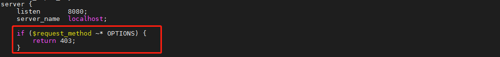

# 安全设置

[TOC]

## 禁用 OPTIONS

在 nginx.conf 配置文件中，增加如下内容：

```bash
if ($request_method ~* OPTIONS) {
        return 403;
}
```

效果如下：

 

 重启 nginx 服务

```bash
systemctl restart nginx
```

 功能验证

```bash
curl -v -X OPTIONS http://localhost:8080/
```

## 检测到目标 Strict-Transport-Security 响应头缺失

```bash
add_header Strict-Transport-Security "max-age=63072000; includeSubdomains; preload";
```

## 错误页面web应用服务器版本信息泄露

http{} 语句体里面加入

```bash
server_tokens off;
```

## 检测到目标 X-Permitted-Cross-Domain-Policies 响应头缺失

```bash
add_header X-Permitted-Cross-Domain-Policies master-only;
```

## 检测到目标 X-Download-Options 响应头缺失

```bash
add_header X-Download-Options "noopen";
```

## 检测到目标 Referrer-Policy 响应头缺失

```bash
add_header Referrer-Policy origin;
```

## 检测到目标Content-Security-Policy响应头缺失

```bash
add_header Content-Security-Policy "default-src 'self'; style-src * 'unsafe-inline'; img-src * data:; object-src 'self'; script-src * 'unsafe-eval' 'unsafe-inline'; font-src * data:; worker-src * blob:;";
```

