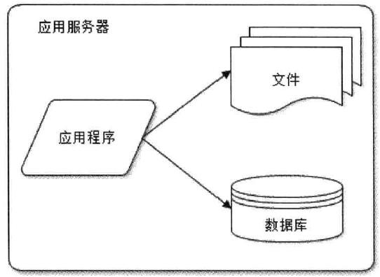
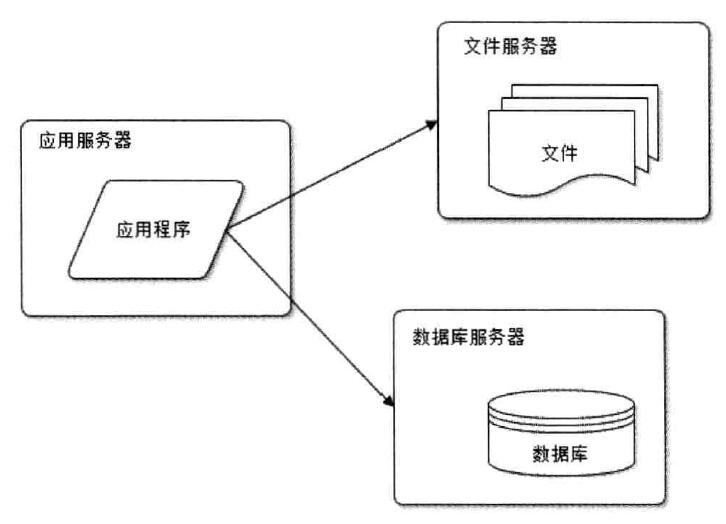
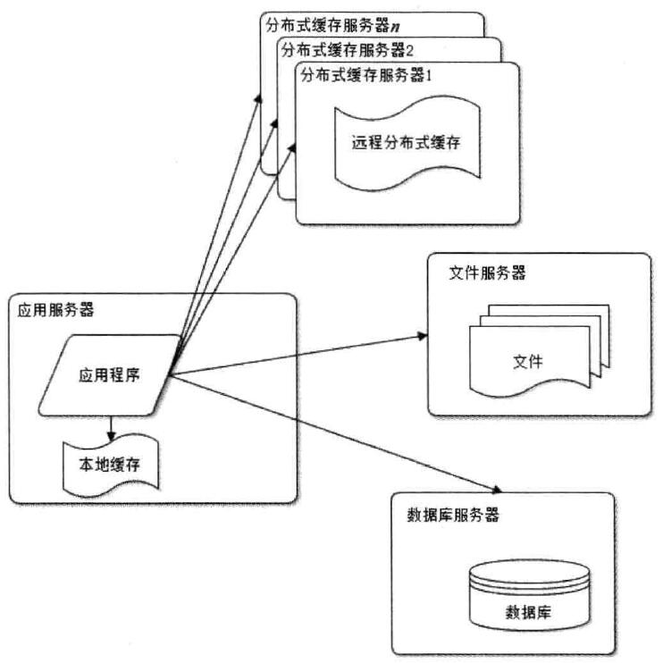
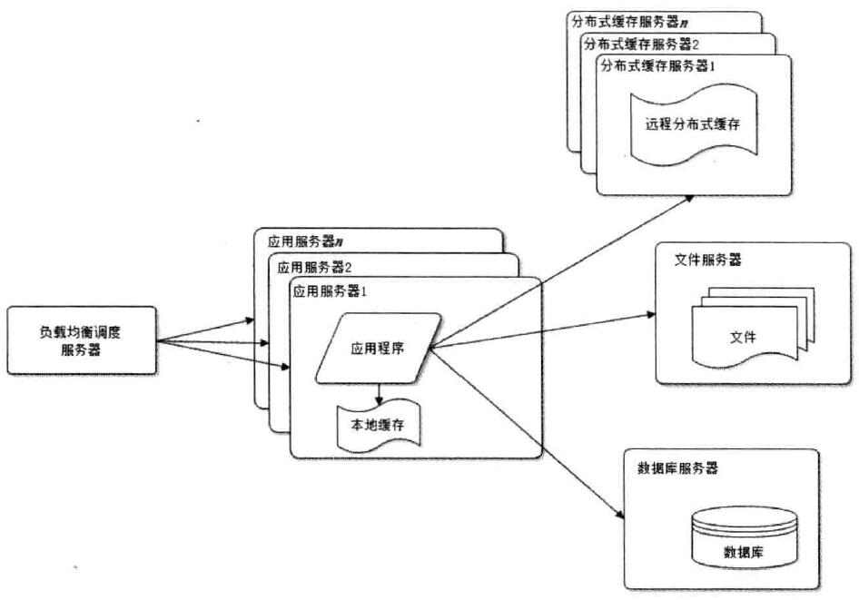
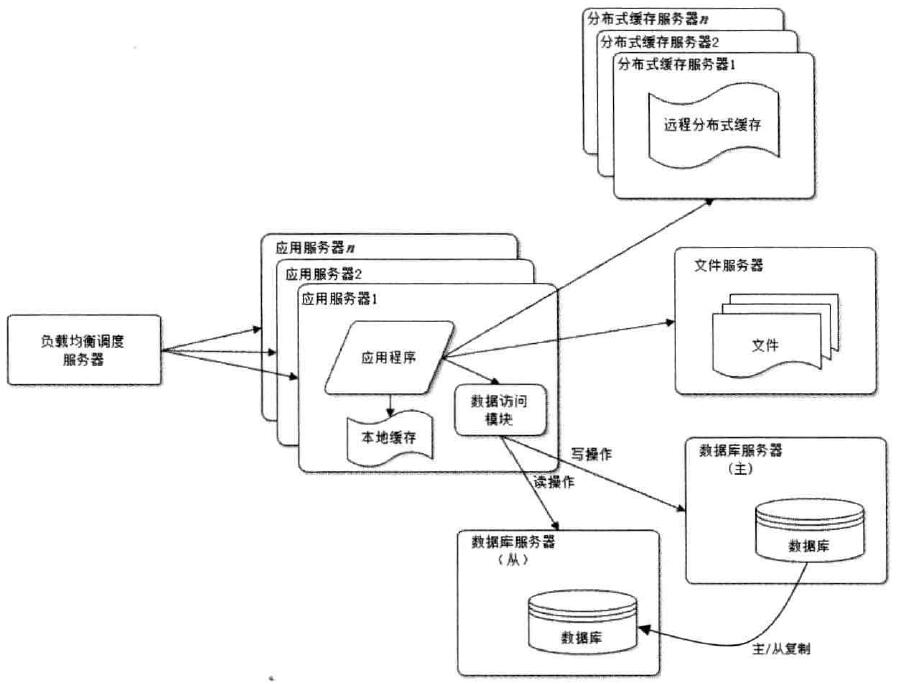
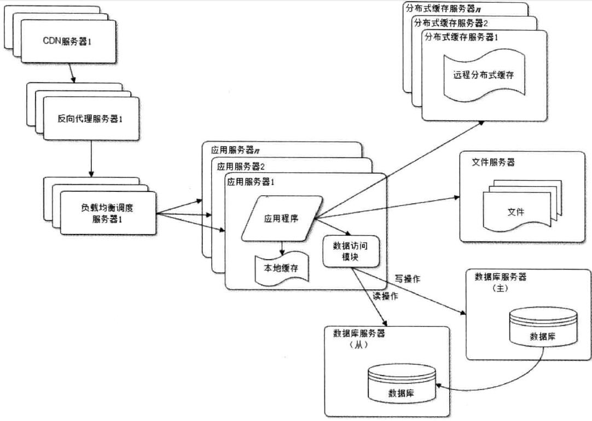
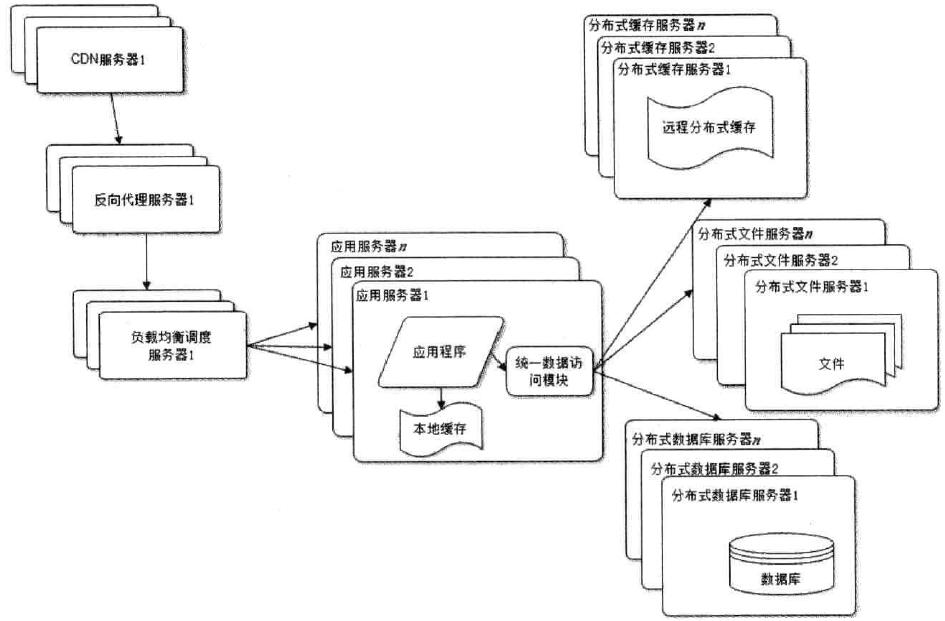
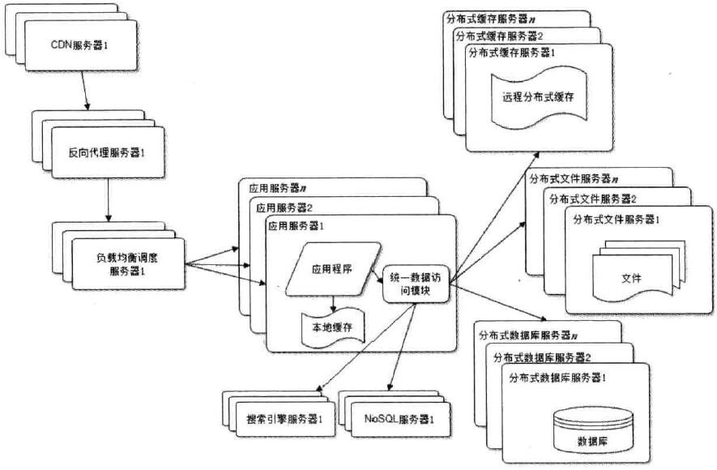
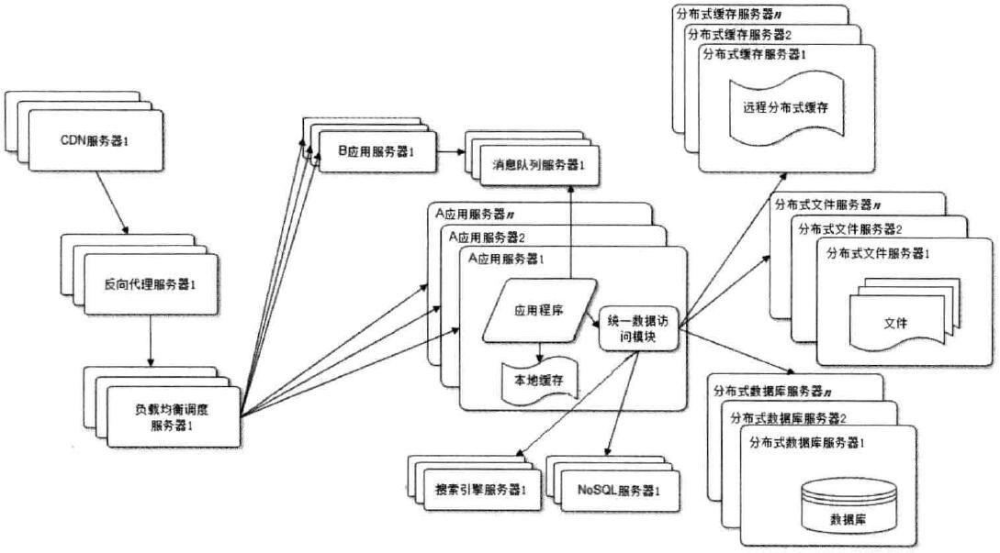
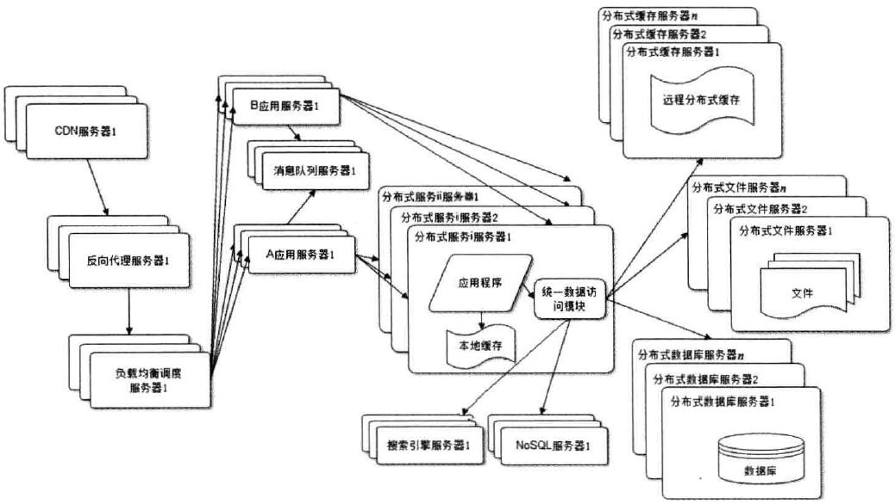

# 大型网站系统

[TOC]

## 特点
1. 高并发，大流量。
2. 高可用
3. 海量数据
4. 用户分布广泛，网络情况复杂
5. 安全环境恶劣
6. 需求快速变更，发布频繁
7. 渐进式发展

## 大型网站架构演化发展历程
1.初始阶段 

2.应用服务和数据服务分离 

3.使用缓存改善网站性能 

4.使用应用服务器集群改善网站的并发处理能力 

5.数据库读写分离 

6.使用反向代理和CDN加速网站

7.使用分布式文件系统和分布式数据库系统

8.使用NoSQL和搜索引擎

9.业务拆分 

10.分布式服务
