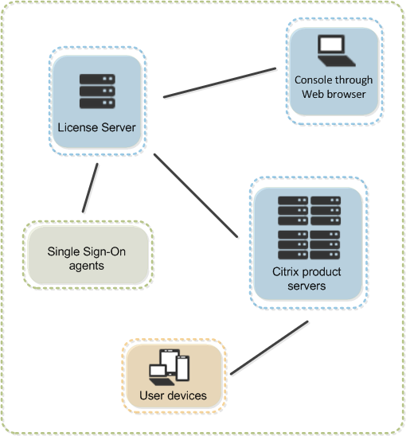
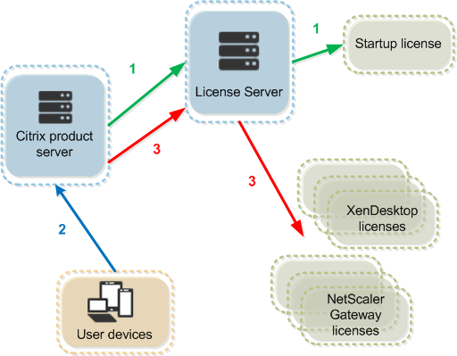

# 技术概述
Citrix Licensing系统包括：

    许可证服务器 - 实现许可证跨网络共享的系统。
    许可证文件 - 许可使用您的产品所需的文件。这些文件存储在许可证服务器中。
    许可证管理控制台 - 用来管理许可证文件和许可证服务器的界面。
    Web Services for Licensing - 允许 Studio、Director 和 Licensing Administration PowerShell Snap-in 与许可证服务器进行通信，让您能够管理用户、分配和安装许可证，让系统显示许可证服务器运行状态、许可证使用情况和其他警报消息。
    Simple License Service - 允许使用 Web 页面界面在许可证服务器上分配和安装许可证文件。
    在 Citrix 产品中与许可证服务器关联的产品端设置。

每个 Citrix 产品环境必须具有至少一个共享的或专用的许可证服务器。许可证服务器是部分或完全专用于存储和管理许可证的计算机。Citrix 产品会在用户尝试连接时向许可证服务器请求许可证。运行 Citrix 产品的服务器会联系许可证服务器来获取许可证。 

许可证文件必须位于与正在许可的产品相关联的许可证服务器上，并且该产品必须配置为与该特定许可证服务器进行通信。许可证管理控制台提供许可证服务器的用户界面，方便您管理和监视 Citrix 许可证。可以查看许可证和警报控制板、导入许可证文件并管理许可证服务器设置。

许可证签出过程有三个阶段。

Citrix 产品通过三个步骤来签出许可证：

    1.在启动时，运行 Citrix 产品的计算机签出启动许可证。
    2.客户端设备连接至产品服务器。
    3.产品从许可证服务器请求许可证。

**宽限期**  
在 Citrix 产品签出启动许可证以后，产品和许可证服务器每隔五分钟交换一次“检测信号”消息，以互相表示自身仍然正常运行。如果产品和许可证服务器无法发送或接收检测信号，产品会进入许可宽限期，并通过缓存的信息对自身进行许可。宽限期由 Citrix 设置。通常为 30 天，但也可能因产品而异。Windows 事件日志及其他产品内消息，指示产品是否已进入宽限期以及宽限期所剩小时数。如果宽限期用完，产品会停止接受连接。在产品和许可证服务器重新建立通信后，宽限期会被重置。  

**许可证服务器组件**

    Citrix 供应商守护程序
    许可证管理控制台
    许可证文件
    选项文件
    启动许可证
    Web Services for Licensing
    Simple License Service
