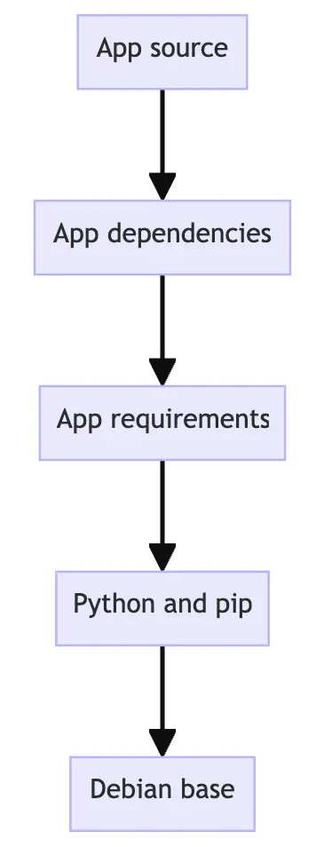
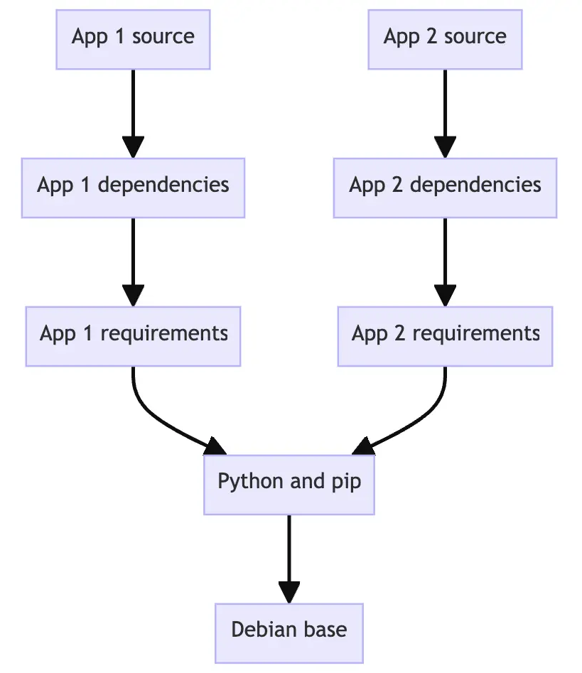

# 镜像

[TOC]

## 概述

镜像有两个重要原则：

1. 镜像是不可变的。镜像一经创建，便无法修改您只能制作新镜像或在其上添加更改。
2. 容器镜像由多个层组成。每一层代表一组文件系统更改，用于添加、删除或修改文件。

这两个原则允许您扩展或添加到现有镜像中。例如，如果正在构建 Python 应用程序，则可以从 Python 镜像开始并添加其他层以安装应用程序的依赖项并添加代码。这使您可以专注于您的应用程序，而不是 Python 本身。

## 搜索镜像

打开终端并使用 `docker search` 命令搜索镜像：

```bash
docker search docker/welcome-to-docker
```

将看到如下所示的输出：

```bash
NAME                       DESCRIPTION                                     STARS     OFFICIAL
docker/welcome-to-docker   Docker image for new users getting started w…   20
```

此输出显示有关 Docker Hub 上可用相关图像的信息。

## 下载镜像

使用 `docker pull` 命令拉取图像。

```bash
docker pull docker/welcome-to-docker
```

将看到如下所示的输出：

```bash
Using default tag: latest
latest: Pulling from docker/welcome-to-docker
579b34f0a95b: Download complete
d11a451e6399: Download complete
1c2214f9937c: Download complete
b42a2f288f4d: Download complete
54b19e12c655: Download complete
1fb28e078240: Download complete
94be7e780731: Download complete
89578ce72c35: Download complete
Digest: sha256:eedaff45e3c78538087bdd9dc7afafac7e110061bbdd836af4104b10f10ab693
Status: Downloaded newer image for docker/welcome-to-docker:latest
docker.io/docker/welcome-to-docker:latest
```

每一行代表镜像的不同下载层。请记住，每一层都是一组文件系统更改，并提供镜像的功能。

## 查看图像

使用 `docker image ls` 命令列出您下载的镜像：

```bash
docker image ls
```

将看到如下所示的输出：

```bash
REPOSITORY                 TAG       IMAGE ID       CREATED        SIZE
docker/welcome-to-docker   latest    eedaff45e3c7   4 months ago   29.7MB
```

The command shows a list of Docker images currently available on your system. The `docker/welcome-to-docker` has a total size of approximately 29.7MB.
该命令显示系统上当前可用的 Docker 映像列表。`docker/welcome-to-docker` 总大小约为 29.7MB。

> **镜像尺寸**
>
> The image size represented here reflects the uncompressed size of the image, not the download size of the layers.
> 此处表示的镜像大小反映了镜像的未压缩大小，而不是图层的下载大小。

使用以下 `docker image history` 命令列出镜像的图层：

```bash
docker image history docker/welcome-to-docker
```

将看到如下所示的输出：

```bash
IMAGE          CREATED        CREATED BY                                      SIZE      COMMENT
648f93a1ba7d   4 months ago   COPY /app/build /usr/share/nginx/html # buil…   1.6MB     buildkit.dockerfile.v0
<missing>      5 months ago   /bin/sh -c #(nop)  CMD ["nginx" "-g" "daemon…   0B
<missing>      5 months ago   /bin/sh -c #(nop)  STOPSIGNAL SIGQUIT           0B
<missing>      5 months ago   /bin/sh -c #(nop)  EXPOSE 80                    0B
<missing>      5 months ago   /bin/sh -c #(nop)  ENTRYPOINT ["/docker-entr…   0B
<missing>      5 months ago   /bin/sh -c #(nop) COPY file:9e3b2b63db9f8fc7…   4.62kB
<missing>      5 months ago   /bin/sh -c #(nop) COPY file:57846632accc8975…   3.02kB
<missing>      5 months ago   /bin/sh -c #(nop) COPY file:3b1b9915b7dd898a…   298B
<missing>      5 months ago   /bin/sh -c #(nop) COPY file:caec368f5a54f70a…   2.12kB
<missing>      5 months ago   /bin/sh -c #(nop) COPY file:01e75c6dd0ce317d…   1.62kB
<missing>      5 months ago   /bin/sh -c set -x     && addgroup -g 101 -S …   9.7MB
<missing>      5 months ago   /bin/sh -c #(nop)  ENV PKG_RELEASE=1            0B
<missing>      5 months ago   /bin/sh -c #(nop)  ENV NGINX_VERSION=1.25.3     0B
<missing>      5 months ago   /bin/sh -c #(nop)  LABEL maintainer=NGINX Do…   0B
<missing>      5 months ago   /bin/sh -c #(nop)  CMD ["/bin/sh"]              0B
<missing>      5 months ago   /bin/sh -c #(nop) ADD file:ff3112828967e8004…   7.66MB
```

此输出显示所有图层、其大小以及用于创建图层的命令。

> **查看完整命令**
>
> Note that, since  the output is in a table-like format, longer commands will cause the  output to be very difficult to navigate.
> 如果将标志 `--no-trunc` 添加到命令中，将看到完整的命令。请注意，由于输出采用类似表格的格式，因此较长的命令将导致输出非常难以导航。

## 构建并推送镜像

现在，已经更新了应用，可以为应用程序创建容器镜像并将其共享到 Docker Hub。为此，需要执行以下操作：

1. 使用 Docker 帐户登录。
2. 在 Docker Hub 上创建镜像仓库。
3. 构建容器镜像。
4. 将镜像推送到 Docker Hub 。

### 使用 Docker 帐户登录

要将映像推送到 Docker Hub，需要使用 Docker 帐户登录。

1. 打开 Docker 仪表板。
2. 选择右上角的“登录”。
3. 如果需要，请创建一个帐户，然后完成登录流程。

完成后，应该会看到“登录”按钮变成个人资料图片。

### 创建镜像仓库

现在已经有了一个帐户，可以创建镜像存储库。

1. 转到 Docker Hub。
2. 选择“创建存储库”。
3. 在“创建存储库”页上，输入以下信息：
   - **Repository name** - `getting-started-todo-app` 
   - **Short description** - 简短描述 - 如果您愿意，请随时输入描述
   - **Visibility** - 可见性 - 选择“公共”以允许其他人拉取您自定义的应用
4. 选择“创建”以创建存储库。

### 构建并推送镜像

#### CLI

首先，将项目克隆或下载为 [ZIP](https://github.com/docker/getting-started-todo-app/archive/refs/heads/main.zip) 文件到本地计算机。

```bash
git clone https://github.com/docker/getting-started-todo-app
```

克隆项目后，导航到克隆创建的新目录：

```bash
cd getting-started-todo-app
```

通过运行以下命令来生成项目，并使用您的用户名替换 `DOCKER_USERNAME` 。

```bash
docker build -t DOCKER_USERNAME/getting-started-todo-app .
```

例如，如果 Docker 用户名是 `mobydock` ，将运行以下命令：

```bash
docker build -t mobydock/getting-started-todo-app .
```

要验证映像在本地是否存在，可以使用以下 `docker image ls` 命令：

```bash
docker image ls
```

将看到类似于以下内容的输出：

```bash
REPOSITORY                          TAG       IMAGE ID       CREATED          SIZE
mobydock/getting-started-todo-app   latest    1543656c9290   2 minutes ago    1.12GB
...
```

要推送映像，请使用 `docker push` 命令。请务必替换 `DOCKER_USERNAME` 为您的用户名：

```bash
docker push DOCKER_USERNAME/getting-started-todo-app
```

根据您的上传速度，这可能需要一些时间才能推送。

#### VS Code


在“文件”菜单中，选择“打开文件夹”。选择 Clone Git Repository 并粘贴此 URL：https://github.com/docker/getting-started-todo-app

 

右键单击 `Dockerfile` 并选择 Build Image... 菜单项。


在显示的对话框中，输入名称 `DOCKER_USERNAME/getting-started-todo-app` ，替换 `DOCKER_USERNAME` 为您的 Docker 用户名。

按 Enter 键后，会看到一个终端出现在将进行构建的位置。完成后，请随时关闭终端。

通过在左侧导航菜单中选择 Docker 徽标，打开 VS Code 的 Docker 扩展。

找到创建的镜像。它的名称为 `docker.io/DOCKER_USERNAME/getting-started-todo-app` 。

展开图像以查看镜像的标签（或不同版本）。应该看到一个名为 `latest` 的标签，这是为镜像提供的默认标签。

右键单击最新项目，然后选择 Push...选择。


Press **Enter** to confirm and then watch as your image is pushed to Docker Hub.  Depending on your upload speeds, it might take a moment to push the  image.
按 Enter 键确认，然后镜像将被推送到 Docker Hub。根据上传速度，可能需要一些时间才能完成。上传完成后，请随时关闭终端。

## 镜像层 image layers 

容器镜像由层组成。这些层中的每一层一旦创建，都是不可变的。

镜像中的每一层都包含一组文件系统更改 - 添加、删除或修改。让我们看一个理论镜像：

1. 第一层添加基本命令和包管理器，例如 apt 。
2. 第二层安装 Python 运行时和 pip 用于依赖项管理。
3. 第三层复制应用程序的特定 requirements.txt 文件。
4. 第四层安装该应用程序的特定依赖项。
5. 第五层复制应用程序的实际源代码。

此示例可能如下所示：

 

This is beneficial because it allows layers to be reused between images. For example, imagine you wanted to create another Python application. Due  to layering, you can leverage the same Python base. This will make  builds faster and reduce the amount of storage and bandwidth required to distribute the images. The image layering might look similar to the  following:
这是有益的，因为它允许在镜像之间重复使用层。例如，假设想要创建另一个 Python 应用程序。由于分层，可以利用相同的 Python 基础。这将使构建速度更快，并减少分发镜像所需的存储量和带宽。镜像分层可能类似于以下内容：

 

通过层，可以通过重用其他层的基础层来扩展其他层的镜像，从而仅允许您添加应用程序所需的数据。

### 堆叠镜像层

Layering is made possible by content-addressable storage and union filesystems. 内容可寻址存储和联合文件系统使分层成为可能。工作原理：

1. 下载每一层后，它被解压缩到主机文件系统上自己的目录中。
2. 当从镜像运行容器时，将创建一个联合文件系统，其中层堆叠在一起，从而创建新的统一视图。
3. When the container starts, its root directory is set to the location of this unified directory, using `chroot`.
   当容器启动时，其根目录将设置为此统一目录的位置，使用 `chroot` .

When the union filesystem is created, in addition to the image layers, a  directory is created specifically for the running container. 创建联合文件系统时，除了镜像层之外，还会专门为正在运行的容器创建一个目录。这允许容器进行文件系统更改，同时允许原始镜像层保持不变。这使您能够从同一底层镜像运行多个容器。

### 示例

在本实践指南中，将使用该 `docker container commit` 命令手动创建新的镜像图层。请注意，很少以这种方式创建映像，因为通常会使用 Dockerfile 。但是，它使人们更容易理解这一切是如何工作的。

#### 创建基础映像

在第一步中，将创建自己的基础映像，然后将该映像用于后续步骤。

下载并安装 Docker Desktop。

在终端中，运行以下命令以启动新容器：

```bash
 docker run --name=base-container -ti ubuntu
```

下载镜像并启动容器后，应该会看到一个新的 shell 提示符。它正在容器内运行。它看起来类似于以下内容（容器 ID 会有所不同）：

```bash
root@d8c5ca119fcd:/#
```

在容器内部，运行以下命令以安装 Node.js：

```bash
 apt update && apt install -y nodejs
```

In the context of the union filesystem, these filesystem changes occur  within the directory unique to this container.
当此命令运行时，会在容器内下载并安装 Node 。在联合文件系统的上下文中，这些文件系统更改发生在此容器唯一的目录中。

通过运行以下命令验证是否已安装 Node：

```bash
 node -e 'console.log("Hello world!")'
```

然后，应该会在控制台中看到 “Hello world！”。

现在，已安装 Node，可以将所做的更改保存为新的镜像层，从中可以启动新容器或构建新镜像。为此，将使用 `docker container commit` 命令。在新终端中运行以下命令：

```bash
 docker container commit -m "Add node" base-container node-base
```

使用 `docker image history` 命令查看镜像的层：

```bash
 docker image history node-base
```

将看到类似于以下内容的输出：

```bash
IMAGE          CREATED          CREATED BY                                      SIZE      COMMENT
d5c1fca2cdc4   10 seconds ago   /bin/bash                                       126MB     Add node
2b7cc08dcdbb   5 weeks ago      /bin/sh -c #(nop)  CMD ["/bin/bash"]            0B
<missing>      5 weeks ago      /bin/sh -c #(nop) ADD file:07cdbabf782942af0…   69.2MB
<missing>      5 weeks ago      /bin/sh -c #(nop)  LABEL org.opencontainers.…   0B
<missing>      5 weeks ago      /bin/sh -c #(nop)  LABEL org.opencontainers.…   0B
<missing>      5 weeks ago      /bin/sh -c #(nop)  ARG LAUNCHPAD_BUILD_ARCH     0B
<missing>      5 weeks ago      /bin/sh -c #(nop)  ARG RELEASE                  0B
```

请注意第一行的“添加节点”注释。此层包含刚刚进行的 Node.js 安装。

为了证明镜像已安装 Node，可以使用此新镜像启动一个新容器：

```bash
 docker run node-base node -e "console.log('Hello again')"
```

这样，应该在终端中得到 “Hello again” 输出，显示 Node 已安装并正在运行。

现在，已完成创建基础镜像，可以删除该容器：

```bash
docker rm -f base-container
```

> **基础镜像定义**
>
> 基础镜像是构建其他镜像的基础。可以将任何镜像用作基础镜像。但是，有些镜像是有意创建的，作为构建基块，为应用程序提供基础或起点。
>
> 在此示例中，可能不会部署此 `node-base` 映像，因为它实际上尚未执行任何操作。但它是可以用于其他构建的基础。

#### 构建应用镜像

现在，已经有了基础映像，可以扩展该映像以构建其他映像。

使用新创建的节点基础映像启动新容器：

```bash
 docker run --name=app-container -ti node-base
```

在此容器内部，运行以下命令以创建 Node 程序：

```bash
 echo 'console.log("Hello from an app")' > app.js
```

要运行此 Node 程序，可以使用以下命令并查看屏幕上打印的消息：

```bash
 node app.js
```

在另一个终端中，运行以下命令以将此容器的更改另存为新映像：

```bash
 docker container commit -c "CMD node app.js" -m "Add app" app-container sample-app
```

此命令不仅会创建一个名为 `sample-app` 的新镜像，还会向镜像添加额外的配置，以在启动容器时设置默认命令。在这种情况下，将其设置为自动运行 `node app.js` 。

在容器外部的终端中，运行以下命令以查看更新的层：

```bash
 docker image history sample-app
```

然后，将看到如下所示的输出。请注意，顶层注释包含“添加应用”，下一层包含“添加节点”：

```bash
IMAGE          CREATED              CREATED BY                                      SIZE      COMMENT
c1502e2ec875   About a minute ago   /bin/bash                                       33B       Add app
5310da79c50a   4 minutes ago        /bin/bash                                       126MB     Add node
2b7cc08dcdbb   5 weeks ago          /bin/sh -c #(nop)  CMD ["/bin/bash"]            0B
<missing>      5 weeks ago          /bin/sh -c #(nop) ADD file:07cdbabf782942af0…   69.2MB
<missing>      5 weeks ago          /bin/sh -c #(nop)  LABEL org.opencontainers.…   0B
<missing>      5 weeks ago          /bin/sh -c #(nop)  LABEL org.opencontainers.…   0B
<missing>      5 weeks ago          /bin/sh -c #(nop)  ARG LAUNCHPAD_BUILD_ARCH     0B
<missing>      5 weeks ago          /bin/sh -c #(nop)  ARG RELEASE                  0B
```

最后，使用全新的图像启动一个新容器。由于指定了默认命令，因此可以使用以下命令：

```bash
 docker run sample-app
```

应该看到问候语出现在终端中，来自 Node 程序。

现在，已完成容器使用，可以使用以下命令删除它们：

```bash
docker rm -f app-container
```