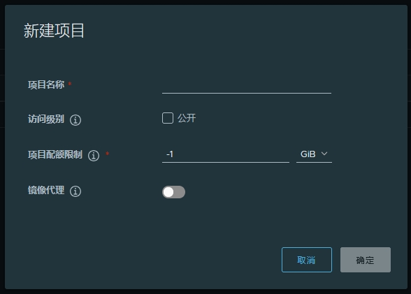
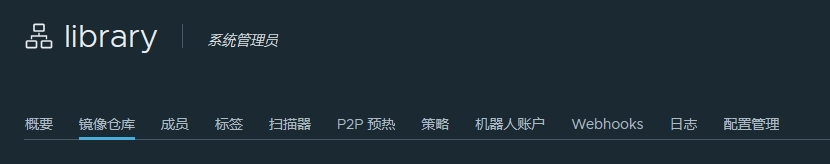

# 使用手册

[TOC]

## 创建项目

Harbor 中的项目包含应用程序的所有仓库。在创建项目之前，无法将镜像推送到 Harbor 。基于角色的访问控制 （RBAC） 应用于项目，因此只有具有适当角色的用户才能执行某些操作。

Harbor 中有两种类型的项目：

- **Public**       任何用户都可以从此项目拉取镜像。这是与他人共享仓库的便捷方式。
- **Private**     只有项目成员才能拉取镜像。

Harbor 系统管理员也可以创建代理缓存项目。

可以创建不同的项目，将用户分配到这些项目，以便他们可以推送和拉取镜像存储库。还可以配置特定于项目的设置。首次部署 Harbor 时，将创建一个名为 `library` 的默认公共项目。

### 先决条件

使用 Harbor 管理员或项目管理员账号登录 Harbor。

### 步骤

1. 转到“项目”，然后单击“新建项目”。
   
2. 为项目提供名称。
   
3. （可选）选中 **公开** 复选框以将项目设为公共。
   
   如果将项目设置为 **公开** ，则任何用户都可以从此项目拉取镜像。如果将项目设置为 **Private**，则只有属于项目成员的用户才能拉取镜像。在创建项目后，可以随时将项目从公共切换到私有，反之亦然。
   
     

4. 单击“确定”。

项目创建完成后，可以使用导航选项卡浏览摘要、仓库、helm chart、成员、标签、扫描器、p2p 预热、策略、机器人账户、日志和配置管理。

  

有两个视图可以显示仓库，列表视图和卡片视图，可以通过单击相应的图标在它们之间切换。

  

可以通过单击“配置”来更改项目属性。

- 要使项目下的所有仓库可供所有人访问，请选中该 `Public` 复选框。
- 为防止拉取项目下未签名的镜像，请选中该 `Prevent vulnerable images from running` 复选框。

   

## 搜索项目、仓库和 Helm 图表

在顶部的搜索字段中输入关键字会列出所有匹配的项目、仓库和 helm 图表。搜索结果包括您有权访问的公共仓库和私有仓库。

  

## 将用户分配给项目

You can add individual users to an existing project and assign a role to  them. You can add an LDAP/AD or OIDC user to the project members if you  use LDAP/AD or OIDC authentication, or a user that you have already  created if you use database authentication. If you use LDAP/AD or OIDC  authentication, you can add groups to projects and assign a role to the  group.
您可以将单个用户添加到现有项目中，并为其分配角色。如果使用 LDAP/AD 或 OIDC 身份验证，则可以将 LDAP/AD 或 OIDC  用户添加到项目成员中，如果使用数据库身份验证，则可以将已创建的用户添加到项目成员中。如果您使用 LDAP/AD 或 OIDC  身份验证，则可以将组添加到项目中，并为该组分配角色。

For more information about users and roles in Harbor, see  [User Permissions By Role](https://goharbor.io/docs/2.11.0/administration/managing-users/user-permissions-by-role/).
有关 Harbor 中的用户和角色的更多信息，请参阅按角色划分的用户权限。

### Add Individual Members to Projects 将单个成员添加到项目中

1. Log in to the Harbor interface with an account that has at least project administrator privileges.
   使用至少具有项目管理员权限的帐户登录 Harbor 界面。

2. Go to **Projects** and select a project.
   转到“项目”，然后选择一个项目。

3. Select the **Members** tab and click **+User**.
   选择“成员”选项卡，然后单击“+用户”。

   

   ​      

   

4. Enter the name of an existing database, LDAP/AD, or OIDC user and select a role for this user.
   输入现有数据库、LDAP/AD 或 OIDC 用户的名称，并为此用户选择一个角色。

   

   ​      

   

5. Optionally select one or more members, click **Action**, and select a different role for the user or users, or select **Remove** to remove them from the project.
   （可选）选择一个或多个成员，单击“操作”，然后为一个或多个用户选择不同的角色，或选择“删除”以将其从项目中移除。

   

   ​      

   

### 将 LDAP/AD 组添加到项目中

1. Log in to the Harbor interface with an account that has at least project administrator privileges.
   使用至少具有项目管理员权限的帐户登录 Harbor 界面。

2. Go to **Projects** and select a project.
   转到“项目”，然后选择一个项目。

3. Select the **Members** tab and click **+Group**.
   选择“成员”选项卡，然后单击“+组”。

   

   ​      

   

4. Enter the name of a group that you have already used in Harbor and assign a role to that group.
   输入已在 Harbor 中使用过的组的名称，并为该组分配角色。

   

   ​      

   

Once an LDAP group has been assigned a role in a project, all LDAP/AD users  in this group have the privileges of the role you assigned to the group. If a user has both user-level role and group-level role, these  privileges are merged.
在项目中为 LDAP 组分配角色后，此组中的所有 LDAP/AD 用户都具有您分配给该组的角色的权限。如果用户同时具有用户级角色和组级角色，则这些权限将合并。

If a user in the LDAP group has admin privilege, the user has the same privileges as the Harbor system administrator.
如果 LDAP 组中的用户具有管理员权限，则该用户具有与 Harbor 系统管理员相同的权限。

### 将 OIDC 组添加到项目

To be able to add OIDC groups to projects, your OIDC provider and Harbor  instance must be configured correctly. For information about how to  configure OIDC so that Harbor can use groups, see  [OIDC Provider Authentication](https://goharbor.io/docs/2.11.0/administration/configure-authentication/oidc-auth/).
为了能够将 OIDC 组添加到项目中，必须正确配置 OIDC 提供商和 Harbor 实例。有关如何配置 OIDC 以便 Harbor 可以使用组的信息，请参阅 OIDC 提供商身份验证。

1. Log in to the Harbor interface with an account that has at least project administrator privileges.
   使用至少具有项目管理员权限的帐户登录 Harbor 界面。

2. Go to **Projects** and select a project.
   转到“项目”，然后选择一个项目。

3. Select the **Members** tab and click **+Group**.
   选择“成员”选项卡，然后单击“+组”。

   

   ​      

   

4. Enter the name of a group that already exists in your OIDC provider and assign a role to that group.
   输入 OIDC 提供商中已存在的组的名称，并为该组分配角色。

   

   ​      

   

​                        

​                 Unlike with LDAP groups, Harbor cannot check whether OIDC groups exist when you add them to a project. If you mistype the group name, or if the group does not exist in your OIDC provider, Harbor still creates the group.      
与 LDAP 组不同，当您将 OIDC 组添加到项目中时，Harbor 无法检查它们是否存在。如果您输入了错误的组名称，或者您的 OIDC 提供商中不存在该组，Harbor 仍会创建该组。

## 项目配置

After the initial creation of a project, you can configure or reconfigure its properties in the **Configuration** tab for that project.
初始创建项目后，您可以在该项目的“配置”选项卡中配置或重新配置其属性。

1. Log in to the Harbor interface with an account that has at least project administrator privileges.
   使用至少具有项目管理员权限的帐户登录 Harbor 界面。
2. Go to **Projects** and select a project.
   转到“项目”，然后选择一个项目。
3. Select the **Configuration** tab.
   选择“配置”选项卡。
4. To make all repositories under the project accessible to everyone, select the `Public` checkbox, or deselect this checkbox to make the project private.
   要使项目下的所有仓库对所有人开放，请选中该 `Public` 复选框，或取消选中此复选框以将项目设为私有。
5. To prevent un-signed images under the project from being pulled, select the `Prevent vulnerable images from running` checkbox.
   为防止拉取项目下未签名的图片，请选中该 `Prevent vulnerable images from running` 复选框。


​      

### Searching projects and repositories 搜索项目和仓库

Enter a keyword in the search field at the top to list all matching projects  and repositories. The search result includes both public and private  repositories you have access to.
在顶部的搜索字段中输入关键字以列出所有匹配的项目和存储库。搜索结果包括您有权访问的公共仓库和私有仓库。


​      

### Configure Vulnerability Settings in Projects 在项目中配置漏洞设置

You can configure projects so that images with vulnerabilities cannot be  run, and to automatically scan images as soon as they are pushed into  the project.
您可以配置项目，使有漏洞的镜像无法运行，并在镜像推送到项目后立即自动扫描镜像。

1. Log in to the Harbor interface with an account that has at least project administrator privileges.
   使用至少具有项目管理员权限的帐户登录 Harbor 界面。

2. Go to **Projects** and select a project.
   转到“项目”，然后选择一个项目。

3. Select the **Configuration** tab.
   选择“配置”选项卡。

4. To prevent vulnerable images under the project from being pulled, select the **Prevent vulnerable images from running** checkbox.
   为防止拉取项目下的易受攻击镜像，请勾选“阻止易受攻击的镜像运行”复选框。

   

   ​      

   

5. Select the severity level of vulnerabilities to prevent images from running.
   选择漏洞的严重性级别，阻止镜像运行。

   

   ​      

   

   Images cannot be pulled if their level is equal to or higher than the selected level of severity. Harbor does not prevent images with a vulnerability  severity of `negligible` from running.
   如果图像的级别等于或高于所选的严重性级别，则无法拉取图像。Harbor 不会阻止漏洞严重性为 的 `negligible` 镜像运行。

6. To activate an immediate vulnerability scan on new images that are pushed to the project, select the **Automatically scan images on push** check box.
   要在推送到项目的新图像上激活立即漏洞扫描，请选中 Automatically scan images on push 复选框。

   

   ​      

   

Harbor also supports additional deployment security options, allowing you to  [implement content trust](https://goharbor.io/docs/2.11.0/working-with-projects/project-configuration/implementing-content-trust/) on your Harbor instance.
Harbor 还支持其他部署安全选项，允许您在 Harbor 实例上实施内容信任。

### Build history 构建历史记录

Build history makes it easy to see the contents of a container image, find  the code which builds an image, or locate the image for a source  repository.
通过生成历史记录，可以轻松查看容器映像的内容、查找生成映像的代码或查找源存储库的映像。

In Harbor portal, enter your project, select the repository, click on the  link of artifact you’d like to see its build history, the detail page  will be opened. Then switch to `Build History` tab, you can see the build history information.
在 Harbor 门户中，输入您的项目，选择存储库，单击您想要查看其构建历史记录的工件链接，详细信息页面将打开。然后切换到 `Build History` 选项卡，您可以看到构建历史记录信息。


​      

### 访问和搜索项目日志

Harbor keeps a log of all of the operations that users perform in a project.  You can apply filters to help you to search the logs.
Harbor 会记录用户在项目中执行的所有操作。您可以应用过滤器来帮助您搜索日志。

#### Prerequisites 先决条件

Log in to Harbor with a Harbor administrator, project administrator, maintainer, developer, or guest account.
使用 Harbor 管理员、项目管理员、维护者、开发者或访客账户登录 Harbor。

#### Procedure 程序

1. Go to **Projects**, select a project, and select **Logs**.
   转到“项目”，选择一个项目，然后选择“日志”。

   

   ​      

   

   All logs for the project are displayed.
   将显示项目的所有日志。

2. Click the **Search** icon and start typing to filter the logs by name.
   单击“搜索”图标，然后开始键入以按名称筛选日志。

   

   ​      

   

3. Click **Advanced**. 单击“高级”。

   

   ​      

   

4. Use the **Operations** drop-down menu to filter by operation type.
   使用“操作”下拉菜单按操作类型进行筛选。

   

   ​      

   

5. Click the calendar icons to enter dates between which to search for logs of the types you set in the **Operations** drop-down menu.
   单击日历图标以输入日期，以在该日期之间搜索您在“操作”下拉菜单中设置的类型的日志。

   

   ​      

### 创建 Project Robot 帐户

Harbor allows you to use a project robot account to automate running operations for a project including,
Harbor 允许您使用项目机器人帐户来自动化项目的运行操作，包括：


​      


A project robot account authenticates to your Harbor instance using a  secret, allowing you to connect to your Harbor instance through the OCI  client or Harbor API to automate tasks. Robot Accounts cannot log in to  the Harbor interface.
项目机器人账户使用密钥对您的 Harbor 实例进行身份验证，允许您通过 OCI 客户端或 Harbor API 连接到 Harbor 实例以自动执行任务。机器人账号无法登录 Harbor 界面。

A project robot account can only perform actions within the project that  it is created in, however, Harbor v2.2 introduces the ability for system administrators to create system robot accounts in addition to creating  project robot account that can automate tasks across multiple projects.  Read more about  [system level robot accounts](https://goharbor.io/docs/2.11.0/administration/robot-accounts/).
项目机器人账户只能在创建它的项目中执行操作，但是，Harbor v2.2 除了创建可以跨多个项目自动执行任务的项目机器人账户外，还为系统管理员引入了创建系统机器人账户的功能。阅读有关系统级机器人帐户的更多信息。

​                        

​                 Harbor 2.2 introduced changes to project robot accounts that  impact existing robot accounts created in Harbor versions before v2.2.  Read more about [legacy robot accounts](https://goharbor.io/docs/2.11.0/working-with-projects/project-configuration/create-robot-accounts/#legacy-robot-accounts).      
Harbor 2.2 对项目机器人账户进行了更改，这些更改会影响在 v2.2 之前的 Harbor 版本中创建的现有机器人账户。阅读有关旧版机器人帐户的更多信息。

#### 查看 Project Robot 帐户

1. Log in to the Harbor interface with an account that has at least project administrator privileges.
   使用至少具有项目管理员权限的帐户登录 Harbor 界面。
2. Go to **Projects**, select a project, and select **Robot Accounts**.
   转到“项目”，选择一个项目，然后选择“机器人帐户”。


​      


This page lists all available project robot accounts for a project. The  table lists the following information for each robot account,
此页面列出了项目的所有可用项目机器人帐户。该表列出了每个机器人帐户的以下信息：

- The name of the robot account. This is derived from robot account prefix  configured for your Harbor instance, the project name, and the name  assigned to the robot account when it was created. A robot account name  follows the format `<prefix><project_name>+<account_name>`. If you use the search function on this page, you only need to search for the account name without the prefix.
  机器人帐户的名称。这是从为您的 Harbor 实例配置的机器人账户前缀、项目名称以及创建机器人账户时分配给机器人账户的名称派生而来的。机器人帐户名称遵循以下格式 `<prefix><project_name>+<account_name>` 。如果您在此页面上使用搜索功能，则只需搜索不带前缀的账户名称即可。
- The enabled status shows if an account is enabled or deactivated.
  启用状态显示帐户是启用还是停用。
- Click the **Permission(s)** dropdown to view the permissions granted to the robot account.
  单击“权限”下拉列表以查看授予机器人帐户的权限。
- The created time shows when the robot account was created.
  创建时间显示机器人帐户的创建时间。
- The time until the project robot account expires. This is calculated based  on the created time and the expiration time set when creating the  project robot account.
  项目机器人帐户过期的时间。这是根据创建项目机器人帐户时设置的创建时间和过期时间计算得出的。
- The description of the project robot account.
  项目机器人帐户的描述。

You are only able to see project robot accounts from this page. Harbor  administrators can also see system robot account information on the  [System Robot Account](https://goharbor.io/docs/2.11.0/administration/robot-accounts/) page.
您只能从此页面查看项目机器人帐户。Harbor 管理员还可以在系统机器人账户页面上查看系统机器人账户信息。

####  添加机器人帐户

1. Log in to the Harbor interface with an account that has at least project administrator privileges.
   使用至少具有项目管理员权限的帐户登录 Harbor 界面。

2. Go to **Projects**, select a project, and select **Robot Accounts**.
   转到“项目”，选择一个项目，然后选择“机器人帐户”。

3. Click **New Robot Account**. 单击“新建机器人帐户”。

4. Enter a name and an optional description for this robot account.
   输入此机器人帐户的名称和可选描述。

5. Set expiration time for this robot account, you can also select checkbox **Never Expired** if you want to create a never expiring robot account.
   设置此机器人帐户的过期时间，如果您想创建一个永不过期的机器人帐户，您也可以选择复选框永不过期。

6. Go to the next step to grant permissions to the robot account. You can refer to the  [**Permission References**](https://goharbor.io/docs/2.11.0/administration/robot-accounts/#permission-references) to assign a combination of the project permissions to this robot account.You can use the **Select All** and **Unselect All** buttons to quickly add or remove all permissions from a robot account.
   转到下一步以向机器人帐户授予权限。您可以参考权限参考，将项目权限的组合分配给此机器人帐户。您可以使用“全选”和“取消全选”按钮快速添加或删除机器人帐户的所有权限。

   ​                        

   ​                 The **Push Repository** permission must be assigned with the **Pull Repository** permission. You are not able to assign the Push Repository permission by itself.      
   Push Repository 权限必须与 Pull Repository 权限一起分配。您无法自行分配 Push Repository 权限。

   

   ​      

   ​      

   

7. Click **FINISH**. 单击 FINISH。

8. In the confirmation window, click **Export to File** to download the access token as a JSON file, or click the clipboard icon to copy its contents to the clipboard.
   在确认窗口中，单击“导出到文件”以将访问令牌下载为 JSON 文件，或单击剪贴板图标将其内容复制到剪贴板。

   

   ​      

   

   ​                        

   ​                 Harbor does not store robot secret tokens, so you must either  download the secret or copy and paste its contents into a text file.  There is no way to get the secret from Harbor after you have created the robot account, however you are able refresh the secret after the robot  account is created.      
   Harbor 不存储机器人秘密令牌，因此您必须下载秘密或将其内容复制并粘贴到文本文件中。在创建机器人帐户后，无法从 Harbor 获取密钥，但是您可以在创建机器人帐户后刷新密钥。

   The new robot project account appears as `<prefix><project_name>+<account_name>` in the list of project robot accounts. The prefix is set by your Harbor administrator and is the same for all robot accounts. Read more about  [robot account prefixes](https://goharbor.io/docs/2.11.0/administration/robot-accounts/#configure-robot-account-prefix).
   新的机器人项目帐户将显示在 `<prefix><project_name>+<account_name>` 项目机器人帐户列表中。前缀由 Harbor 管理员设置，对于所有机器人帐户都是相同的。阅读有关机器人帐户前缀的更多信息。

   

   ​      

   

#### Edit, Deactivate, or Delete a Project Robot Account 编辑、停用或删除 Project Robot 帐户

You are able to edit, deactivate, or delete a project robot account.
您可以编辑、停用或删除项目机器人帐户。

1. From a project’s **Robot Account** page, select the checkbox next to the robot account you are updating.
   在项目的“机器人帐户”页面中，选中要更新的机器人帐户旁边的复选框。
2. Select **Action** and then **Edit**, **Deactivate**, or **Delete**.
   选择“操作”，然后选择“编辑”、“停用”或“删除”。


​      

#### Refresh Project Robot Account Secret 刷新 Project Robot 帐户密钥

You can refresh a robot account’s secret after its created in the event that you need a new one.
如果您需要一个新帐户，您可以在创建机器人帐户后刷新其密钥。

1. From the administrator **Robot Account** page, select the checkbox next to the robot account you are updating.
   在管理员机器人帐户页面中，选中要更新的机器人帐户旁边的复选框。

2. Select **Action** and then **Refresh Secret**.
   选择“操作”，然后选择“刷新机密”。

3. By default Harbor will generate a new secret randomly, or you can choose  to enable manually reseting the secret and entering the **New Secret** then **Confirm Secret**. Optionally, you can view the secret by clicking the eye icon.
   默认情况下，Harbor 会随机生成一个新密钥，或者您可以选择启用手动重置密钥并输入新密钥，然后再确认密钥。或者，您可以通过单击眼睛图标来查看密钥。

   

   ​      

   

4. Click **Refresh**. If you created a secret randomly, download the secret JSON file or copy and paste its contents.
   单击“刷新”。如果您随机创建了密钥，请下载密钥 JSON 文件或复制并粘贴其内容。

#### Authenticate with a Project Robot Account 使用 Project Robot 帐户进行身份验证

To use a robot account in an automated process, for example, use `docker login` and provide the credentials of the robot account.
例如，要在自动化过程中使用机器人帐户，请使用 `docker login` 并提供机器人帐户的凭据。

```fallback
docker login <harbor_address>
Username: <prefix><project_name>+<account_name>
Password: <secret>
```

#### Legacy Robot Accounts 传统机器人帐户

Robot accounts created before Harbor v2.2 are considered legacy robot accounts and will appear with a **Legacy** label in the Harbor v2.2 and later interface.
在 Harbor v2.2 之前创建的机器人账户被视为旧版机器人账户，并将在 Harbor v2.2 及更高版本的界面中显示带有 Legacy 标签。

Legacy robot accounts functionality is still available in Harbor 2.2, but it  will be removed in a future version of Harbor. Its strongly recommended  that you recreate your legacy robot accounts as either a project or  system robot accounts after upgrading to Harbor v2.2. Note that there is currently no way to migrate legacy robot accounts into the new format,  you must create a new account.
旧版机器人帐户功能在 Harbor 2.2 中仍然可用，但在 Harbor 的未来版本中将被删除。强烈建议您在升级到 Harbor v2.2  后将旧版机器人账户重新创建为项目或系统机器人账户。请注意，目前无法将旧版机器人帐户迁移到新格式，您必须创建一个新帐户。

Legacy robot accounts functionality
旧版机器人帐户功能

- You are able to perform operations by using the Docker and Helm CLIs. A  Legacy robot account can’t log into the Harbor interface.
  您可以使用 Docker 和 Helm CLI 执行操作。旧版机器人帐户无法登录 Harbor 界面。
- You can’t edit a legacy robot account. You are only able to deactivate or delete legacy robot accounts.
  您无法编辑旧版机器人帐户。您只能停用或删除旧版机器人帐户。
- Available legacy robot accounts permissions are limited to pushing and pulling artifact, and pushing or pulling a Helm Chart.
  可用的旧版机器人帐户权限仅限于推送和拉取工件，以及推送或拉取 Helm Chart。
- Legacy robot accounts use a JWT for authentication. You are not able to  refresh or retrieve a legacy robot account JWT authentication token.
  传统机器人帐户使用 JWT 进行身份验证。您无法刷新或检索旧版机器人帐户 JWT 身份验证令牌。
- Legacy robot accounts names use the prefix `robot$`, for example `robot$<account_name>`
  例如， `robot$<account_name>` 传统机器人帐户名称使用前缀 `robot$` 

### 配置 Webhook 通知

If you are a project administrator, you can configure a connection from a  project in Harbor to a webhook endpoint. If you configure webhooks,  Harbor notifies the webhook endpoint of certain events that occur in the project. Webhooks allow you to integrate Harbor with other tools to  streamline continuous integration and development processes.
如果您是项目管理员，则可以配置 Harbor 中的项目到 Webhook 端点的连接。如果您配置了 Webhook，Harbor 会将项目中发生的某些事件通知 Webhook 端点。Webhook 允许您将 Harbor 与其他工具集成，以简化持续集成和开发流程。

The action that is taken upon receiving a notification from a Harbor  project depends on your continuous integration and development  processes. For example, by configuring Harbor to send a `POST` request to a webhook listener at an endpoint of your choice, you can  trigger a build and deployment of an application whenever there is a  change to an image in the repository.
在收到 Harbor 项目的通知后采取的操作取决于您的持续集成和开发过程。例如，通过将 Harbor 配置为在您选择的端点向 Webhook 侦听器发送请求 `POST` ，您可以在存储库中的图像发生更改时触发应用程序的构建和部署。

#### Supported Events 支持的事件

You can define multiple webhook endpoints per project. Harbor supports two kinds of endpoints currently,  `HTTP`  and `SLACK`. Webhook notifications provide information about events in JSON format and are delivered by `HTTP` or `HTTPS POST` to an existing webhhook endpoint URL or Slack address that you provide. There are 2 JSON formats supported for the webhook payload, `Default` is the format that has always existed, and the data structure has not  changed from the previous versions, except that it has been named, `CloudEvents` is the format which organizes the payload data as following the spec of  [CloudEvents](https://cloudevents.io/). The following table describes the events that trigger notifications and the contents of each notification.
您可以为每个项目定义多个 Webhook 端点。Harbor 目前支持两种类型的端点， `HTTP` 以及 `SLACK` .Webhook 通知以 JSON 格式提供有关事件的信息，并由您提供的现有 webhhook 端点 URL 或 Slack 地址传递 `HTTP` 或 `HTTPS POST` 发送到该地址。webhook 负载支持 2 种 JSON 格式， `Default` 是一直存在的格式，数据结构与以前的版本相比没有变化，只是已被命名， `CloudEvents` 是按照 CloudEvents 的规范组织负载数据的格式。下表描述了触发通知的事件以及每个通知的内容。

| Event 事件                                             | Webhook Event Type Webhook 事件类型 | Contents of Notification 通知内容                            |
| ------------------------------------------------------ | ----------------------------------- | ------------------------------------------------------------ |
| Push artifact to registry 将项目推送到注册表           | `PUSH_ARTIFACT`                     | Repository namespace name, repository name, resource URL, tags, manifest digest,  artifact name, push time timestamp, username of user who pushed artifact 仓库命名空间名称、仓库名称、资源 URL、标签、清单摘要、工件名称、推送时间戳、推送工件的用户用户名 |
| Pull artifact from registry 从注册表拉取项目           | `PULL_ARTIFACT`                     | Repository namespace name, repository name, manifest digest, artifact name, pull  time timestamp, username of user who pulled artifact 存储库命名空间名称、存储库名称、清单摘要、工件名称、拉取时间戳、拉取工件的用户的用户名 |
| Delete artifact from registry 从注册表中删除项目       | `DELETE_ARTIFACT`                   | Repository namespace name, repository name, manifest digest, artifact name,  artifact size, delete time timestamp, username of user who deleted image 存储库命名空间名称、存储库名称、清单摘要、工件名称、工件大小、删除时间戳、删除图像的用户用户名 |
| Artifact scan completed 工件扫描已完成                 | `SCANNING_COMPLETED`                | Repository namespace name, repository name, tag scanned, artifact name, number of  critical issues, number of major issues, number of minor issues, last  scan status, scan completion time timestamp, username of user who  performed scan 存储库命名空间名称、存储库名称、已扫描的标记、工件名称、严重问题数、主要问题数、次要问题数、上次扫描状态、扫描完成时间时间戳、执行扫描的用户用户名 |
| Artifact scan stopped 工件扫描已停止                   | `SCANNING_STOPPED`                  | Repository namespace name, repository name, tag scanned, artifact name, scan status 存储库命名空间名称、存储库名称、已扫描的标记、工件名称、扫描状态 |
| Artifact scan failed 项目扫描失败                      | `SCANNING_FAILED`                   | Repository namespace name, repository name, tag scanned, artifact name, error that occurred, username of user who performed scan 存储库命名空间名称、存储库名称、已扫描的标记、项目名称、发生的错误、执行扫描的用户的用户名 |
| Project quota exceeded 超出项目配额                    | `QUOTA_EXCEED`                      | Repository namespace name, repository name, tags, manifest digest, artifact name,  push time timestamp, username of user who pushed artifact 仓库命名空间名称、仓库名称、标签、清单摘要、工件名称、推送时间戳、推送工件的用户用户名 |
| Project quota near threshold 项目配额接近阈值          | `QUOTA_WARNING`                     | Repository namespace name, repository name, tags, manifest digest, artifact name,  push time timestamp, username of user who pushed artifact 仓库命名空间名称、仓库名称、标签、清单摘要、工件名称、推送时间戳、推送工件的用户用户名 |
| Artifact replication status changed 项目复制状态已更改 | `REPLICATION`                       | Repository namespace name, repository name, tags, manifest digest, artifact name,  push time timestamp, username of user who trigger the replication 仓库命名空间名称、仓库名称、标签、清单摘要、工件名称、推送时间戳、触发复制的用户用户名 |
| Artifact tag retention finished 工件标记保留已完成     | `TAG_RETENTION`                     | Repository namespace name, repository name, the number of total and retained, the rule of retention, deleted artifacts results 仓库命名空间名称、仓库名称、总和保留的数量、保留规则、已删除的工件结果 |

#### Payload Format 有效负载格式

The webhook notification is delivered in JSON format. The following example shows the JSON notification for different event types when using `HTTP` kind endpoint:
Webhook 通知以 JSON 格式传递。以下示例显示了使用 `HTTP` 种类终结点时不同事件类型的 JSON 通知：

##### Artifact pushed 工件推送

*Default 违约*

```json
{
  "type": "PUSH_ARTIFACT",
  "occur_at": 1680501893,
  "operator": "harbor-jobservice",
  "event_data": {
    "resources": [
      {
        "digest": "sha256:954b378c375d852eb3c63ab88978f640b4348b01c1b3456a024a81536dafbbf4",
        "tag": "sha256:954b378c375d852eb3c63ab88978f640b4348b01c1b3456a024a81536dafbbf4",
        "resource_url": "localhost/harbor/alpine@sha256:954b378c375d852eb3c63ab88978f640b4348b01c1b3456a024a81536dafbbf4"
      }
    ],
    "repository": {
      "date_created": 1680501893,
      "name": "alpine",
      "namespace": "harbor",
      "repo_full_name": "harbor/alpine",
      "repo_type": "private"
    }
  }
}
```

*CloudEvents 云事件*

```json
{
  "specversion": "1.0",
  // id is a generated UUID to make sure the unique
  "id": "66e18103-09c1-41f6-982f-37df223f3eeb",
  // requestid is the http request id for tracing the source request of this event
  "requestid": "51c0b694-0168-4f3c-b0db-282565455d7b",
  "source": "/projects/2/webhook/policies/15",
  "type": "harbor.artifact.pushed",
  "datacontenttype": "application/json",
  "time": "2023-04-03T06:04:46Z",
  "data": {
    "resources": [
      {
        "digest": "sha256:954b378c375d852eb3c63ab88978f640b4348b01c1b3456a024a81536dafbbf4",
        "tag": "sha256:954b378c375d852eb3c63ab88978f640b4348b01c1b3456a024a81536dafbbf4",
        "resource_url": "localhost/harbor/alpine@sha256:954b378c375d852eb3c63ab88978f640b4348b01c1b3456a024a81536dafbbf4"
      }
    ],
    "repository": {
      "date_created": 1680501893,
      "name": "alpine",
      "namespace": "harbor",
      "repo_full_name": "harbor/alpine",
      "repo_type": "private"
    }
  },
  "operator": "harbor-jobservice"
}
```

##### Artifact pulled 工件拉取

*Default 违约*

```json
{
  "type": "PULL_ARTIFACT",
  "occur_at": 1680502372,
  "operator": "robot$harbor+wHSYCuGD-Trivy-8e2e7505-d1e6-11ed-9e71-0242ac130009",
  "event_data": {
    "resources": [
      {
        "digest": "sha256:954b378c375d852eb3c63ab88978f640b4348b01c1b3456a024a81536dafbbf4",
        "tag": "sha256:954b378c375d852eb3c63ab88978f640b4348b01c1b3456a024a81536dafbbf4",
        "resource_url": "localhost/harbor/alpine@sha256:954b378c375d852eb3c63ab88978f640b4348b01c1b3456a024a81536dafbbf4"
      }
    ],
    "repository": {
      "date_created": 1680501893,
      "name": "alpine",
      "namespace": "harbor",
      "repo_full_name": "harbor/alpine",
      "repo_type": "private"
    }
  }
}
```

*CloudEvents 云事件*

```json
{
  "specversion": "1.0",
  "id": "718eab63-2efa-4f88-8c27-8bcacc34929b",
  "requestid": "bb4b5b91-aac7-4acd-8dff-e4118e53f6d1"
  "source": "/projects/2/webhook/policies/15",
  "type": "harbor.artifact.pulled",
  "datacontenttype": "application/json",
  "time": "2023-04-03T06:12:52Z",
  "data": {
    "resources": [
      {
        "digest": "sha256:954b378c375d852eb3c63ab88978f640b4348b01c1b3456a024a81536dafbbf4",
        "tag": "sha256:954b378c375d852eb3c63ab88978f640b4348b01c1b3456a024a81536dafbbf4",
        "resource_url": "localhost/harbor/alpine@sha256:954b378c375d852eb3c63ab88978f640b4348b01c1b3456a024a81536dafbbf4"
      }
    ],
    "repository": {
      "date_created": 1680501893,
      "name": "alpine",
      "namespace": "harbor",
      "repo_full_name": "harbor/alpine",
      "repo_type": "private"
    }
  },
  "operator": "robot$harbor+wHSYCuGD-Trivy-8e2e7505-d1e6-11ed-9e71-0242ac130009"
}
```

##### Artifact deleted 已删除工件

*Default 违约*

```json
{
  "type": "DELETE_ARTIFACT",
  "occur_at": 1680502598,
  "operator": "harbor-jobservice",
  "event_data": {
    "resources": [
      {
        "digest": "sha256:2bb501e6173d9d006e56de5bce2720eb06396803300fe1687b58a7ff32bf4c14",
        "tag": "3.8",
        "resource_url": "localhost/harbor/alpine:3.8"
      }
    ],
    "repository": {
      "date_created": 1680501893,
      "name": "alpine",
      "namespace": "harbor",
      "repo_full_name": "harbor/alpine",
      "repo_type": "private"
    }
  }
}
```

*CloudEvents 云事件*

```json
{
  "specversion": "1.0",
  "id": "343f1623-7cba-487c-88f1-c5ebf55e93aa",
  "requestid": "ca0f3ceb-810f-4598-a268-a2291ad4de49",
  "source": "/projects/2/webhook/policies/15",
  "type": "harbor.artifact.deleted",
  "datacontenttype": "application/json",
  "time": "2023-04-03T06:16:38Z",
  "data": {
    "resources": [
      {
        "digest": "sha256:2bb501e6173d9d006e56de5bce2720eb06396803300fe1687b58a7ff32bf4c14",
        "tag": "3.8",
        "resource_url": "localhost/harbor/alpine:3.8"
      }
    ],
    "repository": {
      "date_created": 1680501893,
      "name": "alpine",
      "namespace": "harbor",
      "repo_full_name": "harbor/alpine",
      "repo_type": "private"
    }
  },
  "operator": "harbor-jobservice"
}
```

##### Scanning completed 扫描完成

*Default 违约*

```json
{
  "type": "SCANNING_COMPLETED",
  "occur_at": 1680502375,
  "operator": "auto",
  "event_data": {
    "resources": [
      {
        "digest": "sha256:954b378c375d852eb3c63ab88978f640b4348b01c1b3456a024a81536dafbbf4",
        "resource_url": "localhost/harbor/alpine@sha256:954b378c375d852eb3c63ab88978f640b4348b01c1b3456a024a81536dafbbf4",
        "scan_overview": {
          "application/vnd.security.vulnerability.report; version=1.1": {
            "report_id": "af0546c1-67dc-4e9d-927e-372900ead0df",
            "scan_status": "Success",
            "severity": "None",
            "duration": 8,
            "summary": {
              "total": 0,
              "fixable": 0,
              "summary": {}
            },
            "start_time": "2023-04-03T06:12:47Z",
            "end_time": "2023-04-03T06:12:55Z",
            "scanner": {
              "name": "Trivy",
              "vendor": "Aqua Security",
              "version": "v0.37.2"
            },
            "complete_percent": 100
          }
        }
      }
    ],
    "repository": {
      "name": "alpine",
      "namespace": "harbor",
      "repo_full_name": "harbor/alpine",
      "repo_type": "private"
    }
  }
}
```

*CloudEvents 云事件*

```json
{
  "specversion": "1.0",
  "id": "64bce2fe-6159-454d-8389-852d01ef1e9d",
  "requestid": "98ecbced-4169-443b-8e19-459a8c81675d",
  "source": "/projects/2/webhook/policies/15",
  "type": "harbor.scan.completed",
  "datacontenttype": "application/json",
  "time": "2023-04-03T06:12:55Z",
  "data": {
    "resources": [
      {
        "digest": "sha256:954b378c375d852eb3c63ab88978f640b4348b01c1b3456a024a81536dafbbf4",
        "resource_url": "localhost/harbor/alpine@sha256:954b378c375d852eb3c63ab88978f640b4348b01c1b3456a024a81536dafbbf4",
        "scan_overview": {
          "application/vnd.security.vulnerability.report; version=1.1": {
            "report_id": "af0546c1-67dc-4e9d-927e-372900ead0df",
            "scan_status": "Success",
            "severity": "None",
            "duration": 8,
            "summary": {
              "total": 0,
              "fixable": 0,
              "summary": {}
            },
            "start_time": "2023-04-03T06:12:47Z",
            "end_time": "2023-04-03T06:12:55Z",
            "scanner": {
              "name": "Trivy",
              "vendor": "Aqua Security",
              "version": "v0.37.2"
            },
            "complete_percent": 100
          }
        }
      }
    ],
    "repository": {
      "name": "alpine",
      "namespace": "harbor",
      "repo_full_name": "harbor/alpine",
      "repo_type": "private"
    }
  },
  "operator": "auto"
}
```

##### Scanning stopped 扫描已停止

*Default 违约*

```json
{
  "type": "SCANNING_STOPPED",
  "occur_at": 1680502334,
  "operator": "auto",
  "event_data": {
    "resources": [
      {
        "digest": "sha256:e802987f152d7826cf929ad4999fb3bb956ce7a30966aeb46c749f9120eaf22c",
        "resource_url": "localhost/harbor/alpine@sha256:e802987f152d7826cf929ad4999fb3bb956ce7a30966aeb46c749f9120eaf22c",
        "scan_overview": {
          "application/vnd.security.vulnerability.report; version=1.1": {
            "report_id": "bf92700b-fa5e-4fe4-891c-42b730c81151",
            "scan_status": "Stopped",
            "severity": "",
            "duration": 5,
            "summary": null,
            "start_time": "2023-04-03T06:12:09Z",
            "end_time": "2023-04-03T06:12:14Z",
            "complete_percent": 0
          }
        }
      }
    ],
    "repository": {
      "name": "alpine",
      "namespace": "harbor",
      "repo_full_name": "harbor/alpine",
      "repo_type": "private"
    }
  }
}
```

*CloudEvents 云事件*

```json
{
  "specversion": "1.0",
  "id": "a8a03301-9e31-433f-ace3-240ac16f17b7",
  "requestid": "daea2f4d-7a08-400d-9eef-e5f726da976e",
  "source": "/projects/2/webhook/policies/15",
  "type": "harbor.scan.stopped",
  "datacontenttype": "application/json",
  "time": "2023-04-03T06:12:14Z",
  "data": {
    "resources": [
      {
        "digest": "sha256:e802987f152d7826cf929ad4999fb3bb956ce7a30966aeb46c749f9120eaf22c",
        "resource_url": "localhost/harbor/alpine@sha256:e802987f152d7826cf929ad4999fb3bb956ce7a30966aeb46c749f9120eaf22c",
        "scan_overview": {
          "application/vnd.security.vulnerability.report; version=1.1": {
            "report_id": "bf92700b-fa5e-4fe4-891c-42b730c81151",
            "scan_status": "Stopped",
            "severity": "",
            "duration": 5,
            "summary": null,
            "start_time": "2023-04-03T06:12:09Z",
            "end_time": "2023-04-03T06:12:14Z",
            "complete_percent": 0
          }
        }
      }
    ],
    "repository": {
      "name": "alpine",
      "namespace": "harbor",
      "repo_full_name": "harbor/alpine",
      "repo_type": "private"
    }
  },
  "operator": "auto"
}
```

##### Scanning failed 扫描失败

*Default 违约*

```json
{
  "type": "SCANNING_FAILED",
  "occur_at": 1680505885,
  "operator": "auto",
  "event_data": {
    "resources": [
      {
        "digest": "sha256:dabea2944dcc2b86482b4f0b0fb62da80e0673e900c46c0e03b45919881a5d84",
        "resource_url": "localhost/harbor/alpine@sha256:dabea2944dcc2b86482b4f0b0fb62da80e0673e900c46c0e03b45919881a5d84",
        "scan_overview": {
          "application/vnd.security.vulnerability.report; version=1.1": {
            "report_id": "a2573415-c727-4723-bc92-376c1d978637",
            "scan_status": "Error",
            "severity": "",
            "duration": 10,
            "summary": null,
            "start_time": "2023-04-03T07:11:15Z",
            "end_time": "2023-04-03T07:11:25Z",
            "complete_percent": 0
          }
        }
      }
    ],
    "repository": {
      "name": "alpine",
      "namespace": "harbor",
      "repo_full_name": "harbor/alpine",
      "repo_type": "private"
    }
  }
}
```

*CloudEvents 云事件*

```json
{
  "specversion": "1.0",
  "id": "bdfe1de3-c069-4efc-b4f4-1a75c9a148c4",
  "requestid": "b28412fe-7934-42c8-9633-4d22d872d718",
  "source": "/projects/2/webhook/policies/15",
  "type": "harbor.scan.failed",
  "datacontenttype": "application/json",
  "time": "2023-04-03T07:11:25Z",
  "data": {
    "resources": [
      {
        "digest": "sha256:dabea2944dcc2b86482b4f0b0fb62da80e0673e900c46c0e03b45919881a5d84",
        "resource_url": "localhost/harbor/alpine@sha256:dabea2944dcc2b86482b4f0b0fb62da80e0673e900c46c0e03b45919881a5d84",
        "scan_overview": {
          "application/vnd.security.vulnerability.report; version=1.1": {
            "report_id": "a2573415-c727-4723-bc92-376c1d978637",
            "scan_status": "Error",
            "severity": "",
            "duration": 10,
            "summary": null,
            "start_time": "2023-04-03T07:11:15Z",
            "end_time": "2023-04-03T07:11:25Z",
            "complete_percent": 0
          }
        }
      }
    ],
    "repository": {
      "name": "alpine",
      "namespace": "harbor",
      "repo_full_name": "harbor/alpine",
      "repo_type": "private"
    }
  },
  "operator": "auto"
}
```

##### Quota exceeded 超出配额

*Default 违约*

```json
{
  "type": "QUOTA_EXCEED",
  "occur_at": 1680505484,
  "operator": "",
  "event_data": {
    "resources": [
      {
        "digest": "sha256:402d21757a03a114d273bbe372fa4b9eca567e8b6c332fa7ebf982b902207242"
      }
    ],
    "repository": {
      "name": "alpine",
      "namespace": "harbor",
      "repo_full_name": "harbor/alpine",
      "repo_type": "private"
    },
    "custom_attributes": {
      "Details": "adding 2.1 MiB of storage resource, which when updated to current usage of 8.3 MiB will exceed the configured upper limit of 10.0 MiB."
    }
  }
}
```

*CloudEvents 云事件*

```json
{
  "specversion": "1.0",
  "id": "81f243ce-699c-44d6-9dbe-b2ee5f10237a",
  "requestid": "4b9dcf9a-db23-460c-9b52-c9d994e362ee",
  "source": "/projects/2/webhook/policies/15",
  "type": "harbor.quota.exceeded",
  "datacontenttype": "application/json",
  "time": "2023-04-03T07:04:44Z",
  "data": {
    "resources": [
      {
        "digest": "sha256:402d21757a03a114d273bbe372fa4b9eca567e8b6c332fa7ebf982b902207242"
      }
    ],
    "repository": {
      "name": "alpine",
      "namespace": "harbor",
      "repo_full_name": "harbor/alpine",
      "repo_type": "private"
    },
    "custom_attributes": {
      "Details": "adding 2.1 MiB of storage resource, which when updated to current usage of 8.3 MiB will exceed the configured upper limit of 10.0 MiB."
    }
  },
  "operator": ""
}
```

##### Quota near threshold 配额接近阈值

*Default 违约*

```json
{
  "type": "QUOTA_WARNING",
  "occur_at": 1680505653,
  "operator": "",
  "event_data": {
    "resources": [
      {
        "digest": "sha256:514ec80ffbe1a2ab1d9a3d5e6082296296a1d8b6870246edf897228e5df2367d"
      }
    ],
    "repository": {
      "name": "alpine",
      "namespace": "harbor",
      "repo_full_name": "harbor/alpine",
      "repo_type": "private"
    },
    "custom_attributes": {
      "Details": "quota usage reach 85%: resource storage used 12.6 MiB of 14.0 MiB"
    }
  }
}
```

*CloudEvents 云事件*

```json
{
  "specversion": "1.0",
  "id": "1267b437-ea5a-4e06-bbe5-75e6fde733d3",
  "requestid": "77eb6c26-f3e9-45d3-bd40-2fd9421c56cd",
  "source": "/projects/2/webhook/policies/15",
  "type": "harbor.quota.warned",
  "datacontenttype": "application/json",
  "time": "2023-04-03T07:07:33Z",
  "data": {
    "resources": [
      {
        "digest": "sha256:514ec80ffbe1a2ab1d9a3d5e6082296296a1d8b6870246edf897228e5df2367d"
      }
    ],
    "repository": {
      "name": "alpine",
      "namespace": "harbor",
      "repo_full_name": "harbor/alpine",
      "repo_type": "private"
    },
    "custom_attributes": {
      "Details": "quota usage reach 85%: resource storage used 12.6 MiB of 14.0 MiB"
    }
  },
  "operator": ""
}
```

##### Replication status changed 复制状态已更改

*Default 违约*

```json
{
  "type": "REPLICATION",
  "occur_at": 1680501904,
  "operator": "MANUAL",
  "event_data": {
    "replication": {
      "harbor_hostname": "localhost",
      "job_status": "Success",
      "artifact_type": "image",
      "override_mode": true,
      "trigger_type": "MANUAL",
      "policy_creator": "admin",
      "execution_timestamp": 1680501881,
      "src_resource": {
        "registry_name": "hub",
        "registry_type": "docker-hub",
        "endpoint": "https://hub.docker.com",
        "namespace": "library"
      },
      "dest_resource": {
        "registry_type": "harbor",
        "endpoint": "http://localhost",
        "namespace": "harbor"
      },
      "successful_artifact": [
        {
          "type": "image",
          "status": "Success",
          "name_tag": "alpine [1 item(s) in total]"
        }
      ]
    }
  }
}
```

*CloudEvents 云事件*

```json
{
  "specversion": "1.0",
  "id": "e3005250-ffa8-4a10-af92-91fe25cca22c",
  "requestid": "0d896c4d-353a-422e-b43b-5067d98ec2a3",
  "source": "/projects/2/webhook/policies/15",
  "type": "harbor.replication.status.changed",
  "datacontenttype": "application/json",
  "time": "2023-04-03T06:05:04Z",
  "data": {
    "replication": {
      "harbor_hostname": "localhost",
      "job_status": "Success",
      "artifact_type": "image",
      "override_mode": true,
      "trigger_type": "MANUAL",
      "policy_creator": "admin",
      "execution_timestamp": 1680501881,
      "src_resource": {
        "registry_name": "hub",
        "registry_type": "docker-hub",
        "endpoint": "https://hub.docker.com",
        "namespace": "library"
      },
      "dest_resource": {
        "registry_type": "harbor",
        "endpoint": "http://localhost",
        "namespace": "harbor"
      },
      "successful_artifact": [
        {
          "type": "image",
          "status": "Success",
          "name_tag": "alpine [1 item(s) in total]"
        }
      ]
    }
  },
  "operator": "MANUAL"
}
```

##### Tag retention finished 标签保留完成

*Default 违约*

```json
{
  "type": "TAG_RETENTION",
  "occur_at": 1680502598,
  "operator": "MANUAL",
  "event_data": {
    "retention": {
      "total": 1,
      "retained": 0,
      "harbor_hostname": "localhost",
      "project_name": "harbor",
      "retention_policy_id": 2,
      "retention_rule": [
        {
          "template": "always",
          "tag_selectors": [
            {
              "kind": "doublestar",
              "decoration": "matches",
              "pattern": "xxxxxxxxxx",
              "extras": "{\"untagged\":true}"
            }
          ],
          "scope_selectors": {
            "repository": [
              {
                "kind": "doublestar",
                "decoration": "repoMatches",
                "pattern": "**",
                "extras": ""
              }
            ]
          }
        }
      ],
      "result": "SUCCESS",
      "deleted_artifact": [
        {
          "type": "image",
          "status": "SUCCESS",
          "name_tag": "alpine:3.8"
        }
      ]
    }
  }
}
```

*CloudEvents 云事件*

```json
{
  "specversion": "1.0",
  "id": "a8618595-6fa0-4cf4-afdc-870459b1d7f6",
  "requestid": "d71943e8-872d-40cd-b12a-f6bafcce1202",
  "source": "/projects/2/webhook/policies/15",
  "type": "harbor.tag_retention.finished",
  "datacontenttype": "application/json",
  "time": "2023-04-03T06:16:38Z",
  "data": {
    "retention": {
      "total": 1,
      "retained": 0,
      "harbor_hostname": "localhost",
      "project_name": "harbor",
      "retention_policy_id": 2,
      "retention_rule": [
        {
          "template": "always",
          "tag_selectors": [
            {
              "kind": "doublestar",
              "decoration": "matches",
              "pattern": "xxxxxxxxxx",
              "extras": "{\"untagged\":true}"
            }
          ],
          "scope_selectors": {
            "repository": [
              {
                "kind": "doublestar",
                "decoration": "repoMatches",
                "pattern": "**",
                "extras": ""
              }
            ]
          }
        }
      ],
      "result": "SUCCESS",
      "deleted_artifact": [
        {
          "type": "image",
          "status": "SUCCESS",
          "name_tag": "alpine:3.8"
        }
      ]
    }
  },
  "operator": "MANUAL"
}
```

Notice that only http type endpoint supports select `Default` or `CloudEvents` format, when you select the Slack type, and fill a Slack incoming  webhook URL as endpoint, the message you received in Slack will be a  rich text like the following.
请注意，只有 http 类型的端点支持 select `Default` 或 `CloudEvents` format，当您选择 Slack 类型，并填充 Slack 传入的 webhook URL 作为端点时，您在 Slack 中收到的消息将是富文本，如下所示。

```json
Harbor webhook events
event_type: PUSH_ARTIFACT
occur_at: April 15th at 11:59 AM
operator: admin
event_data:
{
    "resources": [
        {
            "digest": "sha256:8a9e9863dbb6e10edb5adfe917c00da84e1700fa76e7ed02476aa6e6fb8ee0d8",
            "tag": "latest",
            "resource_url": "hub.harbor.com/test-webhook/debian:latest"
        }
    ],
    "repository": {
        "date_created": 1586922308,
        "name": "debian",
        "namespace": "test-webhook",
        "repo_full_name": "test-webhook/debian",
        "repo_type": "private"
    }
}
```

#### Webhook Endpoint Recommendations Webhook 端点建议

There are two kinds of endpoints.  For `HTTP` the endpoint that receives the webhook should ideally have a webhook  listener that is capable of interpreting the payload and acting upon the information it contains. For example, running a shell script.
有两种类型的终结点。对于 `HTTP` 接收 Webhook 的端点，理想情况下，它应该有一个 Webhook 侦听器，该侦听器能够解释有效负载并对其包含的信息执行操作。例如，运行 shell 脚本。

And for Slack endpoint, you should follow the  [guide of Slack incoming webhook](https://api.slack.com/messaging/webhooks).
对于 Slack 端点，您应该遵循 Slack 传入 webhook 的指南。

#### Example Use Cases 示例用例

You can configure your continuous integration and development  infrastructure so that it performs the following types of operations  when it receives a webhook notification from Harbor.
您可以配置您的持续集成和开发基础设施，以便在收到来自 Harbor 的 Webhook 通知时执行以下类型的操作。

- Artifact push:

   工件推送：

  - Trigger a new build immediately following a push on selected repositories or tags.
    在推送选定的存储库或标记后立即触发新构建。
  - Notify services or applications that use the artifact that a new artifact is available and pull it.
    通知使用该项目的服务或应用程序有新的项目可用，并拉取它。
  - Scan the artifact using Trivy.
    使用 Trivy 扫描工件。
  - Replicate the artifact to remote registries.
    将工件复制到远程注册表。

- Image scanning:

   图像扫描：

  - If a vulnerability is found, rescan the image or replicate it to another registry.
    如果发现漏洞，请重新扫描映像或将其复制到另一个注册表。
  - If the scan passes, deploy the image.
    如果扫描通过，则部署映像。

#### Configure Webhooks 配置 Webhook

1. Log in to the Harbor interface with an account that has at least project administrator privileges.
   使用至少具有项目管理员权限的帐户登录 Harbor 界面。

2. Go to **Projects**, select a project, and select **Webhooks**.
   转到“项目”，选择一个项目，然后选择“Webhooks”。

   

   ​      

   

3. Select notify type `HTTP`, so the webhook will be send to a HTTP endpoint.
   选择 notify type `HTTP` ，以便将 webhook 发送到 HTTP 端点。

4. Select payload format as `Default` or `CloudEvents` when choose the `HTTP` notify type.
   选择有效负载格式，或 `Default`  `CloudEvents` 在选择 `HTTP` 通知类型时选择有效负载格式。

5. Select events that you want to subscribe.
   选择要订阅的事件。

6. Enter the URL for your webhook endpoint listener.
   输入 Webhook 终结点侦听器的 URL。

7. If your webhook listener implements authentication, enter the authentication header.
   如果您的 Webhook 侦听器实现了身份验证，请输入身份验证标头。

8. To implement `HTTPS POST` instead of `HTTP POST`, select the **Verifiy Remote Certficate** check box.
   要实现 `HTTPS POST` ，请 `HTTP POST` 选中 Verifiy Remote Certficate 复选框。

   

   ​      

   

9. Click **Add** to create the webhook.
   单击“添加”以创建 Webhook。

You can modify the webhook, you can also `Enable` or `Deactivate` the webhook.
您可以修改 Webhook，也可以 `Enable`  `Deactivate` 修改 Webhook。

#### Webhook Job Histories Webhook 作业历史记录

1. Click the radio box of one webhook policy, then will list the recent webhook executions in the following section.
   单击一个 Webhook 策略的单选框，然后在下一节中列出最近的 Webhook 执行。

   

   ​      

   

2. Select one webhook execution, then will redirect to the tasks page under this execution.
   选择一个 webhook 执行，然后将重定向到此执行下的任务页面。

   

   ​      

   

3. Click the log button of one task, then will redirect to the page to show the webhook job logs.
   点击一个任务的日志按钮，然后会跳转到页面，显示 webhook 作业日志。

   

   ​      

   

If a webhook notification fails to send, or if it receives an HTTP error response with a code other than `2xx`, the notification is re-sent based on the configuration that you set in `harbor.yml`.
如果 webhook 通知发送失败，或者收到代码不是 `2xx` 的 HTTP 错误响应，则会根据您在 中 `harbor.yml` 设置的配置重新发送通知。

*Docker Compose*

```yaml
notification:
  # Maximum retry count for webhook job
  # Increase or decrease the retry count when webhook job failed, pay attention that a high number of retries can put pressure on the webhook job queue
  webhook_job_max_retry: 3
  # HTTP client timeout for webhook job
  # Increase the timeout if the webhook endpoint cannot respond to harbor within the specified timeout
  webhook_job_http_client_timeout: 3 #seconds
```

*Helm 掌舵*

```yaml
jobservice:
  notification:
    # Maximum retry count for webhook job
    # Increase or decrease the retry count when webhook job failed, pay attention that a high number of retries can put pressure on the webhook job queue
    webhook_job_max_retry: 3
    # HTTP client timeout for webhook job
    # Increase the timeout if the webhook endpoint cannot respond to harbor within the specified timeout
    webhook_job_http_client_timeout: 3 # in seconds
```

#### Globally Enable and Deactivate Webhooks 全局启用和停用 Webhook

As a Harbor system administrator, you can enable and deactivate webhook notifications for all projects.
作为 Harbor 系统管理员，您可以启用和停用所有项目的 webhook 通知。

1. Go to **Configuration** > **System Settings**.
   转到“配置”>“系统设置”。

2. Scroll down and check or uncheck the **Webhooks enabled** check box.
   向下滚动并选中或取消选中 Webhooks enabled 复选框。 

### Configure a Per-Project CVE Allowlist      

配置每个项目的 CVE 允许列表

When you run vulnerability scans, images that are subject to Common  Vulnerabilities and Exposures (CVE) are identified. According to the  severity of the CVE and your security settings, these images might not  be permitted to run. You can create allowlists of CVEs to ignore during  vulnerability scanning.
运行漏洞扫描时，将识别受常见漏洞和暴露 （CVE） 影响的图像。根据 CVE 的严重性和您的安全设置，可能不允许运行这些映像。您可以创建在漏洞扫描过程中忽略的 CVE 允许列表。

Harbor administrators can set a system-wide CVE allowlist. For information about site-wide CVE allowlists, see  [Configure System-Wide CVE Allowlists](https://goharbor.io/docs/2.11.0/administration/vulnerability-scanning/configure-system-allowlist/). By default, the system allowlist is applied to all projects. You can  configure different CVE allowlists for individual projects, that  override the system allowlist.
Harbor 管理员可以设置系统范围的 CVE 白名单。有关站点范围的 CVE 允许列表的信息，请参阅配置系统范围的 CVE 允许列表。默认情况下，系统允许列表将应用于所有项目。您可以为各个项目配置不同的 CVE 允许列表，这些允许列表会覆盖系统允许列表。

1. Go to **Projects**, select a project, and select **Configuration**.
   转到“项目”，选择一个项目，然后选择“配置”。

2. Under **CVE allowlist**, select **Project allowlist**.
   在“CVE 允许列表”下，选择“项目允许列表”。

   

   ​      

   

3. Optionally click **Copy From System** to add all of the CVE IDs from the system CVE allowlist to this project allowlist.
   （可选）单击“从系统复制”，将系统 CVE 允许列表中的所有 CVE ID 添加到此项目允许列表。

4. Click **Add** and enter a list of additional CVE IDs to ignore during vulnerability scanning of this project.
   单击“添加”，然后输入在此项目的漏洞扫描期间要忽略的其他 CVE ID 的列表。

   

   ​      

   

   Either use a comma-separated list or newlines to add multiple CVE IDs to the list.
   使用逗号分隔的列表或换行符将多个 CVE ID 添加到列表中。

5. Click **Add** at the bottom of the window to add the CVEs to the project allowlist.
   单击窗口底部的“添加”，将 CVE 添加到项目允许列表。

6. Optionally uncheck the **Never expires** checkbox and use the calendar selector to set an expiry date for the allowlist.
   （可选）取消选中永不过期复选框，并使用日历选择器为许可名单设置到期日期。

7. Click **Save** at the bottom of the page to save your settings.
   单击页面底部的“保存”以保存您的设置。

After you have created a project allowlist, you can remove CVE IDs from the  list by clicking the delete button next to it in the list. You can click **Add** at any time to add more CVE IDs to this project allowlist.
创建项目允许列表后，您可以通过在列表中单击 CVE ID 旁边的删除按钮从列表中删除 CVE ID。您可以随时单击“添加”，将更多 CVE ID 添加到此项目白名单中。

If CVEs are added to the system allowlist after you have created a project allowlist, click **Copy From System** to add the new entries from the system allowlist to the project allowlist.
如果在创建项目白名单后，已将CVE添加到系统白名单中，请单击“从系统复制”，将系统白名单中的新条目添加到项目白名单中。

​                        

​                 If CVEs are deleted from the system allowlist after you have  created a project allowlist, and if you added the system allowlist to  the project allowlist, you must manually remove the deleted CVEs from  the project allowlist. If you click **Copy From System** after CVEs have been deleted from the system allowlist, the deleted  CVEs are not automatically removed from the project allowlist.      
如果在创建项目白名单后从系统白名单中删除了CVE，并且已将系统白名单添加到项目白名单中，则必须手动从项目白名单中删除已删除的CVE。如果在CVE从系统白名单中删除后，单击“从系统复制”，则已删除的CVE不会自动从项目白名单中移除。

### Implementing Content Trust     实施内容信任
Artifact signing and signature verification are critical security capabilities  that allow you to verify the integrity of an artifact. Harbor supports  content trust through integrations with  [Cosign](https://github.com/sigstore/cosign) and  [Notation](https://github.com/notaryproject/notation), ensuring that only signed and verified images are pulled from your Harbor instance.
工件签名和签名验证是关键的安全功能，可用于验证工件的完整性。Harbor 通过与 Cosign 和 Notation 的集成来支持内容信任，确保仅从您的 Harbor 实例中提取已签名和已验证的图像。

This page describes how to  [enforce content trust](https://goharbor.io/docs/2.11.0/working-with-projects/project-configuration/implementing-content-trust/#enforce-content-trust) using a default Harbor deployment policy. For more information on using Cosign and Notation with Harbor, see more how to  [Sign Artifacts with Cosign and Notation](https://goharbor.io/docs/2.11.0/working-with-projects/working-with-images/sign-images).
本页介绍如何使用默认的 Harbor 部署策略来实施内容信任。有关在 Harbor 中使用 Cosign 和 Notation 的更多信息，请参阅如何使用 Cosign 和 Notation 对工件进行签名。

#### Enforce deployment security 强制实施部署安全性

As a project administrator, you are able to enforce deployment security by activating the default deployment policy for Cosign or Notation for a  given project.
作为项目管理员，您可以通过激活给定项目的 Cosign 或 Notation 的默认部署策略来强制实施部署安全性。

1. Log into the Harbor interface and navigate to the Configuration tab for the Project you want to enforce content trust on.
   登录到 Harbor 界面，然后导航到要强制执行内容信任的项目的“配置”选项卡。
2. Select the checkbox for **Cosign** or **Notation**. When checked, Harbor will only allow verified images to be pulled from  the project. Verified images are determined by Cosign or Notation,  depending on the policy you have checked. You are able to select both  options if you wish for both policies to be enforced. If you have both  Cosign and Notation policies enforced, then images will need to be  signed by both Cosign and Notation to be pulled.
   选中“Cosign”（共署）或“表示法”（Notation）。选中后，Harbor 将只允许从项目中提取经过验证的图像。经过验证的图像由 Cosign 或 Notation  确定，具体取决于您检查过的政策。如果您希望强制执行这两项策略，则可以选择这两个选项。如果您同时强制执行了 Cosign 和 Notation  策略，则需要同时由 Cosign 和 Notation 对图像进行签名才能提取。
3. Click **Save**. 点击保存。


​      

## Working with Images and Tags      
使用图像和标签

### Preheat Images       预热图像

Before you can preheat images, a system administrator must first configure a P2P provider instance. See more about  [configuring P2P preheating in Harbor](https://goharbor.io/docs/2.11.0/administration/p2p-preheat/manage-preheat-providers/).
在预热镜像之前，系统管理员必须先配置 P2P 提供商实例。详细了解如何在 Harbor 中配置 P2P 预热。

In Harbor the preheat action is policy driven, and is scoped to the project within which it’s created. This means when a project administrator creates a preheat policy under a specified project, that policy only applies to images managed under that project.
在 Harbor 中，预热操作是策略驱动的，其范围限定为在其中创建预热操作的项目。这意味着，当项目管理员在指定项目下创建预热策略时，该策略仅适用于在该项目下管理的图像。

#### Create Preheat Policy 创建预热策略

To preheat images, you need to create a preheat policy first.
要预热图像，您需要先创建预热策略。

1. Go to **Projects** and open your project from the project list.
   转到“项目”，然后从项目列表中打开您的项目。

2. Open the **P2P Preheat** tab and then click **+ NEW POLICY** button to open the policy creation dialog.  
   打开 P2P 预热选项卡，然后单击 + NEW POLICY 按钮以打开策略创建对话框。

   ​      

   

3. For the **Provider**, select a pre-configured preheat provider instance as target from the dropdown list.
   对于 Provider，从下拉列表中选择预配置的预热 Provider 实例作为目标。

4. Input a suitable name and description(optional) for the policy to identify and describe your creating policy.
   为策略输入合适的名称和描述（可选），以识别和描述您正在创建的策略。

5. Set the repository filter(required) by following the  [doublestar pattern](https://github.com/bmatcuk/doublestar#patterns).
   按照双星模式设置存储库过滤器（必需）。

6. Set the tags filter(required) by following the same  [doublestar pattern](https://github.com/bmatcuk/doublestar#patterns).
   按照相同的双星模式设置标签过滤器（必需）。

7. Optionally, set the labels filter. Only images with matching labels will be put into the candidate list. Use comma to split multiple labels, e.g.: `label1`,`label2`,`labeln` and the relationship among multiple labels is **AND**.
   （可选）设置标签过滤器。只有标签匹配的图片才会被放入候选列表。使用逗号分割多个标签，例如： `label1` 、 `label2` 、 `labeln` ，多个标签之间的关系是AND。

8. Under certain conditions(deployment security is configured), more criteria may be visible in the policy.  
   在某些情况下（配置了部署安全性），策略中可能会显示更多条件。

   ​      

   

   ​                        

   ​                 The criteria **Only signed images** and **No vulnerability severity of [severity] and above** are directly inherited from corresponding settings of the project configuration. They cannot be changed in the preheat policy, and the only way to change them is via project configuration. If they’re configured,  they will be visible in the preheat policy and taken into account when calculating the phreating candidates,  otherwise, they will be hidden and no influences to the policy.      
   [严重性] 及以上的条件 Only signed images 和 No vulnerability severity are  直接从项目配置的相应设置继承而来。它们在预热策略中无法更改，更改它们的唯一方法是通过项目配置。如果配置了它们，它们将在预热策略中可见，并在计算  phreating 候选项时被考虑在内，否则，它们将被隐藏并且不会影响策略。

   - If the **Deployment Security** configuration option **Enable content trust** is set, **Only signed images** will also be available as a criteria for the preheating policy. This means that only images with valid signatures will be preheated.
     如果设置了“部署安全性”配置选项“启用内容信任”，则仅签名图像也将作为预热策略的条件提供。这意味着只有具有有效签名的图像才会被预热。
   - If a vulnerability scanner is configured and the **Deployment Security** configuration option **Prevent vulnerable images from pulling** is set, **No vulnerability severity of [severity] and above** will also be available as a preheating criteria. With this criteria, only the images whose vulnerability severity match the criteria can be taken into account.
     如果配置了漏洞扫描程序，并设置了部署安全配置选项阻止拉取易受攻击的镜像，则 [严重性] 及以上的漏洞严重性也将作为预热条件提供。使用此条件时，只能考虑漏洞严重性符合条件的图像。

9. For the policy **trigger**, there are multiple ways supported, choose the proper one based on your use case.
   对于策略触发器，支持多种方式，请根据您的用例选择合适的方式。

   - **Manual**: manually start the preheating process.
     手动：手动启动预热过程。

   - Schedule

     : set CRON style schedule to periodically start the preheating process.

     
     计划：设置 CRON 样式计划以定期开始预热过程。

     - some pre-defined cron schedule patterns are provided: `Hourly`,`Daily` and `Weekly`.
       提供了一些预定义的 cron 计划模式： `Hourly` 、 `Daily` 和 `Weekly` 。

     - customize your own cron schedule by following the 

       cron guide

       
       按照 cron 指南自定义您自己的 cron 计划

       - e.g.: `*/15 0 * * *`, execute policy every 15 minutes at every midnight
         例如： `*/15 0 * * *` ，在每 15 分钟的午夜执行一次策略

   - Event-based

     : check if the image should be preheated when the related events occurred, the events includes:

     
     基于事件：在相关事件发生时检查图像是否应进行预热，事件包括：

     - **OnPush**: when the image has been pushed to Harbor
       OnPush：当镜像已经推送到 Harbor 时
     - **OnScanComplete**: when the image has been scanned successfully (no action when scan failed)
       OnScanComplete：当图像已成功扫描时（扫描失败时不执行任何操作）
     - **OnLabel**: when the image has been marked with labels (no action when a label is removed)
       OnLabel：当图像已标记有标签时（删除标签时不执行任何操作）

   ​                        

   ​                 When an event occurs, the preheating process is not started immediately. Instead an evaluation process is launched. The evaluation process will traverse the existing event-based preheat policies under the project where the target image bound in the event is pushed. If the target image matches the pre-defined filters and criteria of some event-based preheat policies, then the matched event-based preheat policies with fixed source image will be executed to complete the preheating process.      
   当事件发生时，预热过程不会立即开始。取而代之的是启动了一个评估过程。评估过程将遍历项目下现有的基于事件的预热策略，其中推送事件中绑定的目标图像。如果目标图像与某些基于事件的预热策略的预定义过滤器和条件匹配，则将执行匹配的具有固定源图像的基于事件的预热策略以完成预热过程。

10. Click **ADD** button to save the policy.
    单击“添加”按钮以保存策略。

#### Manage Preheat Policy 管理预热策略

1. Go to **Projects** and open your project from the project list.
   转到“项目”，然后从项目列表中打开您的项目。

2. Open the **P2P Preheat** tab, all the existing preheat policies are listed in the datagrid view.  
   打开 P2P 预热选项卡，所有现有的预热策略都列在数据网格视图中。

   ​      

   

3. Select the policy by checking the checkbox at front of the row, click **ACTIONS** to open the drop down menu.
   通过选中行前面的复选框来选择策略，然后单击“操作”以打开下拉菜单。

4. Click **Execute** to start the execution of the selected policy immediately.
   单击“执行”以立即开始执行所选策略。

5. Click **Deactivate**/**Enable** to deactivate/enable the selected policy.
   单击“停用/启用”以停用/启用所选策略。

   ​                        

   ​                 A deactivated policy cannot be executed.      
   无法执行已停用的策略。

6. Click **Edit** to open the edit dialog and do modifications to the selected policy.
   单击“编辑”以打开编辑对话框，并对所选策略进行修改。

7. Click **Delete** to delete the selected policy.
   单击“删除”以删除所选策略。

   ​                        

   ​                 If the executions of the selected policy are still in progress, the deletion will be rejected.      
   如果所选策略的执行仍在进行中，则删除操作将被拒绝。

#### Manage Executions of Preheat Policy 管理预热策略的执行

1. Select the policy by clicking the radio button at the front of the row. If the policy has been executed before, the relevant executions will be listed in the execution data grid.  
   通过单击行前面的单选按钮来选择策略。如果策略之前已执行过，则相关执行将在执行数据网格中列出。

   ​      

   

2. For each execution, you can find the following data:
   对于每次执行，您可以找到以下数据：

   - ID: identity of the execution with a hyperlink pointing to the detailed page
     ID：具有指向详细页面的超链接的执行标识
   - Status: `Success`,`Error` and `Running`
     状态： `Success` 和 `Error` `Running` 
   - Trigger: the trigger way of the execution, it can be `Manual`,`Scheduled` and `Event-based`
     Trigger：执行的触发方式，可以是 `Manual` ， `Scheduled` 以及 `Event-based` 
   - Start Time: the start time of the execution (rendered as local time format)
     开始时间：执行的开始时间（呈现为本地时间格式）
   - Duration: the overall duration of the execution
     持续时间：执行的总持续时间
   - Success Rate: each execution may contain multiple tasks, the percent of the success ones over the total
     成功率：每次执行可能包含多个任务，成功任务占总数的百分比

   ​                        

   ​                 For the `Error` status, there will be a small info icon with tooltip that containing the error message next to it. For the `Success` status, if there are no images matching the filters and criteria defined in the policy, a small info icon with tooltip which indicates that no images to preheat will be placed next to it.      
   对于状态， `Error` 将有一个带有工具提示的小信息图标，旁边包含错误消息。对于 `Success` 状态，如果没有与策略中定义的过滤器和条件匹配的图像，则旁边会放置一个带有工具提示的小信息图标，指示没有要预热的图像。

3. Click the ID hyperlink to open the detailed page of the execution.  
   单击 ID 超链接以打开执行的详细页面。

   ​      

   

   ​                        

   ​                 An execution record may contain multiple preheating tasks because multiple images may meet the policy’s criteria.      
   一个执行记录可能包含多个预热任务，因为多个图像可能满足策略的条件。

4. Besides the general info, you can also find a simple metrics grouped by the status of tasks:
   除了常规信息外，您还可以找到按任务状态分组的简单指标：

   - **SUCCESS**: how many tasks have been finished
     SUCCESS：已完成多少个任务
   - **FAILURE**: how many tasks are failed to complete
     FAILURE：未能完成的任务数
   - **IN PROGRESS**: how many tasks are under running
     进行中：正在运行的任务数
   - **STOPPED**: how many tasks have been stopped
     STOPPED：已停止的任务数

5. All the related tasks of the execution are listed in the task data grid. You can find more detailed info of the task:
   执行的所有相关任务都列在任务数据网格中。您可以找到有关任务的更多详细信息：

   - **Artifact**: which artifact is preheating
     伪影：哪个工件正在预热
   - **Status**: the status of this preheating task
     状态：此预热任务的状态
   - **Digest**: the digest of the preheating image
     Digest：预热图像的摘要
   - **Type**: the artifact type of the preheating artifact
     类型：预热工件的工件类型
   - **Start Time**: the start time of this preheating task
     开始时间：本次预热任务的开始时间
   - **Duration**: the overall duration of this preheating task
     持续时间：此预热任务的总持续时间
   - **Logs**: a hyperlink to open the task logs for checking more details of this preheating task
     日志：用于打开任务日志的超链接，用于检查此预热任务的更多详细信息

   ​                        

   ​                 Harbor only supports preheating images so the value of `Type` will always be `image`.      
   Harbor 仅支持预热图像，因此 的值 `Type` 将始终为 `image` 。

### 在 Docker 客户端中拉取和推送镜像
Harbor optionally supports HTTP connections, however the Docker client always  attempts to connect to registries by first using HTTPS. If Harbor is  configured for HTTP, you must configure your Docker client so that it  can connect to insecure registries. In your Docker client is not  configured for insecure registries, you will see the following error  when you attempt to pull or push images to Harbor:
Harbor 可以选择性地支持 HTTP 连接，但 Docker 客户端总是首先尝试使用 HTTPS 连接到注册表。如果为 Harbor 配置了  HTTP，则必须配置 Docker 客户端，以便它可以连接到不安全的注册表。在您的 Docker  客户端未配置不安全的注册表中，当您尝试将镜像拉取或推送到 Harbor 时，您将看到以下错误：

```
Error response from daemon: Get https://myregistrydomain.com/v1/users/: dial tcp myregistrydomain.com:443 getsockopt: connection refused.
```

For information about how to add insecure registries to your Docker client, see  [Connecting to Harbor via HTTP](https://goharbor.io/docs/2.11.0/install-config/run-installer-script/#connect-http).
有关如何向 Docker 客户端添加不安全注册表的信息，请参阅通过 HTTP 连接到 Harbor。

You also see this error if Harbor uses HTTPS with an unknown CA  certificate. In this case, obtain the registry’s CA certificate, and  copy it to `/etc/docker/certs.d/*myregistrydomain.com*/ca.crt`.
如果 Harbor 使用具有未知 CA 证书的 HTTPS，您也会看到此错误。在这种情况下，请获取注册表的 CA 证书，并将其复制到 `/etc/docker/certs.d/*myregistrydomain.com*/ca.crt` 。

​                        

Harbor 仅支持 Registry V2 API。推送和拉取镜像时，必须使用 Docker 客户端 1.6.0 或更高版本。

#### Pulling Images 拉取图像

If the project that the image belongs to is private, you must sign in first:
如果图像所属的项目是私有的，则必须先登录：

```sh
docker login <harbor_address>
```

You can now pull an image:
您现在可以拉取图像：

```sh
docker pull <harbor_address>/library/ubuntu:14.04
```

​                        

​                 Harbor supports content trust through Cosign and Notation. If  you have enforced content trust in your project, you will not be able to pull an unsigned image. Read more about [implementing content trust](https://goharbor.io/docs/2.11.0/working-with-projects/project-configuration/implementing-content-trust/).      
Harbor 通过 Cosign 和 Notation 支持内容信任。如果您在项目中强制实施了内容信任，则将无法拉取未签名的图像。阅读有关实施内容信任的更多信息。

#### Pushing Images 推送镜像

Before you can push an image to Harbor, you must create a corresponding  project in the Harbor interface. For information about how to create a  project, see  [Create Projects](https://goharbor.io/docs/2.11.0/working-with-projects/create-projects/).
在将镜像推送到 Harbor 之前，您需要在 Harbor 界面中创建相应的项目。有关如何创建项目的信息，请参阅创建项目。

To push Windows images to your Harbor instance, you also must set your docker daemon to `allow-nondistributable-artifacts`. For more information see  [Pushing Windows Images](https://goharbor.io/docs/2.11.0/working-with-projects/working-with-images/pulling-pushing-images/#pushing-windows-images).
要将 Windows 镜像推送到 Harbor 实例，您还必须将 docker 守护进程设置为 `allow-nondistributable-artifacts` 。有关详细信息，请参阅推送 Windows 映像。

​                        

​                 You cannot push images to a proxy cache project. See more about [proxy cache projects](https://goharbor.io/docs/2.11.0/administration/configure-proxy-cache/).      
您无法将图像推送到代理缓存项目。请参阅有关代理缓存项目的更多信息。

First, log in from Docker client:
首先，从Docker客户端登录：

```sh
docker login <harbor_address>
```

Tag the image:
标记图像：

```sh
docker tag ubuntu:14.04 <harbor_address>/demo/ubuntu:14.04
```

Push the image:
推送镜像：

```sh
docker push <harbor_address>/demo/ubuntu:14.04
```

#### Pushing Windows Images 推送 Windows 镜像

If you plan to push Windows images to your Harbor instance, you must  configure your docker daemon to allow pushing restricted artifacts by  setting `allow-nondistributable-artifacts` in your `daemon.json` file.
如果您计划将 Windows 镜像推送到 Harbor 实例，则必须配置 docker 守护程序，通过在 `daemon.json` 文件中设置 `allow-nondistributable-artifacts` 来允许推送受限制的工件。

```fallback
{
"allow-nondistributable-artifacts" : ["myregistrydomain.com:5000"]
}
```

For more information on the `allow-nondistributable-artifacts` setting, see  [Docker’s documentation](https://docs.docker.com/engine/reference/commandline/dockerd/#allow-push-of-nondistributable-artifacts).
有关该 `allow-nondistributable-artifacts` 设置的更多信息，请参阅 Docker 的文档。

## Add Descriptions to Repositories 向仓库添加描述

After pushing an image, the project administrator can add information to describe the repository.
推送镜像后，项目管理员可以添加信息来描述仓库。

Go into the repository and select the **Info** tab, and click the **Edit** button. Enter a description and click **Save** to save the description.
进入存储库，选择“信息”选项卡，然后单击“编辑”按钮。输入描述，然后单击“保存”以保存描述。


​      


## Download the Harbor Certificate 下载 Harbor 证书

Users can click the **Registry Certificate** button to download the registry certificate. If there is no **Registry Certificate** button, copy your server certificate into the directory `<your-data_volume>/ca_download/` and name it `ca.cert`.
用户可以点击注册表证书按钮下载注册表证书。如果没有“注册表证书”按钮，请将服务器证书复制到目录中 `<your-data_volume>/ca_download/` 并命名为 `ca.cert` 。


​      


## Deleting Repositories 删除仓库

Deleting repositories involves two steps.
删除仓库包括两个步骤。

First, you delete a repository in the Harbor interface. This is soft deletion. You can delete the entire repository or just one of its tags. After the soft deletion, the repository is no longer managed by Harbor, however,  the repository files remain in the Harbor storage.
首先，在 Harbor 界面中删除存储库。这是软删除。您可以删除整个仓库，也可以仅删除其中一个标签。软删除后，仓库将不再由 Harbor 管理，但是，仓库文件仍保留在 Harbor 存储中。


​      


Next, delete the repository files by running  [garbage collection](https://goharbor.io/docs/2.11.0/administration/garbage-collection/) in the Harbor interface.
接下来，通过在 Harbor 界面中运行垃圾回收来删除仓库文件。

## Pulling Images from Harbor in Kubernetes 在 Kubernetes 中从 Harbor 拉取镜像

Kubernetes users can easily deploy pods with images stored in Harbor. The settings are similar to those of any other private registry. There are two  issues to be aware of:
Kubernetes 用户可以轻松部署带有存储在 Harbor 中的镜像的 Pod。这些设置与任何其他私有注册表的设置类似。有两个问题需要注意：

1. When your Harbor instance is hosting HTTP and the certificate is self-signed, you must modify `daemon.json` on each work node of your cluster. For information, see https://docs.docker.com/registry/insecure/#deploy-a-plain-http-registry.
   当您的 Harbor 实例托管 HTTP 并且证书是自签名的时，您必须在集群的每个工作节点上进行修改 `daemon.json` 。有关信息，请参阅 https://docs.docker.com/registry/insecure/#deploy-a-plain-http-registry。
2. If your pod references an image under a private project, you must create a secret with the credentials of a user who has permission to pull images from the project. For information, see https://kubernetes.io/docs/tasks/configure-pod-container/pull-image-private-registry/.
   如果您的 Pod 引用了私有项目下的镜像，则必须使用有权从项目拉取镜像的用户的凭据创建一个密钥。有关信息，请参阅  https://kubernetes.io/docs/tasks/configure-pod-container/pull-image-private-registry/。

### 管理标签

Harbor provides two kinds of labels to isolate different kinds of resources:
Harbor 提供了两种标签来隔离不同类型的资源：

- **Global Level Label**: Managed by Harbor system administrators and used to manage the images  of the whole system. They can be added to images under any projects.
  全局级别标签：由 Harbor 系统管理员管理，用于管理整个系统的镜像。它们可以添加到任何项目下的图像中。
- **Project Level Label**: Managed by project administrators under a project and can only be added to the images of the project.
  项目级别标签：由项目下的项目管理员管理，只能添加到项目的镜像中。

## Managing Global Labels 管理全局标签

The Harbor system administrators can list, create, update and delete the global level labels under `Administration->Labels`:
Harbor 系统管理员可以在以下位置 `Administration->Labels` 列出、创建、更新和删除全局级别标签：


​      


## Managing Project-Level Labels 管理项目级标签

The project administrators and Harbor system administrators can list, create, update and delete the project level labels under `Labels` tab of the project detail page:
项目管理员和 Harbor 系统管理员可以在项目详情页的标签页下 `Labels` 列出、创建、更新和删除项目级别标签：


​      


## Adding and Removing Labels to and from Images 在图像中添加和删除标签

Users who have Harbor system administrator, project administrator or project developer role can click the `ADD LABELS` button to add labels to or remove labels from images. The label list  contains both globel level labels(come first) and project level labels:
拥有 Harbor 系统管理员、项目管理员或项目开发者角色的用户可以点击按钮为 `ADD LABELS` 图片添加标签或移除图片标签。标签列表包含 globel 级别标签（先到）和项目级别标签：


​      


## Filtering Images by Label 按标签过滤图像

The images can be filtered by labels:
可以按标签过滤图像：


​      

### Deleting Artifacts       删除工件

Harbor v2.0 now supports OCI images and OCI image indexes ( [OCI Image Index Specification](https://github.com/opencontainers/image-spec/blob/master/image-index.md)). An OCI image index (or OCI index) is a higher level manifest which  points to a list of image manifests, ideal for one or more platforms.   Both the index itself and the images referenced within are referred to  as artifacts in Harbor parlance. An OCI index could hold another OCI  index and so on and so forth.  For any artifact referenced by an OCI  index, the referenced artifact is known as the child artifact and the  OCI index referencing the artifact is known as the parent artifact.  We  can also say that the child artifact belongs to the parent artifact or  is a part of the parent artifact.
Harbor v2.0 现在支持 OCI 镜像和 OCI 镜像索引（OCI 镜像索引规范）。OCI 镜像索引（或 OCI  索引）是更高级别的清单，它指向镜像清单列表，是一个或多个平台的理想选择。在 Harbor 的说法中，索引本身和其中引用的图像都被称为工件。一个  OCI 索引可以持有另一个 OCI 索引，依此类推。对于 OCI 索引引用的任何工件，引用的工件称为子工件，引用工件的 OCI  索引称为父工件。我们也可以说子工件属于父工件，或者是父工件的一部分。

An example of an OCI image index
OCI 镜像索引示例

```fallback
{
  "schemaVersion": 2,
  "manifests": [
    {
      "mediaType": "application/vnd.oci.image.manifest.v1+json",
      "size": 7143,
      "digest": "sha256:e692418e4cbaf90ca69d05a66403747baa33ee08806650b51fab815ad7fc331f",
      "platform": {
        "architecture": "ppc64le",
        "os": "linux"
      }
    },
    {
      "mediaType": "application/vnd.oci.image.manifest.v1+json",
      "size": 7682,
      "digest": "sha256:5b0bcabd1ed22e9fb1310cf6c2dec7cdef19f0ad69efa1f392e94a4333501270",
      "platform": {
        "architecture": "amd64",
        "os": "linux"
      }
    }
  ],
  "annotations": {
    "com.example.key1": "value1",
    "com.example.key2": "value2"
  }
}
```

**Deleting Artifact**: 删除工件：

When an artifact is not referenced by any OCI index, you can delete the  artifact freely which will delete its manifest and all associated tags.
当任何 OCI 索引未引用工件时，您可以自由删除该工件，这将删除其清单和所有关联的标记。

When an artifact is referenced by an OCI index, you cannot delete it.  In  order to delete this artifact, you must first delete all OCI indexes  referencing this artifact first, remembering that an artifact can be  referenced by multiple parents artifacts pushed onto Harbor by different users.  So when deleting an OCI index holding 9 children artifacts not  referenced by any other index and 1 child artifact referenced by another index, only 9 out of 10 children artifacts will be deleted.
当 OCI 索引引用工件时，您无法删除它。要删除此工件，您必须首先删除引用此工件的所有 OCI 索引，请记住，一个工件可以被不同用户推送到  Harbor 的多个父工件引用。因此，在删除包含 9 个子工件（未被任何其他索引引用）和 1 个子工件（由另一个索引引用）的 OCI  索引时，将仅删除 10 个子工件中的 9 个。

To delete any artifact in the Harbor interface, click on the artifact and select ‘Delete’ and confirm.
要删除 Harbor 界面中的任何工件，请单击该工件并选择“删除”并确认。


​      


​      

### Detagging Artifacts       取消标记工件

Harbor v2.0 now supports OCI images and OCI image indexes ( [OCI Image Index Specification](https://github.com/opencontainers/image-spec/blob/master/image-index.md)). An OCI image index (or OCI index) is a higher level manifest which  points to a list of image manifests, ideal for one or more platforms.   Both the index itself and the images referenced within are referred to  as artifacts in Harbor parlance. An OCI index could hold another OCI  index and so on and so forth.  For any artifact referenced by an OCI  index, the referenced artifact is known as the child artifact and the  OCI index referencing the artifact is known as the parent artifact.  We  can also say that the child artifact belongs to the parent artifact or  is a part of the parent artifact.
Harbor v2.0 现在支持 OCI 镜像和 OCI 镜像索引（OCI 镜像索引规范）。OCI 镜像索引（或 OCI  索引）是更高级别的清单，它指向镜像清单列表，是一个或多个平台的理想选择。在 Harbor 的说法中，索引本身和其中引用的图像都被称为工件。一个  OCI 索引可以持有另一个 OCI 索引，依此类推。对于 OCI 索引引用的任何工件，引用的工件称为子工件，引用工件的 OCI  索引称为父工件。我们也可以说子工件属于父工件，或者是父工件的一部分。

Users can delete any existing tag from an artifact without deleting the  artifact digest and all other existing tags. For an OCI index, users can delete tags from the parent as well as from the referenced artifacts  within. Tags removed from the parent artifact are not automatically  removed from children artifacts. For example, you can tag artifacts as  follows:
用户可以从工件中删除任何现有标签，而无需删除工件摘要和所有其他现有标签。对于 OCI 索引，用户可以从父项中删除标签，也可以从其中引用的项目中删除标签。从父工件中删除的标记不会自动从子工件中删除。例如，您可以按如下方式标记工件：

In the Harbor interface, click on an artifact to see its current set of  tags, then select the tag you wish to delete and click ‘REMOVE TAG’, and then click ‘OK’
在 Harbor 界面中，单击工件以查看其当前的标签集，然后选择要删除的标签并单击“删除标签”，然后单击“确定”


​      


You can remove all tags from an artifact without deleting the artifact  manifest itself.  The artifact is still visible on the web console with  nothing listed under ‘Tags '
您可以从工件中删除所有标记，而无需删除工件清单本身。工件在 Web 控制台上仍然可见，“标记”下未列出任何内容

### Repositories       存储 库

A repository is a collection of artifacts.  Since version v2.0, in  addition to container images, Harbor can manage different kinds of  artifacts that are bundled in OCI-compatible format, such as helm chart  (requires helm v3), CNAB, OPA bundle, etc.
存储库是工件的集合。从 v2.0 版本开始，除了容器镜像外，Harbor 还可以管理以 OCI 兼容格式捆绑的不同类型的工件，例如 helm chart（需要 helm v3）、CNAB、OPA bundle 等。

### List Repositories 列出仓库

Click your project to enter the project detail page after successful logging  in.  Click the “Repositories” tab to view the list of of repositories.
成功登录后，点击您的项目，进入项目详情页。单击“存储库”选项卡以查看存储库列表。


​      


### Description of a repository 仓库的描述

Click the repository, then click the “Info” tab.  You can view the  description of the project.  Users with project admin, maintainer or  developer role can click the “Edit” button to edit the description.  You can style the description via Markdown syntax.
单击存储库，然后单击“信息”选项卡。您可以查看项目的描述。具有项目管理员、维护者或开发人员角色的用户可以单击“编辑”按钮来编辑描述。您可以通过 Markdown 语法设置描述的样式。


​      


### List artifacts in a repository 列出存储库中的项目

Click the “Artifacts” tab to view the list of artifacts in a repository. Each artifact is identified by its sha256 digest in the list of  artifacts, and different types of artifacts can be distinguished by the  icon on the left of the digest.  Hover your mouse on the icon you can  see the name of the type.
单击“Artifacts”选项卡以查看存储库中的工件列表。每个工件都由其在工件列表中的 sha256 摘要标识，并且可以通过摘要左侧的图标来区分不同类型的工件。将鼠标悬停在图标上，您可以看到类型的名称。

By clicking the icon in the column **Pull Command**, the command to pull the artifact in the row of the icon will be copied to the clipboard.
通过单击 Pull Command 列中的图标，将复制图标行中用于拉取工件的命令到剪贴板。
 The column **Annotations** in the grid shows the manifest annotations of the artifact, which are a set of key-value pairs.  More details about the annotations please  refer to  [OCI Annotations](https://github.com/opencontainers/image-spec/blob/master/annotations.md). The column **Push Time** in the grid shows the time each artifact is pushed to the registry.
网格中的 Annotations 列显示工件的清单注释，它们是一组键值对。有关注解的更多详细信息，请参阅 OCI 注解。网格中的 Push Time 列显示每个工件被推送到注册表的时间。


​      


By clicking the search icon in the top right of the list of artifacts, you can user different types of filters to filter the items in the artifact list.  You can choose to filter by type, tags, labels.  Particularly,  if you choose to filter by tags, you can choose to view only the tagged  or untagged artifacts.
通过单击工件列表右上角的搜索图标，您可以使用不同类型的过滤器来过滤工件列表中的项目。您可以选择按类型、标签、标签进行过滤。具体而言，如果选择按标签进行筛选，则可以选择仅查看已标记或未标记的项目。


​      


Since Harbor v2.0.0,  [Image index](https://raw.githubusercontent.com/opencontainers/image-spec/master/image-index.md) can also be managed as an artifact in a repository.  If an artifact is  an index, there will be a folder icon on the right side of its digest.
从 Harbor v2.0.0 开始，镜像索引也可以作为仓库中的工件进行管理。如果工件是索引，则其摘要的右侧将有一个文件夹图标。


​      


Click the folder icon, you can see the list of artifacts that is referenced  by the index.  The artifacts in this view is read only.  i.e. You can  not remove an artifact from an index via Harbor’s UI, and none of the  actions like ‘copy digest’, ‘add labels’, ‘copy’ are available.
单击文件夹图标，您可以看到索引引用的项目列表。此视图中的工件是只读的。也就是说，您无法通过 Harbor 的 UI 从索引中删除工件，并且“复制摘要”、“添加标签”、“复制”等操作都不可用。


​      

### Retagging Artifacts       重新标记工件

User with sufficient privileges can copy artifacts in Harbor to different  repositories and projects. For example, you can copy images as follows:
具有足够权限的用户可以将 Harbor 中的工件复制到不同的仓库和项目。例如，您可以按如下方式复制图像：

- `release/app:stg`  –>  `release/app:prd`
- `develop/app:v1.0` –> `release/app:v1.0`

To copy an artifact, you must have read permission (guest role or above)  in the source project and write permission (developer role or above) in  the target project.
要复制工件，您必须在源项目中具有读取权限（来宾角色或更高级别），在目标项目中具有写入权限（开发人员角色或更高级别）。

In the Harbor interface, select the artifact to copy, and click `Copy`.
在 Harbor 界面中，选择要复制的工件，然后单击 `Copy` 。


​      


In the Retag window, enter the project name, repository name, the new tag name, and click **Confirm**.
在 Retag 窗口中，输入项目名称、存储库名称和新标签名称，然后单击 Confirm。


​      

### Tagging Artifacts       标记工件

Harbor v2.0 now supports OCI images and OCI image indexes ( [OCI Image Index Specification](https://github.com/opencontainers/image-spec/blob/master/image-index.md)). An OCI image index (or OCI index) is a higher level manifest which  points to a list of image manifests, ideal for one or more platforms.   Both the index itself and the images referenced within are referred to  as artifacts in Harbor parlance. An OCI index could hold another OCI  index and so on and so forth.  For any artifact referenced by an OCI  index, the referenced artifact is known as the child artifact and the  OCI index referencing the artifact is known as the parent artifact.  We  can also say that the child artifact belongs to the parent artifact or  is a part of the parent artifact.
Harbor v2.0 现在支持 OCI 镜像和 OCI 镜像索引（OCI 镜像索引规范）。OCI 镜像索引（或 OCI  索引）是更高级别的清单，它指向镜像清单列表，是一个或多个平台的理想选择。在 Harbor 的说法中，索引本身和其中引用的图像都被称为工件。一个  OCI 索引可以持有另一个 OCI 索引，依此类推。对于 OCI 索引引用的任何工件，引用的工件称为子工件，引用工件的 OCI  索引称为父工件。我们也可以说子工件属于父工件，或者是父工件的一部分。

Users can add as many tags to any artifact as they wish without impacting the artifact digest or the associated storage. For an OCI index, users can  add tags to the parent as well as add tags to the individual referenced  artifacts within. Tags added to the parent artifact are not  automatically inherited by the children artifacts. You can tag artifacts on the Harbor web console as follows:
用户可以根据需要向任何工件添加任意数量的标签，而不会影响工件摘要或关联的存储。对于 OCI 索引，用户可以向父项添加标签，也可以向其中的各个引用工件添加标签。添加到父工件的标记不会自动由子工件继承。您可以在 Harbor  Web 控制台上标记工件，如下所示：

In the Harbor interface, click on an artifact to see its current set of  tags, then click ‘ADD TAG’, specify the name and click ‘OK’
在 Harbor 界面中，单击工件以查看其当前的标签集，然后单击“添加标签”，指定名称并单击“确定”


​      

### Create Tag Retention Rules      
创建标签保留规则

A repository can rapidly accumulate a large number of artifacts, many of  which might not be required after a given time or once they have been  superseded by a subsequent artifact build. These excess artifacts can  obviously consume large quantities of storage capacity. As a Harbor  system administrator, you can define rules that govern how many  artifacts of a given repository to retain, or for how long to retain  certain artifacts.
存储库可以快速积累大量工件，其中许多工件可能在给定时间后或被后续工件构建取代后就不需要了。这些多余的工件显然会消耗大量的存储容量。作为 Harbor 系统管理员，您可以定义规则来管理要保留的给定存储库的工件数量，或者保留某些工件的时间。

## How Tag Retention Rules Work 代码保留规则的工作原理

You define tag retention rules on projects and can specify which  repositories you want to apply it to. This allows for greater  granularity when defining your retention rules. As the name suggests,  when you define a retention rule for a repository, you are identifying  which tags to retain. You do not define rules to explicitly remove tags. Rather, when you set a rule, any tags in a repository that are not  identified as being eligible for retention are discarded. The `OR` algorithm is used between rules.
您可以在项目上定义标记保留规则，并可以指定要将其应用于哪些存储库。这样可以在定义保留规则时实现更细致的粒度。顾名思义，当您为存储库定义保留规则时，您正在确定要保留哪些标签。您无需定义规则来明确删除标签。相反，当您设置规则时，存储库中任何未被标识为符合保留条件的标记都将被丢弃。该 `OR` 算法在规则之间使用。

A tag retention rule has 3 filters that are applied sequentially, as described in the following table.
标记保留规则有 3 个过滤器，这些过滤器按顺序应用，如下表所述。

| Order 次序  | Filter 滤波器                         | Description 描述                                             |
| ----------- | ------------------------------------- | ------------------------------------------------------------ |
| First 第一  | Repository or repositories 仓库或仓库 | Identity the tags on which to apply the rule. You can identify repositories that either have a certain name or name fragment, or that do not have that  name or name fragment. Wild cards (for example `*repo`, `repo*`, and `**`) are permitted. The repository filter is applied first to mark the  repositories to which to apply the retention rule. The identified  repositories are earmarked for further matching based on the tag  criteria. No action is taken on the nonspecified repositories at this  stage. 标识要应用规则的标签。您可以识别具有特定名称或名称片段的存储库，或者没有该名称或名称片段的存储库。允许使用通配符（例如 `*repo` 、 `repo*` 和 `**` ）。首先应用存储库筛选器，以标记要应用保留规则的存储库。根据标记条件，将指定已识别的存储库以供进一步匹配。在此阶段不会对未指定的存储库执行任何操作。 |
| Second 第二 | Quantity to retain 要保留的数量       | Set which tags to retain either by specifying a maximum number of tags, or  by specifying a maximum period for which to retain tags. 通过指定标签的最大数量或指定保留标签的最长期限，设置要保留的标签。 |
| Third 第三  | Tags to retain 要保留的标签           | Identify the tag or tags on which to apply the rule. You can identify tags that  either have a certain name or name fragment, or that do not have that  name or name fragment. Wild cards (for example `*tag`, `tag*`, and `**`) are permitted. Use the checkbox to select whether untagged artifacts  should be captured as part of the set of artifacts eligible for tag  retention. 确定要应用规则的一个或多个标签。您可以识别具有特定名称或名称片段的标签，或者没有该名称或名称片段的标签。允许使用通配符（例如 `*tag` 、 `tag*` 和 `**` ）。使用该复选框可选择是否应将未标记的项目作为符合标记保留条件的项目集的一部分捕获。 |

For information about how the `**` wildcard is applied, see https://github.com/bmatcuk/doublestar#patterns.
有关如何应用 `**` 通配符的信息，请参阅 https://github.com/bmatcuk/doublestar#patterns。

### Example 1 示例 1

- You have 5 repositories in a project, repositories A to E.

  
  一个项目中有 5 个仓库，仓库 A 到 E。

  - Repository A has 102 artifacts with 2 untagged, all of which have been pulled in the last week.
    存储库 A 有 102 个工件，其中 2 个未标记，所有这些工件都在上周被拉取。
  - Repositories B to E each have 7 artifacts with 1 untagged artifact, none of which have been pulled in the last month.
    存储库 B 到 E 各有 7 个工件和 1 个未标记的工件，其中没有一个在上个月被拉取。

- You set the repository filter to `**`, meaning that all repositories in the project are included.
  将存储库筛选器设置为 `**` ，这意味着项目中的所有存储库都包括在内。

- You set the retention policy to retain the 10 most recently pulled artifacts in each repository.
  您可以设置保留策略，以保留每个存储库中最近拉取的 10 个项目。

- You set the tag filter to `**`, keep “untagged artifacts” unchecked, meaning that all artifacts with at least one tag in the repository are included.
  将标记过滤器设置为 `**` ，保持未选中“未标记的工件”，这意味着存储库中至少有一个标记的所有工件都将包含在内。

In this example the rule retains the 10 most recently pulled tagged  artifacts in repository A, and the 6 of the artifacts in each of the 4  repositories B to E. So, a total of 34 artifacts are retained in the  project. In other words, the rule does not treat all of the artifacts in  repositories A to E as a single pool from which to choose the 10 most  recent artifacts. So, even if the 11th to 100th tags in repository A have been pulled more recently than any of the tags in repositories B to E, all of the tagged artifacts in repositories B to E are retained, because each of those  repositories has fewer than 10 tags, and all untagged artifacts are  deleted.
在此示例中，规则保留存储库 A 中最近拉取的 10 个标记工件，以及 4 个存储库 B 到 E 中每个库中的 6 个工件。因此，项目中总共保留了 34  个工件。换言之，该规则不会将存储库 A 到 E 中的所有项目视为一个池，从中选择 10 个最新的项目。因此，即使仓库 A 中的第 11 到  100 个标签比仓库 B 到 E 中的任何标签最近被拉取，仓库 B 到 E 中的所有标记工件也会被保留，因为每个仓库的标签都少于 10  个，并且所有未标记的工件都会被删除。

### Example 2 示例 2

This example uses the same project and repositories as example 1, but sets  the retention policy to retain the artifacts in each repository that  have been pulled in the last 7 days.
此示例使用与示例 1 相同的项目和存储库，但设置了保留策略，以保留每个存储库中在过去 7 天内拉取的项目。

In this case, all of the 100 tagged artifacts in repository A are retained because they have been pulled in the last 7 days. None of the artifacts in repositories B to E are retained, because none of them has been  pulled in the last week. In this example, 100 artifacts are retained, as opposed to 34 artifacts in example 1. And all untagged artifacts are deleted.
在这种情况下，存储库 A 中的所有 100 个标记工件都会被保留，因为它们在过去 7 天内已被拉取。存储库 B 到 E  中的任何工件都不会保留，因为上周没有拉取任何工件。在此示例中，将保留 100 个项目，而不是示例 1 中的 34  个项目。并且所有未标记的项目都将被删除。

### Example 3 示例 3

This example uses the same project and repositories as example 2, but  checked “untagged artifacts”, then all artifacts in repository A are  retained.
此示例使用与示例 2 相同的项目和存储库，但选中了“未标记的项目”，然后保留存储库 A 中的所有项目。

In this case, all of the 103 artifacts in repository A are retained  because they have been pulled in the last 7 days. None of the artifacts  in repositories B to E are retained, because none of them has been  pulled in the last week. In this example, 103 artifacts are retained, as opposed to 100 artifacts in example 2. And all untagged artifacts are retained.
在这种情况下，存储库 A 中的所有 103 个工件都会被保留，因为它们在过去 7 天内已被拉取。存储库 B 到 E  中的任何工件都不会保留，因为上周没有拉取任何工件。在此示例中，保留了 103 个工件，而不是示例 2 中的 100  个工件。并且所有未标记的项目都将被保留。

### Tag Retention Rules and Native Docker Tag Deletion 标签保留规则和原生 Docker 标签删除

**Note**: If an artifact has several tags, and only a partial set of tags are  matched via the retention policy, then the artifact and all its tags  will be retained. In other words, retention is matched at the tag level  but retention / deletion is carried out at the artifact level, with  retention fully preserving the artifact including all of its tags.
注意：如果一个工件有多个标签，并且只有部分标签通过保留策略进行匹配，则该工件及其所有标签将被保留。换言之，保留期在标记级别匹配，但保留/删除是在工件级别执行的，保留期完全保留工件（包括其所有标签）。

For example, you have following tags, listed according to their push time, and all of them refer to the same SHA digest:
例如，您有以下标签，根据其推送时间列出，并且它们都引用相同的 SHA 摘要：

- `harbor-1.8`, pushed 8/14/2019 01:00am
   `harbor-1.8` ， 推 8/14/2019 01：00am
- `harbor-release`, pushed 8/14/2019 03:00am
   `harbor-release` ， 推 8/14/2019 03：00am
- `harbor-nightly`, pushed 8/14/2019 06:00am
   `harbor-nightly` ， 推 8/14/2019 06：00am
- `harbor-latest`, pushed 8/14/2019 09:00am
   `harbor-latest` ， 推 8/14/2019 09：00am

You configure a retention policy to retain the two latest tags that match `harbor-*`, so that `harbor-nightly` and `harbor-latest` are retained. However, since all tags refer to the same SHA digest, this policy would also retain the tags `harbor-1.8` and `harbor-release`, so all tags are retained.
您可以配置保留策略以保留匹配 `harbor-*` 的两个最新标记，以便保留 `harbor-nightly` 和 `harbor-latest` 。但是，由于所有标记都引用相同的 SHA 摘要，因此此策略还将保留标记 `harbor-1.8` 和 `harbor-release` ，因此将保留所有标记。

## Combining Rules on a Repository 在存储库上合并规则

You can define up to 15 rules per project. You can apply multiple rules to a repository or set of repositories. When you apply multiple rules to a  repository, they are applied with `OR` logic rather than with `AND` logic. In this way, there is no prioritization of application of the  rules on a given repository. Rules run concurrently in the background,  and the resulting sets from each rule are combined at the end of the  run.
您最多可以为每个项目定义 15 个规则。您可以将多个规则应用于一个仓库或一组仓库。当您将多个规则应用于存储库时，这些规则将与逻辑一起 `OR` 应用，而不是与逻辑一起 `AND` 应用。这样，在给定的存储库上，没有规则应用的优先级。规则在后台并发运行，每个规则的结果集在运行结束时合并。

### Example 4 示例 4

This example uses the same project and repositories as examples 1 and 2, but sets two rules:
此示例使用与示例 1 和 2 相同的项目和存储库，但设置了两个规则：

- Rule 1: Retain all of the artifacts in each repository that have been pulled in the last 7 days.
  规则 1：保留每个仓库中过去 7 天内拉取的所有工件。
- Rule 2: Retain a maximum number of 10 artifacts in each repository.
  规则 2：每个仓库中最多保留 10 个工件。

For repository A, rule 1 retains all of the 100 tagged artifacts because  they have all been pulled in the last week. Rule 2 retains the 10 most  recently pulled artifacts. So, since the two rules are applied with an `OR` relationship, all 100 artifacts are retained in repository A.
对于存储库 A，规则 1 保留所有 100 个标记的工件，因为它们都是在上周拉取的。规则 2 保留最近拉取的 10 个工件。因此，由于这两个规则是通过 `OR` 关系应用的，因此所有 100 个工件都保留在存储库 A 中。

For repositories B-E, rule 1 will retain 0 artifacts as no artifacts are  pulled in the last week. Rule 2 will retain all 6 artifacts because 6  < 10. So, since the two rules are applied with an `OR` relationship, for repositories B-E, each repository will keep all 6 artifacts.
对于存储库 B-E，规则 1 将保留 0 个项目，因为上周没有拉取任何项目。规则 2 将保留所有 6 个工件，因为 6 < 10。 因此，由于这两个规则是通过 `OR` 关系应用的，因此对于仓库 B-E，每个仓库将保留所有 6 个工件。

In this example, all of the artifacts are retained.
在此示例中，将保留所有项目。

### Example 5 示例 5

This example uses a different repository to the previous examples.
此示例使用与前面示例不同的存储库。

- You have a repository that has 12 tags:
  您有一个包含 12 个标签的存储库：

  | Production 生产      | Release Candidate 候选版本 | Release 释放            |
  | -------------------- | -------------------------- | ----------------------- |
  | `2.1-your_repo-prod` | `2.1-your_repo-rc`         | `2.1-your_repo-release` |
  | `2.2-your_repo-prod` | `2.2-your_repo-rc`         | `2.2-your_repo-release` |
  | `3.1-your_repo-prod` | `3.1-your_repo-rc`         | `3.1-your_repo-release` |
  | `4.4-your_repo-prod` | `4.4-your_repo-rc`         | `4.4-your_repo-release` |

- You define two tag retention rules on this repository:
  您可以在此存储库上定义两个标签保留规则：

  - Retain the 10 most recently pushed artifacts that start with `2`.
    保留最近推送的 10 个以 `2` 开头的项目。
  - Retain the 10 most recently pushed artifacts that end with `-prod`.
    保留最近推送的 10 个以 `-prod` 结尾的项目。

In this example, the rules are applied to the following 8 tags:
在此示例中，规则应用于以下 8 个标签：

- `2.1-your_repo-prod`
- `2.1-your_repo-rc`
- `2.1-your_repo-release`
- `2.2-your_repo-prod`
- `2.2-your_repo-rc`
- `2.2-your_repo-release`
- `3.1-your_repo-prod`
- `4.4-your_repo-prod`

Because there are no untagged artifacts, checking the checkbox makes no difference.
由于没有未标记的项目，因此选中该复选框没有区别。

## How Tag Retention Rules Interact with Project Quotas 标签保留规则如何与项目配额交互

The Harbor system administrator can set a maximum on the number of tags  that a project can contain and the amount of storage that it can  consume. For information about project quotas, see  [Configure Project Quotas](https://goharbor.io/docs/2.11.0/administration/configure-project-quotas/).
Harbor 系统管理员可以设置项目可以包含的标签数量和项目可以消耗的存储量的最大值。有关项目配额的信息，请参阅配置项目配额。

If you set a quota on a project, this quota cannot be exceeded. The quota  is applied to a project even if you set a retention rule that would  exceed it. In other words, you cannot use retention rules to bypass  quotas.
如果为项目设置了配额，则不能超过此配额。即使您设置的保留规则会超过配额，配额也会应用于项目。换言之，您不能使用保留规则绕过配额。

## Configure Tag Retention Rules 配置标签保留规则

1. Log in to the Harbor interface with an account that has at least project administrator privileges.
   使用至少具有项目管理员权限的帐户登录 Harbor 界面。

2. Go to **Projects**, select a project, select **Policy**, and select **Tag Retention**.
   转到“项目”，选择一个项目，选择“策略”，然后选择“标记保留”。

   

   ​      

   

3. Click **Add Rule** to add a rule.
   单击“添加规则”以添加规则。

4. In the **Repositories** drop-down menu, select **matching** or **excluding**.  
   在存储库下拉菜单中，选择匹配或排除。

   ​      

   

5. In the **Repositories** text box, identify the repositories on which to apply the rule.
   在“存储库”文本框中，确定要应用规则的存储库。

   You can define the repositories on which to apply the rule by entering the following information:
   您可以通过输入以下信息来定义要应用规则的存储库：

   - A repository name, for example `my_repo_1`.
     存储库名称，例如 `my_repo_1` .
   - A comma-separated list of repository names, for example `my_repo_1,my_repo_2,your_repo_3`.
     以逗号分隔的存储库名称列表，例如 `my_repo_1,my_repo_2,your_repo_3` .
   - A partial repository name with wildcards, for example `my_*`, `*_3`, or `*_repo_*`.
     带有通配符的部分存储库名称，例如 `my_*` 、 `*_3` 或 `*_repo_*` 。
   - `**` to apply the rule to all of the repositories in the project.
      `**` 将规则应用于项目中的所有存储库。

   If you selected **matching**, the rule is applied to the repositories you identified. If you selected **excluding**, the rule is applied to all of the repositories in the project except for the ones that you identified.
   如果选择了匹配，则规则将应用于您标识的存储库。如果选择了“排除”，则该规则将应用于项目中的所有存储库，但您标识的存储库除外。

6. In the **By artifact count or number of days** drop-down menu, define how many tags to retain or the period to retain tags.  
   在 By artifact count or number of days （按工件计数或天数） 下拉菜单中，定义要保留的标签数量或要保留标签的时间段。

   ​      

   

   | Option 选择                                                  | Description 描述                                             |
   | ------------------------------------------------------------ | ------------------------------------------------------------ |
   | **retain the most recently pushed # artifacts 保留最近推送的 # 个项目** | Enter the maximum number of artifacts to retain, keeping the ones that have  been pushed most recently. There is no maximum age for an artifact. 输入要保留的项目的最大数量，保留最近推送的项目。工件没有最大期限。 |
   | **retain the most recently pulled # artifacts 保留最近拉取的 # 个工件** | Enter the maximum number of artifacts to retain, keeping only the ones that  have been pulled recently. There is no maximum age for an artifact. 输入要保留的项目的最大数量，仅保留最近拉取的项目。工件没有最大期限。 |
   | **retain the artifacts pushed within the last # days 保留最近 # 天内推送的项目** | Enter the number of days to retain artifacts, keeping only the ones that have been pushed during this period. There is no maximum number of  artifacts. 输入保留工件的天数，仅保留在此期间推送过的工件。没有项目的最大数量。 |
   | **retain the artifacts pulled within the last # days 保留最近 # 天内拉取的项目** | Enter the number of days to retain artifacts, keeping only the ones that have been pulled during this period. There is no maximum number of  artifacts. 输入保留工件的天数，仅保留在此期间拉取的工件。没有项目的最大数量。 |
   | **retain always 始终保留**                                   | Always retain the artifacts identified by this rule. 始终保留此规则标识的项目。 |

7. In the **Tags** drop-down menu, select **matching** or **excluding**.
   在标签下拉菜单中，选择匹配或排除。

8. In the **Tags** text box, identify the tags on which to apply the rule.
   在“标记”文本框中，确定要应用规则的标记。

   You can define the tags on which to apply the rule by entering the following information:
   您可以通过输入以下信息来定义要应用规则的标签：

   - A tag name, for example `my_tag_1`.
     标记名称，例如 `my_tag_1` 。
   - A comma-separated list of tag names, for example `my_tag_1,my_tag_2,your_tag_3`.
     以逗号分隔的标记名称列表，例如 `my_tag_1,my_tag_2,your_tag_3` 。
   - A partial tag name with wildcards, for example `my_*`, `*_3`, or `*_tag_*`.
     带有通配符的部分标记名称，例如 `my_*` 、 `*_3` 或 `*_tag_*` 。
   - `**` to apply the rule to all of the tags in the project.
      `**` 将规则应用于项目中的所有标签。

   If you selected **matching**, the rule is applied to the tags you identified. If you selected **excluding**, the rule is applied to all of the tags in the repository except for the ones that you identified.
   如果您选择了匹配，则规则将应用于您标识的标签。如果选择了排除，则规则将应用于存储库中的所有标签，但您标识的标签除外。

9. Click **Add** to save the rule.
   单击“添加”以保存规则。

10. (Optional) Click **Add Rule** to add more rules, up to a maximum of 15 per project.
    （可选）单击“添加规则”以添加更多规则，每个项目最多添加 15 个规则。

11. (Optional) Under Schedule, click **Edit** and select how often to run the rule.
    （可选）在“计划”下，单击“编辑”，然后选择运行规则的频率。

    

    ​      

    

    If you select **Custom**, enter a cron job command to schedule the rule.
    如果选择“自定义”，请输入 cron job 命令以计划规则。

    **NOTE**: If you define multiple rules, the schedule is applied to all of the  rules. You cannot schedule different rules to run at different times.
    注意：如果定义了多个规则，则计划将应用于所有规则。您不能计划在不同的时间运行不同的规则。

12. Click **Dry Run** to test the rule or rules that you have defined.
    单击“试运行”以测试已定义的规则或规则。

13. Click **Run Now** to run the rule immediately.
    单击“立即运行”以立即运行规则。

**WARNING**: You cannot revert a rule after you run it. It is strongly recommended to perform a dry run before you run rules.
警告：规则在运行后无法还原。强烈建议在运行规则之前执行试运行。

To modify an existing rule, use the **Action** drop-down menu next to a rule to deactivate, edit, or delete that rule.
要修改现有规则，请使用规则旁边的操作下拉菜单来停用、编辑或删除该规则。


​      


​                                  On this page       本页内容    

​      [How Tag Retention Rules Work
代码保留规则的工作原理](https://goharbor.io/docs/2.11.0/working-with-projects/working-with-images/create-tag-retention-rules/#how-tag-retention-rules-work)              [Combining Rules on a Repository
在存储库上合并规则](https://goharbor.io/docs/2.11.0/working-with-projects/working-with-images/create-tag-retention-rules/#combining-rules-on-a-repository)              [How Tag Retention Rules Interact with Project Quotas
标签保留规则如何与项目配额交互](https://goharbor.io/docs/2.11.0/working-with-projects/working-with-images/create-tag-retention-rules/#how-tag-retention-rules-interact-with-project-quotas)    [Configure Tag Retention Rules
配置标签保留规则](https://goharbor.io/docs/2.11.0/working-with-projects/working-with-images/create-tag-retention-rules/#configure-tag-retention-rules)  

​                                  Contributing       贡献    

​      

​              

​        [                                                           GitHub            GitHub的         ](https://github.com/goharbor/harbor)

### Tag Immutability Rules       标记不可变性规则

By default, users can repeatedly push an artifact with the same tag to a  repository in Harbor. This causes the tag to migrate across the  artifacts and every artifact that has its tag taken away becomes  tagless. This is due to Distribution/Distribution upstream which does  not enforce the mapping between an image tag and the image digest. This  can be undesirable in certain cases, because the tag can no longer be  trusted to identify the image version. The sha256 digest remains  reliable and always points to the same build, but it is not rendered in a human-readable format.
默认情况下，用户可以重复推送具有相同标签的工件到 Harbor 中的仓库。这会导致标签在工件之间迁移，并且每个被移除标签的工件都将变为无标签。这是由于  Distribution/Distribution upstream  不强制执行图像标记和图像摘要之间的映射。在某些情况下，这可能是不可取的，因为无法再信任标记来识别图像版本。sha256  摘要仍然可靠，并且始终指向相同的版本，但它不会以人类可读的格式呈现。

To prevent this, Harbor allows you to configure tag immutability at the  project level, so that artifacts with certain tags cannot be pushed into Harbor if their tags match existing tags. This prevents existing  artifacts from being overwritten. Tag immutability guarantees that an  immutable tagged artifact cannot be deleted, and also cannot be altered  in any way such as through re-pushing, re-tagging, or replication from  another target registry.
为了防止这种情况，Harbor 允许您在项目级别配置标签不可变性，这样，如果具有特定标签的工件的标签与现有标签匹配，则无法将其推送到 Harbor  中。这样可以防止现有工件被覆盖。标记不可变性保证了不可变标记的工件不能被删除，也不能以任何方式更改，例如通过重新推送、重新标记或从另一个目标注册表复制。

Immutability rules use `OR` logic, so if you set multiple rules and a tag is matched by any of those rules, it is marked as immutable.
不可变性规则使用 `OR` 逻辑，因此，如果您设置了多个规则，并且标签与这些规则中的任何一个匹配，则会将其标记为不可变。

## How Immutable Tags Prevent Tag Deletion 不可变标签如何防止标签删除

Since v2.0, you can delete any tag of an artifact without deleting the  artifact itself. Therefore, you can lock down a particular tag by  configuring an immutability rule matching this tag which means the  artifact holding the tag also cannot be overwritten or deleted. However  you can still delete other tags associated with this immutable artifact. Consider the follow example:
从 v2.0 开始，您可以删除工件的任何标签，而无需删除工件本身。因此，您可以通过配置与此标签匹配的不可变性规则来锁定特定标签，这意味着保存标签的工件也无法被覆盖或删除。但是，您仍然可以删除与此不可变工件关联的其他标签。请看以下示例：

1. In the Docker client, push `hello-world:v1` into a project.
   在 Docker 客户端中，推送 `hello-world:v1` 到项目中。
2. In the project, set an immutable tag rule in this project that matches the image and tag `hello-world:v1`.
   在项目中，在此项目中设置与图片和标签 `hello-world:v1` 匹配的不可变标签规则。
3. Push `hello-world:v1` to the project.
   推送 `hello-world:v1` 到项目。
4. In your local env, retag `hello-world:v1` to `hello-world:v2`.
   在本地环境中，重新标记为 `hello-world:v1` `hello-world:v2` 。
5. Push `hello-world:v2` to the project.
   推送 `hello-world:v2` 到项目。
6. In the Harbor interface, attempt to delete tag `v1` and `v2` of `hello-world` sequentially.
   在 Harbor 界面中，尝试按顺序删除标签 `v1` 和 `v2`  `hello-world` 。

In this case, you cannot delete tag `v1` as it’s an immutable tag and you cannot delete the artifact `hello-world` holding this tag. But you can delete tag `v2` even it shares the sha256 digest with `v1`.
在这种情况下，您无法删除标签 `v1` ，因为它是不可变标签，并且您无法删除 `hello-world` 包含此标签的工件。但是，即使它与 sha256 摘要共享，您也可以删除标签 `v2` `v1` 。

## Create a Tag Immutability Rule 创建标签不可变性规则

1. Log in to the Harbor interface with an account that has at least project administrator privileges.
   使用至少具有项目管理员权限的帐户登录 Harbor 界面。

2. Go to **Projects**, select a project, select policy, and select **Tag Immutability**.
   转到“项目”，选择一个项目，选择“策略”，然后选择“标记不可变性”。

   

   ​      

   

3. Click **Add Rule**. 单击“添加规则”。

   - In the **Respositories** row, enter a comma-separated list of repositories to which to either apply or exclude from the rule by selecting either **matching** or **excluding** from the drop-down menu.
     在“存储库”行中，通过从下拉菜单中选择“匹配”或“排除”，输入要应用到的存储库列表或从规则中排除的存储库。

   - In the **Tags** row, enter a comma-separated list of tags to which to either apply or exclude from the rule by selecting either **matching** or **excluding** from the drop-down menu.
     在“标记”行中，通过从下拉菜单中选择“匹配”或“排除”，输入要应用或从规则中排除的标记的逗号分隔列表。

     

     ​      

     

4. Click **Add** to save the rule.
   单击“添加”以保存规则。

   You can add a maximum of 15 immutability rules per project.
   每个项目最多可以添加 15 个不可变性规则。

   After you add a rule, any tags that are identified by the rule are marked **Immutable** in the Repositories tab.
   添加规则后，该规则标识的任何标签都会在“存储库”选项卡中标记为“不可变”。

5. To modify an existing rule, use the **Action** drop-down menu next to a rule to deactivate, edit, or delete that rule.
   要修改现有规则，请使用规则旁边的操作下拉菜单来停用、编辑或删除该规则。

   

   ​      

   

## Example 例

To make all tags for all repositories in the project immutable, set the following options:
要使项目中所有仓库的所有标签不可变，请设置以下选项：

- Set **For the respositories** to **matching** and enter `**`.
  将“对于存储库”设置为“匹配”，然后输入 `**` 。
- Set **Tags** to **matching** and enter `**`.
  将 Tags 设置为 matching，然后输入 `**` 。

To allow the tags `rc`, `test`, and `nightly` to be overwritten but make all other tags immutable, set the following options:
要允许覆盖标签 `rc` 、 `test` 和 ， `nightly` 但使所有其他标签不可变，请设置以下选项：

- Set **For the respositories** to **matching** and enter `**`.
  将“对于存储库”设置为“匹配”，然后输入 `**` 。
- Set **Tags** to **excluding** and enter `rc,test,nightly`.
  将“标签”设置为“排除”，然后输入 `rc,test,nightly` 。

### Sign Artifacts with Cosign or Notation      
使用 Cosign 或 Notation 对工件进行签名

Artifact signing and signature verification are critical security capabilities  that allow you to verify the integrity of an artifact. Harbor supports  content trust through integrations with  [Cosign](https://github.com/sigstore/cosign) and  [Notation](https://github.com/notaryproject/notation).
工件签名和签名验证是关键的安全功能，可用于验证工件的完整性。Harbor 通过与 Cosign 和 Notation 的集成来支持内容信任。

This page describes how to start using Cosign and Notation to sign your  artifacts. A project administrator can configure a project to  [enforce content trust](https://goharbor.io/docs/2.11.0/working-with-projects/project-configuration/implementing-content-trust/#enforce-content-trust), making it required for all artifacts to be signed before they can be pulled from a Harbor registry.
本页介绍如何开始使用 Cosign 和 Notation 对工件进行签名。项目管理员可以将项目配置为强制执行内容信任，从而要求先对所有工件进行签名，然后才能从 Harbor 注册表中提取它们。

## Use Cosign to sign artifacts 使用 Cosign 对工件进行签名

Harbor v2.5 integrates support for  [Cosign](https://github.com/sigstore/cosign), an OCI artifact signing and verification solution that is part of the  [Sigstore project](https://github.com/sigstore).
Harbor v2.5 集成了对 Cosign 的支持，Cosign 是 Sigstore 项目的一部分，是 OCI 工件签名和验证解决方案。

Cosign signs OCI artifacts and pushes the generated signature into Harbor.  This signature is stored as an artifact accessory along side the signed  artifact. Harbor manages a link between the signed artifact and cosign  signature, allowing you to apply things like  [tag retention rules](https://goharbor.io/docs/2.11.0/working-with-projects/working-with-images/create-tag-retention-rules/) and  [immutable rules](https://goharbor.io/docs/2.11.0/working-with-projects/working-with-images/create-tag-immutability-rules/) to a signed artifact, and it will extend to both the signed artifact  and the signature. In this way you can use Harbor’s built in  functionality to manage signed artifacts and Cosign signature  accessories. Note that  [Vulnerability scans](https://goharbor.io/docs/2.11.0/administration/vulnerability-scanning/) of Cosign signatures are not supported.
Cosign 对 OCI 工件进行签名，并将生成的签名推送到 Harbor 中。此签名与已签名的工件一起存储为工件附件。Harbor  管理已签名工件和共同签名之间的链接，允许您将标签保留规则和不可变规则等内容应用于已签名的工件，并且它将扩展到已签名的工件和签名。通过这种方式，您可以使用 Harbor 的内置功能来管理已签名的工件和 Cosign 签名附件。请注意，不支持对 Cosign 签名进行漏洞扫描。

A key feature of using Cosign with Harbor is the ability to use Harbor’s  [replication capabilities](https://goharbor.io/docs/2.11.0/administration/configuring-replication/) to replicate signatures with their associated signed artifact. This means that if a  [replication rule](https://goharbor.io/docs/2.11.0/administration/configuring-replication/create-replication-rules/) applies to a signed artifact, Harbor will apply the replication rule to the signature in the same way it applies it to the signed artifact.
将 Cosign 与 Harbor 结合使用的一个关键特性是能够使用 Harbor 的复制功能来复制签名及其关联的签名工件。这意味着，如果复制规则适用于已签名的工件，Harbor 将以与将复制规则应用于已签名工件相同的方式应用于签名。

- When replicating between Harbor instances, the target Harbor instance will  maintain the link between the signed artifact and its associated  signatures. You will be able to see the relationship between the two  artifacts in the target Harbor interface, in the same way that you do in the source registry.
  在 Harbor 实例之间复制时，目标 Harbor 实例将保持已签名工件与其关联签名之间的链接。您将能够在目标 Harbor 接口中查看两个工件之间的关系，就像在源注册表中一样。
- When replicating from Harbor to another target registry type, the target  registry will not manage the link between the signed artifact and any  associated signatures. You will see the subject manifest and signatures  as coordinating artifacts under the same repository.
  从 Harbor 复制到另一个目标注册表类型时，目标注册表将不会管理已签名工件与任何关联签名之间的链接。您将看到主题清单和签名作为同一存储库下的协调工件。

**Note:** Only Manual and Scheduled replications “Trigger Modes” are applicable.  Event-based replication is not possible at the moment due to the chicken and egg situation, you cannot replication image which is not signed,  but you cannot replicate signature without image.
注意：只有手动复制和计划复制的“触发模式”适用。由于先有鸡还是先有蛋的情况，目前无法进行基于事件的复制，您无法复制未签名的镜像，但您无法复制没有镜像的签名。

### Sign, upload, and view Cosign signatures in Harbor 在 Harbor 中签署、上传和查看共同签名

Before starting to sign with Cosign, you must have cosign installed locally and have generated a private key. See the  [Cosign documentation](https://github.com/sigstore/cosign) for more installation information.
在开始使用 Cosign 签名之前，您必须已在本地安装 Cosign 并生成私钥。有关更多安装信息，请参阅 Cosign 文档。

Use the `cosign sign` command to sign an image and upload the Cosign signature to your Harbor instance. Replace `<harbor-instance>/<image/path>:<image-tag>` in the example below with your Harbor instance and the path to the image.
使用该 `cosign sign` 命令对镜像进行签名，并将 Cosign 签名上传到 Harbor 实例。在以下示例中，请替换为 `<harbor-instance>/<image/path>:<image-tag>` 您的 Harbor 实例和图像的路径。

```fallback
cosign sign --key cosign.key <harbor-instance>/<image/path>:<image-tag>
```

After entering the password for your cosign private key, cosign will sign the image and upload the generated signature to your Harbor instance. You  can view all signatures for a signed artifact in the Harbor interface.
输入 cosign 私钥的密码后，cosign 将对镜像进行签名，并将生成的签名上传到 Harbor 实例。您可以在 Harbor 界面中查看已签名工件的所有签名。

1. Log into the Harbor interface and navigate to the project that your signed artifact is located in.
   登录到 Harbor 界面并导航到您的签名工件所在的项目。

   

   ​      

   

2. If the artifact has an associated cosign signature accessory, you can click the > icon to display the Accessories table.
   如果工件具有关联的共同签名附件，则可以单击>图标以显示“附件”（Accessories） 表格。

   

   ​      

   

   The Accessories table lists all associated cosign signatures that have been pushed to the project. This table shows the Accessory name, Type, Size, and Created Time.
   “附件”（Accessories） 表格列出了已推送到项目的所有关联签名。此表显示附件名称、类型、大小和创建时间。

   

   ​      

   

### Delete Cosign signatures 删除共同签名

You can delete a Cosign signature individually through the Harbor interface.
您可以通过 Harbor 界面单独删除 Cosign 签名。

1. Log into the Harbor interface and navigate to the project that your signed  artifact is located in and expand the accessories table.
   登录到 Harbor 界面，导航到已签名工件所在的项目，然后展开附件表。

   

   ​      

   

2. Click on the **three vertical dot icon** next to the signature you want to delete and then click Delete.
   单击要删除的签名旁边的三个垂直点图标，然后单击“删除”。

   

   ​      

   

All the signatures associated with a signed artifact and will be deleted if the signed artifact is deleted.
与已签名工件关联的所有签名，如果删除已签名的项目，则将删除这些签名。

Note that Harbor’s  [garbage collection](https://goharbor.io/docs/2.11.0/administration/garbage-collection/) will not remove any signature individually. In Harbor, Cosign  signatures are treated like any other OCI artifact, except from the  perspective of the garbage collector which can’t see accessory  artifacts, like Cosign signatures. For example, if you configure garbage collection for untagged artifacts, Harbor’s garbage collector will not  remove any signatures without a tag. If the signed artifact is untagged, and matches the configured garbage collect rule, it and any associated  signatures will be deleted.
请注意，Harbor 的垃圾回收不会单独删除任何签名。在 Harbor 中，Cosign 签名的处理方式与任何其他 OCI  工件相同，但从垃圾收集器的角度来看，垃圾收集器无法查看附件工件，例如 Cosign 签名。例如，如果您为未标记的工件配置垃圾回收，则  Harbor 的垃圾收集器将不会删除任何没有标签的签名。如果已签名的项目未标记，并且与配置的垃圾回收规则匹配，则将删除它和任何关联的签名。

Harbor doesn’t support `cosign clean` to remove signatures as Harbor has chosen not to implement tag deletion which is used by `cosign clean`. See the  [OCI distribution specification](https://github.com/opencontainers/distribution-spec/blob/main/spec.md#content-management) for more for more information on implantation requirements.
Harbor 不支持 `cosign clean` 删除签名，因为 Harbor 已选择不实施标签删除，而 `cosign clean` .有关植入要求的更多信息，请参阅 OCI 分发规范以了解更多信息。

## Use Notation to sign and verify artifacts with distribution spec v1.1 mode 使用表示法对具有分发规范 v1.1 模式的工件进行签名和验证

[Notation](https://notaryproject.dev/) is a standard-based tool and library for signing and verifying OCI  artifacts. It generates signatures and associates them with OCI  artifacts to ensure integrity for the supply chain.
Notation 是一种基于标准的工具和库，用于对 OCI 工件进行签名和验证。它生成签名并将其与 OCI 工件关联，以确保供应链的完整性。

### Install Notation CLI 安装 Notation CLI

Install the latest version on Linux. Follow the  [installation guide](https://notaryproject.dev/docs/user-guides/installation/cli/) for other platforms and methods.
在 Linux 上安装最新版本。请按照其他平台和方法的安装指南进行操作。

```
brew install notation
```

### Generating a Test Key and Self-Signed Certificate: 生成测试密钥和自签名证书：

Use notation `cert generate-test` to generate a test RSA key for signing artifacts, and a self-signed `X.509` test certificate for verifying artifacts. Please note the self-signed  certificate should be used for testing or development purposes only. You should use CA-issued certificate in production.
使用表示法 `cert generate-test` 生成用于对工件进行签名的测试 RSA 密钥，以及用于验证工件的自签名 `X.509` 测试证书。请注意，自签名证书只能用于测试或开发目的。应在生产环境中使用 CA 颁发的证书。

```shell
notation cert generate-test --default "wabbit-networks.io"
```

### Authenticate to Harbor Registry 向 Harbor Registry 进行身份验证

To authenticate with the Harbor registry, set the following environment variables:
要使用 Harbor 注册表进行身份验证，请设置以下环境变量：

```shell
export NOTATION_USERNAME="YOUR_REGISTRY_USERNAME"
export NOTATION_PASSWORD="YOUR_REGISTRY_PASSWORD"
```

### Sign an existing image in Harbor 在 Harbor 中对现有图像进行签名

Assuming you have configured HTTPS access and pushed an image to Harbor, you can use the `notation sign` command to sign the image.
假设您已经配置了 HTTPS 访问并将镜像推送到 Harbor，您可以使用该 `notation sign` 命令对镜像进行签名。

```shell
notation sign <harbor-domain>/<image-reference>
```

Once the image is successfully signed, the signed status is updated to a  green tick and the corresponding signature has been pushed to the  registry.
成功对映像进行签名后，签名状态将更新为绿色勾号，并且相应的签名已推送到注册表。


​      


### Create a trust policy to verify the image 创建信任策略以验证映像

To verify the container image, configure the trust policy to specify  trusted identities that sign the artifacts, and level of signature  verification to use. For more details, see trust policy spec.
要验证容器映像，请配置信任策略以指定对项目进行签名的受信任身份，以及要使用的签名验证级别。有关详细信息，请参阅信任策略规范。

Create a JSON file with the following trust policy, for example:
使用以下信任策略创建 JSON 文件，例如：

```shell
cat <<EOF > ./trustpolicy.json
{
    "version": "1.0",
    "trustPolicies": [
        {
            "name": "wabbit-networks-images",
            "registryScopes": [ "*" ],
            "signatureVerification": {
                "level" : "strict"
            },
            "trustStores": [ "ca:wabbit-networks.io" ],
            "trustedIdentities": [
                "*"
            ]
        }
    ]
}
EOF
```

Use `notation policy import` to import the trust policy configuration from a JSON file. For example:
用于 `notation policy import` 从 JSON 文件导入信任策略配置。例如：

```shell
notation policy import ./trustpolicy.json
```

### Verify the image 验证图像

Use `notation verify` to verify signatures associated with the container image.
用于 `notation verify` 验证与容器映像关联的签名。

```shell
notation verify <harbor-domain>/<image-reference>
```

You can also check the signature digest and inspect the signature and its  certificate information to make sure the image is produced by a trusted  identity.
您还可以检查签名摘要并检查签名及其证书信息，以确保图像是由受信任的身份生成的。

```
notation inspect $IMAGE
```

See the  [Notation documentation](https://notaryproject.dev/docs/) for more information.
有关详细信息，请参阅表示法文档。

## Working with OCI Artifacts      
使用 OCI 工件

### Working with OCI Helm Charts      
使用 OCI Helm Charts

With the release of Helm 3.8.0, Helm is able to store and work with charts  in container registries, as an alternative to Helm repositories. This  feature, which used to be an experimental feature, is now generally  available.
随着 Helm 3.8.0 的发布，Helm 能够在容器注册表中存储和处理图表，作为 Helm 仓库的替代方案。此功能以前是一项实验性功能，现已正式发布。

Please see Helm documentation on  [storing charts in OCI](https://helm.sh/blog/storing-charts-in-oci/).
请参阅 Helm 文档，了解如何在 OCI 中存储图表。

## Pulling Helm Charts 拉取 Helm 图表

If the project that the helm chart belongs to is private, you must sign in first:
如果 helm chart 所属的项目是私有的，您必须先登录：

```sh
helm registry login <harbor_address>
```

You can now pull a chart:
您现在可以拉取图表：

```sh
helm pull oci://<harbor_address>/<project>/<chart_name> --version <version>
```

e.g. 例如

```sh
helm pull oci://demo.goharbor.io/oci/demo --version 0.1.0
```

​                        

​                 Harbor supports content trust through Cosign and Notation. If  you have enforced content trust in your project, you will not be able to pull an unsigned image. Read more about [implementing content trust](https://goharbor.io/docs/2.11.0/working-with-projects/project-configuration/implementing-content-trust/).      
Harbor 通过 Cosign 和 Notation 支持内容信任。如果您在项目中强制实施了内容信任，则将无法拉取未签名的图像。阅读有关实施内容信任的更多信息。

## Pushing OCI Helm charts 推送 OCI Helm 图表

Before you can push an OCI Helm chart  to Harbor, you must create a project in the Harbor interface or use already existing one. For information about how to create a project, see  [Create Projects](https://goharbor.io/docs/2.11.0/working-with-projects/create-projects/).
在将 OCI Helm 图表推送到 Harbor 之前，您必须在 Harbor 界面中创建一个项目或使用现有的项目。有关如何创建项目的信息，请参阅创建项目。

​                        

​                 You cannot push charts and images to a proxy cache project. See more about [proxy cache projects](https://goharbor.io/docs/2.11.0/administration/configure-proxy-cache/).      
您无法将图表和图像推送到代理缓存项目。请参阅有关代理缓存项目的更多信息。

First, log in from Docker client:
首先，从Docker客户端登录：

```sh
helm registry login <harbor_address>
```

Push the OCI Helm Chart:
推送 OCI Helm 图表：

```sh
helm push <chart_name_and_version>.tgz oci://<harbor_address>/<project>
```

e.g. 例如

```sh
helm push example-0.1.0.tgz oci://demo.goharbor.io/oci
```

## Installing OCI Helm Chart 安装 OCI Helm Chart

If project is private you need to login first as shown above
如果项目是私有的，您需要先登录，如上图所示

```sh
helm install <release_name> oci://<harbor_address>/<project>/<chart_name> --version <version>
```

e.g. 例如

```sh
helm install MyRelease oci://demo.goharbor.io/oci/demo --version 0.1.0
```

## Creating and packaging the OCI Chart 创建和打包 OCI 图表

For full reference please check official  [Helm documentation](https://goharbor.io/docs/2.11.0/working-with-projects/working-with-oci/working-with-helm-oci-charts/)
如需完整参考，请查看官方 Helm 文档

### Create the chart 创建图表

```sh
helm create oci-chat-example
```

### Edit and make it usable 编辑并使其可用

Use your preferred method to edit the newly created chart.
使用您喜欢的方法来编辑新创建的图表。

### Package 包

```sh
helm package oci-chat-example
```

### Push OCI Chart to Harbor Registry 将 OCI 图表推送到 Harbor 注册表

```sh
helm push oci-chat-example-0.1.0.tgz oci://demo.goharbor.io/oci-charts
```

## See you images in the Harbor Interface 在 Harbor 界面中查看图片

You can see your OCI Helm Charts in your Harbor Project as any other artefact  
您可以在 Harbor 项目中查看 OCI Helm 图表，就像查看任何其他工件一样

​      


You can see all tags(versions)  
您可以看到所有标签（版本）

​      


Work with OCI Helm Charts from the UI  
从 UI 使用 OCI Helm 图表

​      

## REST API

You can view and test the Harbor REST API from your Harbor interface using  the Swagger UI. This means that you can invoke all APIs through the  Harbor interface. You can navigate to the REST API through the Harbor  portal, or by navigate to the Swagger UI using your Harbor instance IP.
您可以使用 Swagger UI 从 Harbor 界面查看和测试 Harbor REST API。这意味着您可以通过 Harbor 接口调用所有  API。您可以通过 Harbor 门户导航到 REST API，也可以使用 Harbor 实例 IP 导航到 Swagger UI。

## Access Harbor REST API thorough the interface 通过接口访问 Harbor REST API

1. Log in to Harbor and click the 

   Harbor API

    button located at the bottom of the left side navigation menu in the  Harbor interface. All APIs will be invoked with the current user’s  authorization.                      

   
   登录 Harbor，点击 Harbor 界面左侧导航菜单底部的 Harbor API 按钮。所有 API 都将在当前用户的授权下调用。

   ​      

## Access Harbor REST API directly 直接访问 Harbor REST API

1. Navigate to the Swagger page by using the IP address of your Harbor instance, `https://<harbor_ip>/devcenter-api-2.0`. For example: https://10.192.111.118/devcenter-api-2.0.
   使用 Harbor 实例的 IP 地址导航到 Swagger 页面 `https://<harbor_ip>/devcenter-api-2.0` 。例如：https://10.192.111.118/devcenter-api-2.0。

2. Then click the 

   Authorize

    button to give basic authentication to all APIs. All APIs will be invoked with the current user’s authorization.

   
   然后单击“授权”按钮，为所有 API 提供基本身份验证。所有 API 都将在当前用户的授权下调用。

   ​      