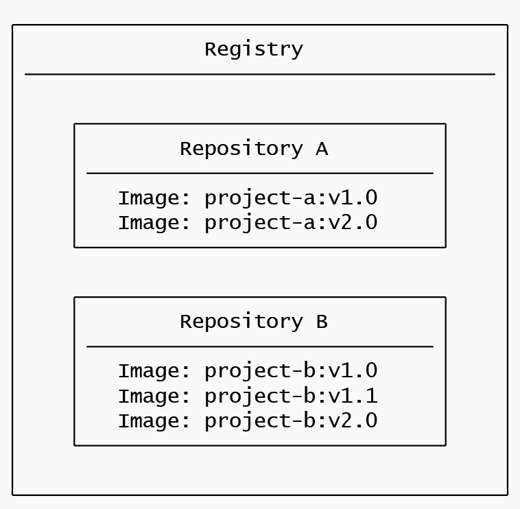

# Registry

[TOC]

## 概述

镜像仓库是用于存储和共享容器镜像的集中位置。它可以是公共的，也可以是私有的。Docker Hub 是一个任何人都可以使用的公共注册表，并且是默认注册表。
虽然 Docker Hub 是一个流行的选项，但目前还有许多其他可用的容器注册表，包括 [Quay.io](https://quay.io) 、[Amazon Elastic Container Registry(ECR)](https://aws.amazon.com/ecr/) 、[Azure Container Registry (ACR)](https://azure.microsoft.com/en-in/products/container-registry) 和 [Google Container Registry (GCR)](https://cloud.google.com/artifact-registry) 。甚至可以在本地系统或组织内部运行私有注册表。例如，Harbor 、JFrog  Artifactory 、GitLab Container registry 等。

## Registry vs. repository 注册表与存储库

While you're working with registries, you might hear the terms *registry* and *repository* as if they're interchangeable. Even though they're related, they're not quite the same thing.
在处理注册表时，您可能会听到注册表和存储库这两个术语，就好像它们是可以互换的一样。尽管它们是相关的，但它们并不完全是一回事。

A *registry* is a centralized location that stores and manages container images, whereas a *repository* is a collection of related container images within a registry. 注册表是存储和管理容器映像的集中位置，而存储库是注册表中相关容器映像的集合。将其视为一个文件夹，可以在其中根据项目组织镜像。每个存储库都包含一个或多个容器镜像。

下图显示了它们之间的关系：

 

## 注册一个免费的 Docker 帐户

如果尚未创建一个，请前往 Docker Hub 页面注册一个新的 Docker 帐户。

 

可以使用 Google 或 GitHub 帐户进行身份验证。

## 创建第一个仓库

1. 登录到 Docker Hub。

2. 选择右上角的“创建存储库”按钮。

3. 选择您的命名空间（很可能是您的用户名）并输入 `docker-quickstart` 作为存储库名称。

4. 将可见性设置为“公开”。

5. 选择“创建”按钮以创建存储库。

   此存储库现在是空的。现在，可以通过将镜像推送到它来修复此问题。

## 使用 Docker Desktop 登录

1. 下载并安装 Docker Desktop（如果尚未安装）。
2. 在 Docker Desktop GUI 中，选择右上角的“登录”按钮。

## 推送镜像

为了创建图像，首先需要一个项目。为了快速入门，将使用在 github.com/dockersamples/helloworld-demo-node 找到的示例 Node.js 项目。此存储库包含构建  Docker 镜像所需的预构建 Dockerfile。

使用以下命令克隆 GitHub 存储库：

```bash
git clone https://github.com/dockersamples/helloworld-demo-node
```

导航到新创建的目录。

```bash
cd helloworld-demo-node
```

运行以下命令以构建 Docker 镜像， `YOUR_DOCKER_USERNAME` 替换为您的用户名。

```bash
docker build -t YOUR_DOCKER_USERNAME/docker-quickstart .
```

> **注意**
>
> 请确保在 `docker build` 命令的末尾包含点 （.）。这会告诉 Docker 在哪里可以找到 Dockerfile。

运行以下命令以列出新创建的 Docker 镜像：

```bash
docker images
```

将看到如下所示的输出：

```console
REPOSITORY                                 TAG       IMAGE ID       CREATED         SIZE
YOUR_DOCKER_USERNAME/docker-quickstart   latest    476de364f70e   2 minutes ago   170MB
```

通过运行以下命令启动容器以测试映像（将用户名替换为您自己的用户名）：

```bash
docker run -d -p 8080:8080 YOUR_DOCKER_USERNAME/docker-quickstart 
```

可以通过使用浏览器访问 http://localhost:8080 来验证容器是否正常工作。

使用 `docker tag` 命令标记 Docker 镜像。Docker 标签允许对镜像进行标记和版本控制。

```bash
docker tag YOUR_DOCKER_USERNAME/docker-quickstart YOUR_DOCKER_USERNAME/docker-quickstart:1.0 
```

Finally, it's time to push the newly built image to your Docker Hub repository by using the [`docker push`](https://docs.docker.com/reference/cli/docker/image/push/) command:
最后，使用 `docker push` 命令将新构建的镜像推送到 Docker Hub 存储库：

```bash
docker push YOUR_DOCKER_USERNAME/docker-quickstart:1.0
```

打开 Docker Hub 并导航到存储库。导航到“标签”部分，然后查看新推送的镜像。

 

## 私有化部署

仅包含官方 Docker Registry 。

### registry

1. 启动 registry 容器。

   ```bash
   docker run -d -p 5000:5000 -v /myregistry:/var/lib/registry registry:2
   ```

2. 调整本地镜像的tag

   ```bash
   docker tag kkkk/httpd:v1 registry.example.net:5000/kkkk/httpd:v1
   ```

3. 上传镜像

   ```bash
   docker push registry.example.net:5000/kkkk/httpd:v1
   ```

4. 下载镜像

   ```bash
   docker pull registry.example.net:5000/kkkk/httpd:v1
   ```

   

