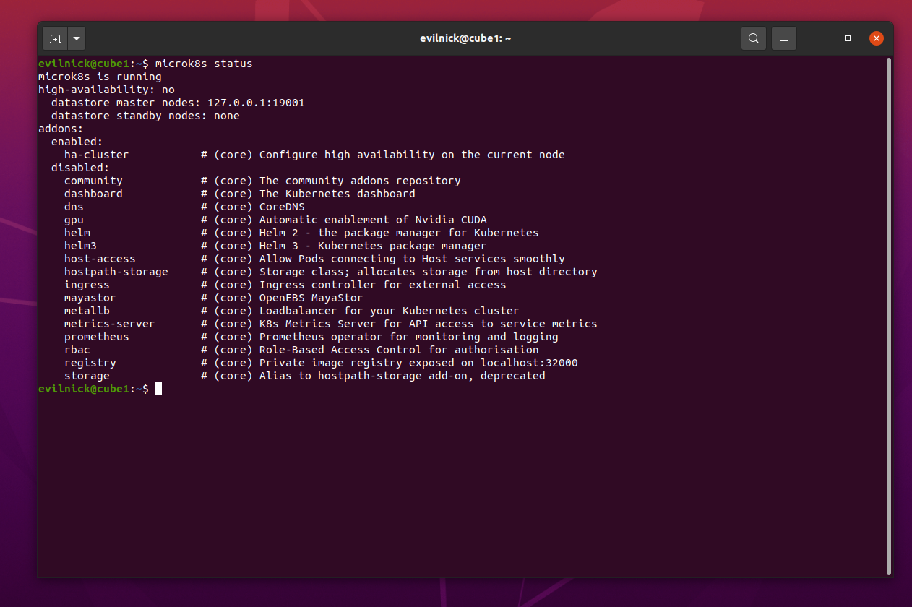
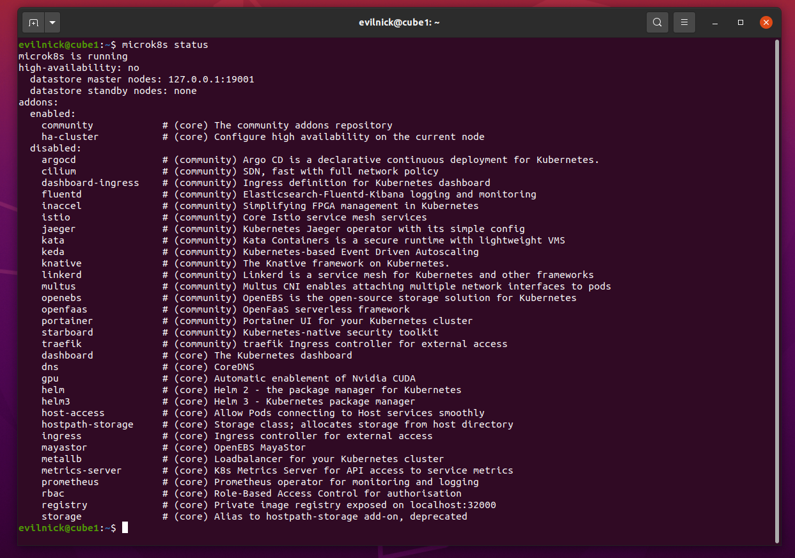
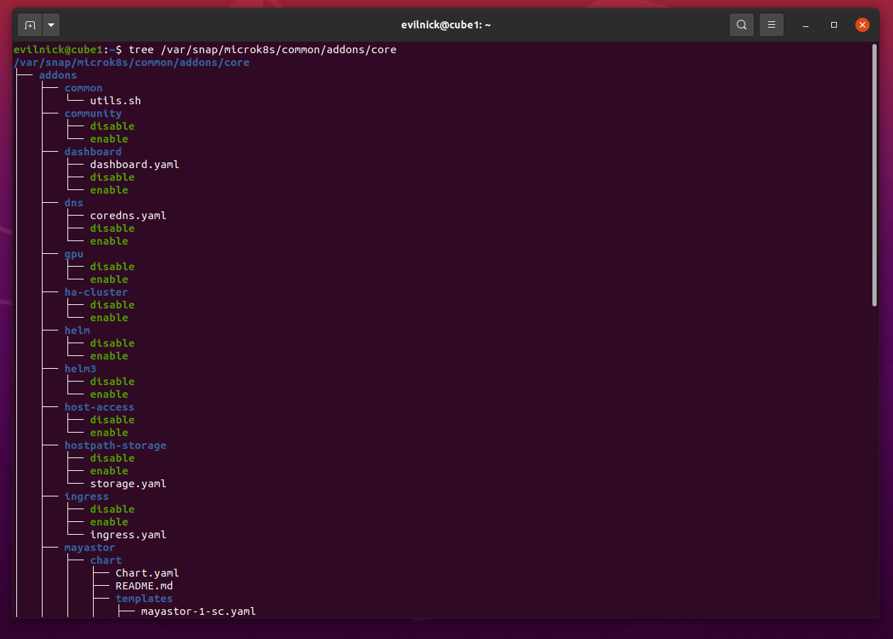

# MicroK8s 插件

[TOC]

插件有两种类型，由 Canonical 的 MicroK8s 团队维护和官方支持的 Core Addons，以及 Community Addons。

## 核心仓库中的插件

| 名字             | 描述                                                         | 版本                                                         | 兼容性                                                       |
| ---------------- | ------------------------------------------------------------ | ------------------------------------------------------------ | ------------------------------------------------------------ |
| cert-manager     | Kubernetes 集群的证书管理                                    |  |      |
| community        | 启用社区插件存储库                                           |  |       |
| dns              | 部署 CoreDNS。建议始终启用此插件。                           |  |       |
| dashboard        | 标准 Kubernetes 仪表板。                                     |  |       |
| gpu              | Enable support for GPU accelerated workloads using the NVIDIA runtime. 使用 NVIDIA 运行时启用对 GPU 加速工作负载的支持。 |  |   |
| ha-cluster       | 允许在至少具有三个节点的集群上实现高可用性。                 |  |       |
| helm             | 为 Kubernetes 安装 [Helm 3](https://helm.sh) 包管理器        |  |       |
| helm3            | Transition addon introducing the [Helm 3](https://helm.sh) package manager 介绍 [Helm 3](https://helm.sh) 包管理器的 Transition 插件 |  |       |
| hostpath-storage | Create a default storage class which allocates storage from a host directory. **Note!:** The  add-on uses simple filesystem storage local to the node where it  was added. Not suitable for a production environment or clusters 创建一个默认存储类，用于从主机目录分配存储。**注意！：**该附加组件使用添加它的节点本地的简单文件系统存储。不适用于生产环境或集群 |  |       |
| host-access      | Provides a fixed IP for access to the host’s services. 提供用于访问主机服务的固定 IP。 |  |       |
| ingress          | A simple ingress controller for external access. 用于外部访问的简单入口控制器。 |  |       |
| kube-ovn         | The feature rich [Kube-OVN](https://www.kube-ovn.io/) network fabric. 功能丰富的 [Kube-OVN](https://www.kube-ovn.io/) 网络结构。 |  |    |
| mayastor         | Multi-node zero-ops storage option powered by [Mayastor](https://github.com/openebs/mayastor) 由 [Mayastor](https://github.com/openebs/mayastor) 提供支持的多节点零作存储选项 |  |    |
| minio            | 与云无关的 S3 兼容对象存储。                                 |  |       |
| metallb          | Note that currently this does not work on macOS, due to  network filtering. 部署 [MetalLB 负载均衡器](https://metallb.universe.tf/)。请注意，由于网络筛选，目前这在 macOS 上不起作用。 |  |       |
| metrics-server   | Adds the [Kubernetes Metrics Server](https://github.com/kubernetes-sigs/metrics-server) for API access to service metrics. 添加 [Kubernetes Metrics Server](https://github.com/kubernetes-sigs/metrics-server)，用于对服务指标的 API 访问。 |  |       |
| prometheus       | 部署 [Prometheus Operator](https://prometheus.io/docs/)。    |  |     |
| rbac             | Note that this is incompatible with some other add-ons. 启用基于角色的访问控制以进行授权。请注意，这与一些其他附加组件不兼容。 |  |       |
| rook-ceph        | Rook turns distributed storage systems into self-managing, self-scaling, self-healing storage services. Rook 将分布式存储系统转变为自我管理、自我扩展、自我修复的存储服务。 |  |   |
| registry         | Deploy a private image registry and expose it on localhost:32000. 部署私有镜像注册表并将其公开在 localhost:32000 上。 |  |       |
| storage          | DEPRECATED  - Replaced by the **hostpath-storage** addon. DEPRECATED - 替换为 **hostpath-storage** 插件。 |  |       |

## 社区仓库中的插件

这个第三方和社区维护的插件集合可以通过以下方式启用：

```bash
microk8s enable community
```

以下是目前包含的内容：

| 名字           | 描述                                                         | 版本                                                         | 兼容性                                                       |
| -------------- | ------------------------------------------------------------ | ------------------------------------------------------------ | ------------------------------------------------------------ |
| ambassador     | [Ambassador](https://www.getambassador.io/) is an API and Ingress controller [Ambassador](https://www.getambassador.io/) 是一个 API 和 Ingress 控制器 |   |    |
| argocd         | Deploys [Argo CD](https://argo-cd.readthedocs.io/en/stable/), the declarative, GitOps continuous delivery tool for Kubernetes. 部署 [Argo CD](https://argo-cd.readthedocs.io/en/stable/)，这是适用于 Kubernetes 的声明式 GitOps 持续交付工具。 |  |   |
| cilium         | Deploys [Cilium](http://docs.cilium.io/en/stable/intro/) to support Kubernetes network policies using eBPF. 部署 [Cilium](http://docs.cilium.io/en/stable/intro/) 以支持使用 eBPF 的 Kubernetes 网络策略。 |  |    |
| cloudnative-pg | Adds cloud native Postgres support for faster and more reliable PG 添加云原生 Postgres 支持，以实现更快、更可靠的 PG |  |   |
| easyhaproxy    | Adds EasyHAProxy for automatic ingress. 添加 EasyHAProxy 以实现自动入口。 |  |     |
| falco          | Cloud native security alerts 云原生安全警报                  |  |   |
| fluentd        | Deploy the [Elasticsearch-Fluentd-Kibana](https://www.elastic.co/guide/en/kibana/current/discover.html) logging and monitoring solution. 部署 [Elasticsearch-Fluentd-Kibana](https://www.elastic.co/guide/en/kibana/current/discover.html) 日志记录和监控解决方案。 |  |   |
| gopaddle-lite  | 面向 Kubernetes 开发人员的简单“无代码”平台。                 |  |    |
| inaccel        | Simplify FPGA management and application lifecycle with InAccel. 使用 InAccel 简化 FPGA 管理和应用程序生命周期。 |  |    |
| istio          | Adds the core [Istio](https://istio.io/docs/) services (not available on arm64 arch). 添加核心 [Istio](https://istio.io/docs/) 服务（在 arm64 arch 上不可用）。 |  |    |
| jaeger         | Deploy the [Jaeger Operator](https://github.com/jaegertracing/jaeger-operator) in the “simplest” configuration. 以 “最简单” 的配置部署 [Jaeger Operator](https://github.com/jaegertracing/jaeger-operator)。 |  |     |
| kata           | Adds [Kata containers](https://katacontainers.io/) support - A secure container runtime with lightweight virtual machines. 添加 [Kata 容器](https://katacontainers.io/)支持 - 具有轻量级虚拟机的安全容器运行时。 |  |   |
| keda           | Deploys [KEDA](https://keda.sh/) - Kubernetes Event-driven Autoscaling operator. 部署 [KEDA](https://keda.sh/) - Kubernetes 事件驱动的 Autoscaling 运算符。 |  |    |
| knative        | Adds the [Knative](https://knative.dev/) middleware to your cluster 将 [Knative](https://knative.dev/) 中间件添加到您的集群中 |  |       |
| kubearmor      | Provides policy-based security for workloads. See [KubeArmor website](https://kubearmor.io/) . 为工作负载提供基于策略的安全性。详见 [KubeArmor 网站](https://kubearmor.io/) 。 |  |    |
| kwasm          | 向 Kubernetes 节点添加 WebAssembly 支持                      |  |     |
| linkerd        | Deploys the [linkerd](https://linkerd.io/2/overview/) service mesh 部署 [linkerd](https://linkerd.io/2/overview/) 服务网格 |  |    |
| microcks       | Open source Kubernetes native tool for API Mocking and Testing. Microcks is a [Cloud Native Computing](https://www.cncf.io/) Sandbox project. 用于 API 模拟和测试的开源 Kubernetes 原生工具。Microcks 是一个 [Cloud Native Computing](https://www.cncf.io/) Sandbox 项目。 |  |     |
| multus         | Add multus for multiple network capability. 为多个网络功能添加 multus。 |  |    |
| nfs            | 添加基于 NFS 的存储。                                        |  |   |
| ngrok          | Unified ingress/gateway 统一入口/网关                        |  |    |
| ondat          | A Kubernetes-native persistent storage platform. Kubernetes 原生持久存储平台。 |  |   |
| openebs        | Add [OpenEBS](https://openebs.io/) storage capability. 添加 [OpenEBS](https://openebs.io/) 存储功能。 |  |     |
| openfaas       | [OpenFaaS](https://www.openfaas.com/), the popular serverless framework. [OpenFaaS](https://www.openfaas.com/)，流行的无服务器框架。 |  |    |
| osm-edge       | Open Service Mesh Edge (OSM-Edge) fork from [Open Service Mesh](https://github.com/openservicemesh/osm) is a lightweight, extensible, Cloud Native [service mesh](https://en.wikipedia.org/wiki/Service_mesh) built for Edge computing. [Open Service Mesh](https://github.com/openservicemesh/osm) Edge （OSM-Edge） 的分支是专为边缘计算构建的轻量级、可扩展的云原生[服务网格](https://en.wikipedia.org/wiki/Service_mesh)。 |  |     |
| parking        | Parking for static sites 静态站点停车                        |  |     |
| portainer      | 容器管理仪表板（请参阅 [portainer.io](https://portainer.io)）。 |  |     |
| shifu          | Kubernetes 原生 IoT 开发框架                                 |  |   |
| sosivio        | Predictive troubleshooting for Kubernetes Kubernetes 的预测性故障排除 |  |    |
| traefik        | Adds the [Traefik Kubernetes Ingress controller](https://doc.traefik.io/traefik/providers/kubernetes-ingress/). 添加 [Traefik Kubernetes Ingress 控制器](https://doc.traefik.io/traefik/providers/kubernetes-ingress/)。 |  |     |
| trivy          | 适用于 Kubernetes 的开源安全扫描程序                         |  |     |

## 如何管理插件

为了尽可能轻量级，MicroK8s 只安装了可用的 Kubernetes 安装：

- api-server
- controller-manager
- scheduler
- kubelet
- cni
- kube-proxy

While this does deliver a pure Kubernetes experience with the smallest  resource footprint possible, there are situations where you may require  additional services. MicroK8s caters for this with the concept of  “Addons” - extra services which can easily be added to MicroK8s. These  addons can be enabled and disabled at any time, and most are  pre-configured to ‘just work’ without any further set up.
虽然这确实以尽可能小的资源占用提供了纯 Kubernetes 体验，但在某些情况下，您可能需要额外的服务。MicroK8s 通过“插件”的概念来满足这一点 - 可以轻松添加到  MicroK8s 的额外服务。这些插件可以随时启用和禁用，并且大多数插件都预先配置为“正常工作”，无需任何进一步设置。

例如，要启用 CoreDNS 插件：

```bash
microk8s enable dns
```

这些附加组件可以随时使用 `disable` 命令禁用：

```bash
microk8s disable dns
```

…可以随时通过运行以下命令来检查可用和已安装的插件列表：

```bash
microk8s status
```

**Note:** Before installing add-ons which install extra client tools (e.g. Helm), be sure that the current user is part of the `microk8s` group, to avoid potential permission problems.
**注意：**在安装安装额外客户端工具（例如 Helm）的附加组件之前，请确保当前用户是 `microk8s` 组的一部分，以避免潜在的权限问题。

### Addon 仓库

To assist in creating a such  repositories, the MicroK8s team maintains a [template repository](https://github.com/canonical/microk8s-addons-repo-template) on github that can be forked to start a new addons collection. Although the template repository includes a [HACKING.md guide](https://github.com/canonical/microk8s-addons-repo-template/blob/main/HACKING.md) with instructions on building a Python based demo addon.
从 v1.24 版本开始，插件被组织在仓库中。存储库本质上是 git 项目，用户可以在其中放置他们感兴趣的插件。为了帮助创建此类存储库，MicroK8s 团队在 github 上维护了一个[模板存储库](https://github.com/canonical/microk8s-addons-repo-template)，可以分叉该存储库以启动新的插件集合。尽管模板存储库包括一个 [HACKING.md 指南](https://github.com/canonical/microk8s-addons-repo-template/blob/main/HACKING.md)，其中包含有关构建基于 Python 的演示插件的说明，但插件可以用任何编程语言实现，甚至是 bash。

Addon 存储库位于 `/var/snap/microk8s/common/addons` 下，可以就地编辑。为了简化添加、删除和更新此类存储库的过程，可以使用 `microk8s addons repo` 命令。可以在 MicroK8s 集群上添加 `https://github.com/my-org/awesome-repo` 下的存储库：

```bash
microk8s addons repo add myrepo https://github.com/my-org/awesome-repo
```

可选的 `--reference` 标志可用于指向 git 存储库中的特定分支或标记。

This identifier is  used to differentiate addons with the same name found on separate addon  repositories.
上面示例中的 `myrepo` 是存储库标识符。此标识符用于区分在单独的插件存储库中找到的具有相同名称的插件。

删除和更新存储库分别使用 `microk8s addons repo remove` 和 `microk8s addons repo update` 命令实现。

默认情况下，MicroK8s 附带两个存储库：

- [core](https://github.com/canonical/microk8s-core-addons/), with essential addons maintained by the MicroK8s team, and
  [core](https://github.com/canonical/microk8s-core-addons/) 的 GitHub S S 的 Zip S S 的 Essential Addons 的 S S API 和
- [community](https://github.com/canonical/microk8s-addons/), with community maintained addons.
  [community](https://github.com/canonical/microk8s-addons/)，带有社区维护的插件。

**注意：**在全新安装时，默认情况下仅启用核心存储库。可以随时通过以下方式轻松添加社区存储库：`microk8s enable community` 。

## 使用、编辑或创建插件      

MicroK8s’ addons, extra services which can be added to your bare-bones cluster,  are a great favourite with users. Do you want to apply the CoreDNS  manifest, reconfigure kubelet and restart the nodes on a cluster? Just  run `microk8s enable dns`… Do you want to install a hostpath storage provisioner and fire up Portainer? `microk8s enable portainer` does exactly that. There are no particular restrictions to what an  addon can do - if you can do it in Kubernetes, you can write an addon to do it too.
MicroK8s 的插件，可以添加到您的基本集群的额外服务，深受用户喜爱。是否要应用 CoreDNS 清单、重新配置 kubelet 并重启集群上的节点？只需运行 `microk8s enable dns`...是否要安装 hostpath 存储配置程序并启动 Portainer？`microk8s enable portainer` 正是这样做的。插件可以做什么没有特别的限制 - 如果你可以在 Kubernetes 中做到这一点，你也可以编写一个插件来做到这一点。

From the v1.24 release, the addons framework is now open to the public! We  have made sure software vendors and enthusiasts can create and use thier own addon repositories and edit in-place any available addons within a  running cluster.
从 v1.24 版本开始，插件框架现在向公众开放！我们确保软件供应商和爱好者可以创建和使用他们自己的插件存储库，并在正在运行的集群中就地编辑任何可用的插件。

在此页面中，您将了解到：

- 插件的使用方法
- 如何调整它们以满足您的需求
- 如何创建插件并在您自己的存储库中使用它们
- 如何通过社区插件仓库推广您的作品

### 如何使用 MicroK8s 插件

使用 `microk8s status` 命令，可以查看可用插件的列表：



要启用插件，需要调用 microk8s enable，后跟插件的名称，例如 `microk8s enable dns` 。同样，`microk8s disable` 将禁用命名插件并卸载它。

In the example output above you may notice that the description of each  addon starts with “core”. This indicates the repository the addon is  available from. Core addons are the ones maintained and supported by the MicroK8s team.  In addition to the core addons we ship MicroK8s with a  set of community maintained addons. To display those you just need to  run the command `microk8s enable community`
在上面的示例输出中，您可能会注意到每个插件的描述都以 “core” 开头。这表示插件可从哪个存储库获得。核心插件是由 MicroK8s  团队维护和支持的插件。除了核心插件之外，我们还提供带有一组社区维护的插件的 MicroK8s。要显示这些内容，您只需运行命令 `microk8s enable community`



正如我们将看到的，添加、删除和更新存储库是通过 microk8s addons repo 命令完成的。microk8s enable community 是一个快捷方式，可以在不知道相应存储库的确切 URL 的情况下使社区贡献可见。

### 调整插件以满足您的需求

Addon repositories are git projects which are cloned under `/var/snap/microk8s/common/addons` . For example, the core repository is found in the `/var/snap/microk8s/common/addons/core` directory inside which there is a folder called addons with all its addons.
Addon 存储库是在 下克隆的 git 项目 `/var/snap/microk8s/common/addons` 。例如，核心存储库位于 `/var/snap/microk8s/common/addons/core` 目录中，其中有一个名为 addons 的文件夹及其所有插件。




Notice the enable and disable executable files found on each addon? These are the hook scripts each addon implements and the `microk8s enable` and `microk8s disable` commands expect to be able to find and call.
注意到每个插件上的启用和禁用可执行文件了吗？这些是每个插件实现的钩子脚本，以及 `microk8s enable` 和 `microk8s disable` 命令希望能够找到和调用的。

Maybe an addon does 95% of what you want, but not *exactly* what you need. There is nothing stopping you from editing the  respective enable hook to match your needs. Although there are no  restrictions on the language these hooks are written in, often they come as bash or Python scripts.
也许插件可以完成你想要的 95%，但并不*完全*是你需要的。没有什么能阻止您编辑相应的 enable 钩子以满足您的需求。尽管这些钩子的编写语言没有限制，但它们通常以 bash 或 Python 脚本的形式出现。

Try this yourself. Edit `/var/snap/microk8s/common/addons/core/addons/dns/coredns.yaml` and change the `image: coredns/coredns:1.10.0` to `image: coredns/coredns:1.10.1` Save the enable file and call `microk8s enable dns`. Yes, it is that simple!
自己试试这个。编辑 `/var/snap/microk8s/common/addons/core/addons/dns/coredns.yaml` 并将`镜像 coredns/coredns：1.10.0` 更改为 `image： coredns/coredns：1.10.1`保存启用文件并调用 `microk8s enable dns`。是的，就是这么简单！

### 设置您自己的存储库

The most exciting feature of the v1.24 release is the option to add 3rd-party repositories to a MicroK8s cluster.
v1.24 版本最令人兴奋的功能是可以选择将第三方存储库添加到 MicroK8s 集群。

To bootstrap the repository authoring process the MicroK8s team provides a template repository with two example addons (in python and bash) to  fork. That repository can be found at https://github.com/canonical/microk8s-addons-repo-template. The README.md and HACKING.md pages will guide you through this task.
为了引导存储库创作过程，MicroK8s 团队提供了一个模板存储库，其中包含两个示例插件（python 和 bash 中）以供 fork 使用。该存储库可以在 https://github.com/canonical/microk8s-addons-repo-template 中找到。README.md 页和 HACKING.md 页将指导您完成此任务。

Here, we will briefly touch on the main steps you need to take:
在这里，我们将简要介绍您需要采取的主要步骤：

Fork the template repository. If you are logged into Github just click on  the “Use this template” button and fill out the “new repository” form.
Fork 模板存储库。如果您已登录 Github，只需单击“使用此模板”按钮并填写“新存储库”表格。

The addons.yaml at the top level of each repo holds the list of the addons. Replace this list with the list of addons you will be shipping. Each  entry has the following fields:
每个仓库顶层的 addons.yaml 包含插件列表。将此列表替换为您将要运送的插件列表。每个条目都有以下字段：

- name：插件的名称
- description：打印在 microk8s status 输出中
- version：包含插件版本的字符串
- check_status: what would the microk8s status run to figure out if the addon is  enabled or not. This can be a deployment within Kubernetes or a file  acting as a lock file on the host.
  check_status：microk8s 状态将运行什么来确定插件是否已启用。这可以是 Kubernetes 中的部署，也可以是充当主机上的锁定文件的文件。
- supported_architectures：目前 MicroK8s 适用于 AMD64、ARM64 和 S390x。

Create a directory under addons named after the addon you would be implementing.
在 addons 下创建一个目录，以将要实现的 addon 命名。

In that directory, add two executable files named enable and disable.  These executables can be written in any language and are called by the  microk8s enable/disable commands.
在该目录中，添加两个名为 enable 和 disable 的可执行文件。这些可执行文件可以用任何语言编写，并由 microk8s enable/disable 命令调用。

At this point, you are able to add your repository into MicroK8s with something similar to:
此时，您可以使用类似于以下内容将存储库添加到 MicroK8s 中：

```bash
microk8s addons repo add fantastic https://github.com/myorg/myrepo
```

fantastic is the ID you give to your repository. From this point on this ID is  used to reference the repo when updating and removing it, eg:
fantastic 是您为仓库提供的 ID。从这一点开始，这个 ID 用于在更新和删除 repo 时引用它，例如：

```bash
microk8s addons repo update fantastic
microk8s addons repo remove fantastic
```

Knowing that addons are git projects allows for a number of workflows while developing:
知道插件是 git 项目允许在开发时进行许多工作流程：

Using the --reference flag you can add a repository and point to a branch/tag:
使用 --reference 标志，您可以添加存储库并指向分支/标签：

You can also add a git project as a repository that is local on your host:
您还可以将 git 项目添加为主机上的本地存储库：

Use `microk8s addons repo update` to fetch the latest changes pushed on the repository you are working  on. Alternatively you can clone a git repository directly under `/var/snap/microk8s/common/addons/` and MicroK8s will pick it up as a repository.
使用 `microk8s addons repo update` 来获取推送到您正在处理的存储库上的最新更改。或者，您可以直接在 git 下 `/var/snap/microk8s/common/addons/` 克隆一个 git 存储库，MicroK8s 会将其作为存储库获取。

### 在 MicroK8s 社区存储库中推广您的工作

MicroK8s ships with both the core and community addons. In order not to clutter  the user output the community addons are not visible by default. You  need to `microk8s enable community` or to add the community repository as any other repository:
MicroK8s 附带了核心插件和社区插件。为了不弄乱用户输出，默认情况下，community 插件是不可见的。您需要 `microk8s 启用 community` 或将 community 仓库添加为任何其他仓库：

```bash
microk8s addons repo add community https://github.com/canonical/microk8s-addons.git
```

In order to promote your work you can fork the community repository, add  your addon, and place a PR against the upstream repo. Some things you  should be aware of:
为了推广你的工作，你可以 fork 社区仓库，添加你的插件，并针对上游仓库放置一个 PR。您应该注意的一些事项：

- New addons are added only on new releases. This means that the set of  addons of a release (eg v1.24) will not change during patch releases.  Newly merged addons are available in the next release.
  新插件仅在新版本中添加。这意味着版本（例如 v1.24）的插件集在补丁发布期间不会更改。新合并的插件将在下一个版本中推出。
- Each addon is expected to have a maintainer. The addons are not “donated” to the MicroK8s team.
  每个插件都应该有一个维护者。插件不会“捐赠”给 MicroK8s 团队。
- Each addon is expected to have a test making sure it deploys correctly.  Tests are Python based at this point and are found under the tests  directory. Before each patch release we make sure all tests are passing.
  每个插件都需要进行测试，以确保它正确部署。此时，测试基于 Python，位于 tests 目录下。在每个补丁发布之前，我们确保所有测试都通过。
